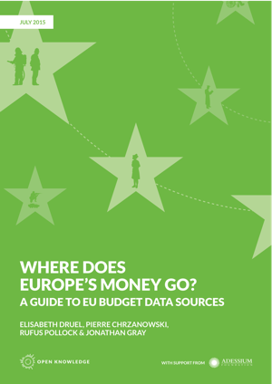

## A Guide to EU Budget Data Sources

This report was researched and written by **Elisabeth Druel** and **Pierre Chrzanowski** on behalf of **Open Knowledge**, with input and guidance from **Rufus Pollock** and **Jonathan Gray**. Support was provided by the **Adessium Foundation**.

**Open Knowledge** is a global civil society organisation dedicated to opening up public information, research and culture to benefit the lives of citizens around the world. Find out more at: [okfn.org](https://okfn.org/).

**Adessium Foundation** aspires to a society that encourages people to live in harmony with each other and with their environments. The Foundation works to achieve a balanced society characterized by integrity, a balance between people and nature, and social harmony. Find out more at: [adessium.org](http://www.adessium.org/).

Thanks to the following people who provided input, feedback and support at various stages:

-   **Brigitte Alfter**, Europe Editor, JournalismFund.eu and Lecturer, Roskilde University
-   **Caelainn Barr**, Data Journalist, The Guardian
-   **Cynthia O’Murchu**, Reporter, Financial Times
-   **Nick Aiossa**, EU Policy Officer, Transparency International EU Office

## Executive Summary

<table>
<col width="100%" />
<tbody>
<tr class="odd">
<td align="left">
The EU Budget in Numbers

<ul>
<li>The EU has committed to spending over €959 988 million over the period 2014-2020.</li>
</ul>
<ul>
<li>The EU budget is divided into more than 80 funds and programmes.</li>
<li>Five of these funds, the European Structural and Investments Funds (ESIF), represent 33% of the total budget.</li>
<li>Around 6% of the budget goes to the administration of the European institutions, whereas around 94% is allocated to various European programmes.</li>
<li>There are more than 100 authorities managing EU funds. 20% of these are managed directly by the European Commission. The remaining 80% are managed by other authorities.</li>
</ul></td>
</tr>
</tbody>
</table>

Recent polls show that European citizens hold the EU to be inaccessible due to its complexity and lack of transparency.[^ftnt1] The lack of transparency and democratic accountability in European institutions is widely characterised as a “[democratic deficit](http://europa.eu/legislation_summaries/glossary/democratic_deficit_en.htm)”, a phrase which has become part of the EU’s official glossary. This “democratic deficit” is particularly apparent when it comes to EU public finances.

This guide aims to help civil society organisations (CSOs), journalists and others to navigate the vast landscape of documents and datasets about the EU’s fiscal affairs. In doing so, our objective is to support more evidence-based journalism and advocacy, and - in the longer term - to contribute towards the transparency, public understanding and democratic accountability of EU public finances.

The level of transparency about EU public money is highly variable, and is largely dependent on which authority is responsible for managing and disbursing a given fund. Funds which are exemplary for their transparency exist alongside funds which are effectively dark. For example, on one hand, the Financial Transparency System (FTS) set up by the European Commission provides access to granular open data about spending, but only concerns about 20% of total spending. On the other hand, information about public money spent by EU Members States is often unavailable to the public.

The European Union has now entered into a new budget framework for 2014-2020. This is accompanied by a new financial regulation, defining new funds and new transparency rules. However, as we shall see in this report, many barriers still remain. In addition to providing an overview of key funds and programmes, we also conclude with some analysis and recommendations for further work in this area, which are summarised below.

<table>
<col width="100%" />
<tbody>
<tr class="odd">
<td align="left"><h2>Summary of Recommendations</h2>

<ol>
<li><strong>Establish a single central point of reference</strong> for data and documents about EU revenue, budgeting and expenditure and ensure all the information is up to date  at this domain (e.g. at a website such as <a href="http://www.google.com/url?q=http%3A%2F%2Fec.europa.eu%2Fbudget&amp;sa=D&amp;sntz=1&amp;usg=AFQjCNFWcyA9aOiTTUegt8YVevYXpnkn0Q">ec.europa.eu/budget</a>). At the same time, ensure all EU budget data are available from the EU open data portal as open data.</li>
</ol>

<ol start="2">
<li><strong>C</strong><strong>reate an open dataset with key details about each EU fund</strong>, including name of the fund, heading, policy, type of management, implementing authorities, link to information on beneficiaries, link to legal basis in Eur-Lex and link to regulation in Eur-Lex.</li>
</ol>

<ol start="3">
<li><strong>Extend the Financial Transparency System to all EU funds</strong> by integrating or federating detailed data expenditures from Members States, non-EU Members and international organisations. Data on beneficiaries should include, when relevant, a unique European identifier of company, and when the project is co-financed, the exact amount of EU funding received and the total amount of the project.</li>
</ol>

<ol start="4">
<li><strong>Clarify and harmonise the legal framework regarding transparency rules</strong> for the beneficiaries of EU funds.</li>
</ol>

<ol start="5">
<li><strong>Support and strengthen funding for civil society groups and journalists</strong> working on EU public finances.</li>
</ol>

<ol start="6">
<li><strong>Conduct a more detailed</strong> <strong>assessment</strong><strong> of beneficiary data availability</strong> for all EU funds and for all implementing authorities - e.g., through a dedicated “open data audit”.</li>
</ol>

<ol start="7">
<li><strong>Build a stronger central base of evidence about the uses and users of EU fiscal data</strong> - including data projects, investigative journalism projects and data users in the media and civil society.</li>
</ol>

</td>
</tr>
</tbody>
</table>

## Table of Contents

- [The EU Budget at a Glance](./overview/)
- [How is the EU Budget Set Up?](./budget/)
- [Where Does the Money Come From?](./revenue/)
- [Who Manages and Spends the Money, and How?](./expenditure/)
- [Where Does the Money Go?](./funds/)
- [How Transparent is the EU Budget?](./transparency/)
- [Journalistic Investigations and Transparency Projects to Follow the Money](./research/)
- [Recommendations and Next Steps](./recommendations/)
- [Annex - The Open Data Audit of EU Funds](./datasets/)
- [Annex - Legal Basis for the Establishment of the EU budget](./legal-basis/)
- [References](./references/)
- [Acronyms](./acronyms/)
- [Glossary](./glossary/)

## Download the PDF version


