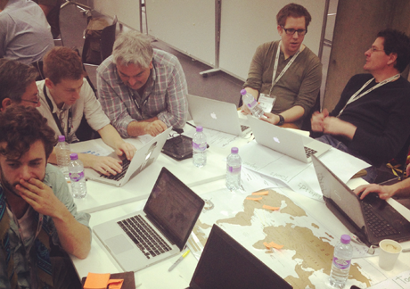

## Community

OpenSpending is not just a set of technologies.  The core of our
project is a community of transparency enthusiasts, public finance
experts and data wranglers. We're discussing and developing new ways
to monitor and explain budgets and government spending through the use
of technology.  The following reports and guides are the results of
this ongoing work.

### Reports

- [Where Does the European Union's Money Go?](/resources/eu/)
- [Mapping the Open Spending Data Community](/resources/mappingcommunity/)
- [Technology for Transparent and Accountable Public Finance](resources/gift/)

### Guides

- [Connecting the International Aid Flows](resources/iati/)
- [Follow the money](resources/journo/)
- [UK Departmental Spending](resources/gb-spending/)

### Other

- [OpenSpending.mobi](resources/mobi/)
- [Map of Spending Projects](resources/map-of-spending-projects/)
- [Working Group on Open Spending Data](resources/wg/)
- [Spending Data Standard [Fiscal Data Package] (current)](https://frictionlessdata.io/specs/fiscal-data-package/)
- [Spending Data Standard (deprecated)](resources/standard/)

