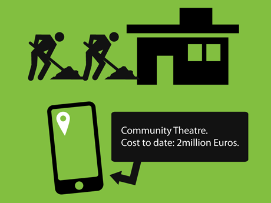
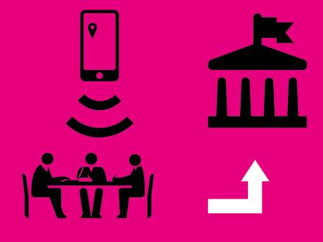

<iframe src="http://player.vimeo.com/video/41036716" width="100%" frameborder="0" webkitAllowFullScreen="true" mozallowfullscreen="true" allowFullScreen="true"></iframe>

OpenSpending.mobi was <a
href="http://www.llga.org/project.php?idP=480">submitted</a> as an
application to the Living Labs Global Awards. While it was
shortlisted, the idea was ultimately not accepted. We still hope to to
implement the concept soon.

### Challenge

Poor public good provision is major a obstacle in translating
municipal funds into basic services. Policy makers are often unaware
of the preferences in the population. Lack of transparency in the
allocation process often results in leakage and inefficiencies.

Many cities like Sant Cugat are looking for ways of engaging citizens,
private sector and civil society in a collaborative way, aimed at
re-thinking and improving the city's services in order to seize
opportunities for sustainable development, competitiveness and
effectiveness.

With an increasing tightening of the public purse, funding decisions
should be based on sound information - both about the project's
expected outcomes and about the interests amongst the local citizens
and other stakeholders. Information exchange and coordination through
public review can help determining the actual net benefit to society
and improve the accountability of local governments.

### Community impact

The project will enable the direct engagement of citizens, making them
part of the information gathering and decision-making process, foster
deliberation in an otherwise anonymous urban environment and
strengthening their sense of belonging to the community. The
geographical focus of the application would encourage user interaction
and stimulate creativity and responsibility towards the local
community.

Through mapping and analysing the citizens' experience in public
services, individuals are given a chance to contribute to shaping the
landscape of their local area and available services: E.g. 'I think
this daycare facility would be more useful if there were local bus
routes allowing me to drop my child off more easily.'

Furthermore, the project would give the possibility of rewarding
organisations who invest in the economy, thus taking pressure off
municipal authorities. If a local company would sponsor repairing of a
broken swing in a playground and it could be marked directly on the
map that their company funded the project, which would also encorage
further contributions from the private sector.

***Idea by Velichka Dimitrova, Lucy Chambers and Friedrich Lindenberg***

### Solution

OpenSpending.mobi improves the efficiency of public service delivery
by engaging the wider public. The solution is based on a mobile
application and a web portal that allows users to address important
questions:

1. Geo-based impact analysis: "I'm standing in point X - the building that was meant to be funded is not here - where is it and what's happened to the money?", "How much did it cost to fix the potholes in my street?".
1. Citizen experience of public services: Citizens will be able to rate and submit feedback on a public service they have used, enabling policy makers to assess questions: Which projects are making the most impact? Which require more funding to work more effectively? This feedback mechanism will help to aggregate collective knowlegde which is usually distributed and therefore inaccessible to policy makers.
1. Citizen allocation suggestions: Allowing users to suggest uses for a 'pot' of money in the next budget by voting for proposed plans. And conversely, measuring how much a given project would be missed if funding were cut off in the future.
1. Transparency in public procurement: The project will level the playing field for contenders in public procurement and encourage competition through opening information on commissioned projects and selection criteria.

### Economic impact

Public authorities can use the information generated by OpenSpending
to design more efficient policies and offer public goods tailored to
the needs of the local population. Imperfect information about the
actual impact of public projects could be eliminated by the
crowd-sourcing approach proposed by OpenSpending.

The project would guarantee that decisions about public spending
allocations are taken using a "bottom-up" approach and will also
encourage policy makers to try and increase the accuracy of their
predictions. Data analytics would allow for applied cost-benefit
analysis of the actual primary data, instead of depending on
predictions from external consultants, which make predictions based on
imperfect information, incomplete data and assumptions about consumer
preferences.

OpenSpending will guarantee transparency in public procurement and
enable competition:

> I'm a supplier of ABC - I put forward a proposal to tender for a
  government contract but my proposal wasn't chosen. What did the
  winner of the tender offer that we didn't?" If the text of the
  procurement contract were available and linked to concrete outcomes,
  it would enable SMEs to better understand the demands of government
  and tailor future business strategy to make them better able to
  compete in future tenders and ensure tenders are not always won by
  the usual suspects.

