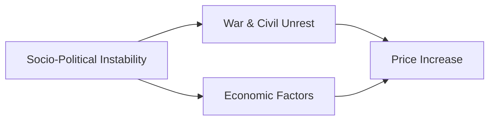

The below chart clearly shows the steep upward trend of oil prices these are largely due to social-political factors and civil unrest:

<LineChart
  data="https://raw.githubusercontent.com/datasets/oil-prices/main/data/wti-year.csv"
  title="Oil Price x Year"
  xAxis="Date"
  yAxis="Price"
/>

But to really understand the different global factors that influence the price of a commodity like oil the  long term trends as shown above is not adequate.

When considering the yearly fluctuations it is often beneficial to filter certain time periods.

One can use the below preview to filter year periods. Alternatively, if you want to consider the points in time when the price of oil was the highest the price range can also be filtered.

<FlatUiTable url="https://raw.githubusercontent.com/datasets/oil-prices/main/data/wti-year.csv" />

Careful data analysis has identified instability albeit economic or political to be the major driver of oil price flatuations

___

**To find the raw data used in this article visit https://github.com/datasets/oil-prices/**
