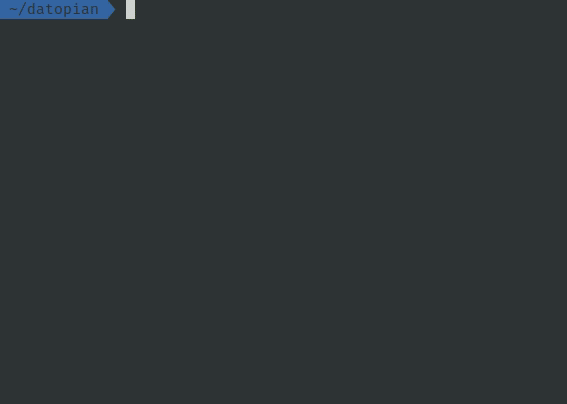

# Create Portal App

<br/>



<br/>
<br/>

This is a friendly way to start using  `portal.js`. Using this CLI helps you to set up fast and easly one portal.js with the default template.
The CLI automatically create the project folder, install main dependencies, generate a new git repository and change package name.

<br/> 

## Requirements

-  Yarn (> 1.22.10) or Npm (> 6.14.5)
-  Git

<br/>

## How to use

To create a new portal.js application you can send the project name as first argument.
```
create-portal-app my-app
```

<br/>

## Options
`create-portal-app` comes with options:

- **--use-npm** - This option allows to use npm instead yarn as default package manager


