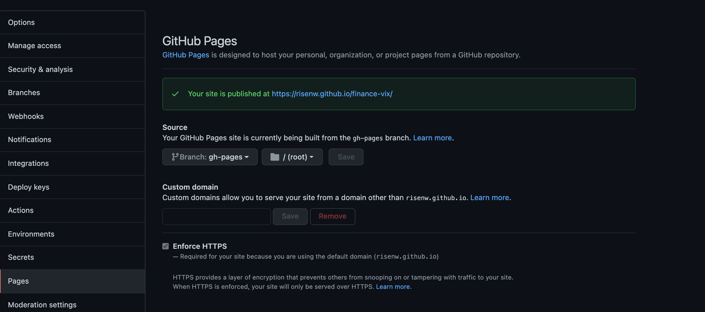

## Steps to use scripts

### Single dataset with no portal commit
This script creates and commit only the build files from nextjs to the gh-pages branch. 
**Step 1:** Export an env variable with the name of your dataset github repo.
For example if deploying https://github.com/datasets/finance-vix, then export the name as:
```bash
export PORTAL_REPO_NAME=finance-vix
```
**Step 2:** Create a file called `portal.sh` and paste the following content:
```bash
#!/bin/bash
git checkout -b gh-pages
git rm -r --cached . 
rm -rf portal
mkdir -p portal
npx create-next-app portal -e https://github.com/datopian/portal.js/tree/main/examples/dataset-frictionless 
mkdir portal/public/dataset

cp -a ./data portal/public/dataset
cp -a ./datapackage.json portal/public/dataset
cp -a ./README.md portal/public/dataset

PORTAL_DATASET_PATH=$PWD"/portal/public/dataset"
export PORTAL_DATASET_PATH

cd portal
assetPrefix='"/'$PORTAL_REPO_NAME'/"'
basePath='"/'$PORTAL_REPO_NAME'"'
echo 'module.exports = {assetPrefix:' ${assetPrefix}', basePath: '${basePath}' }' > next.config.js ## This ensures css and public folder works
yarn export

cd ..
cp -R -a portal/out/ ./
touch .nojekyll
git add $PWD'/_next' $PWD'/index.html' $PWD'/dataset' $PWD'/404.html' $PWD'/.nojekyll' $PWD'/favicon.ico'
git commit -m "Build new dataset page"
git push origin gh-pages
```
**Step 3:** Run the bash script with:
```bash
source portal.sh
```
> Note: Use `source` instead of `bash` so that the script can work well with environment variables. 

**Step 3:**
Go to your repository's github `pages` in setting and set the Branch to gh-pages and folder to root:


**Step 4:**
Open your deployed site 

____
### Single dataset with portal code commit
TODO