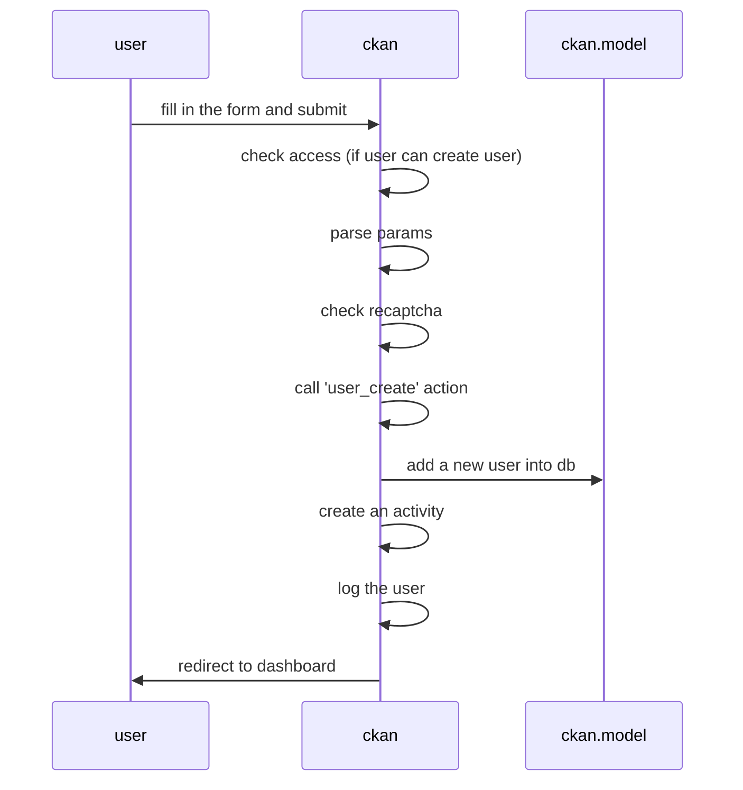
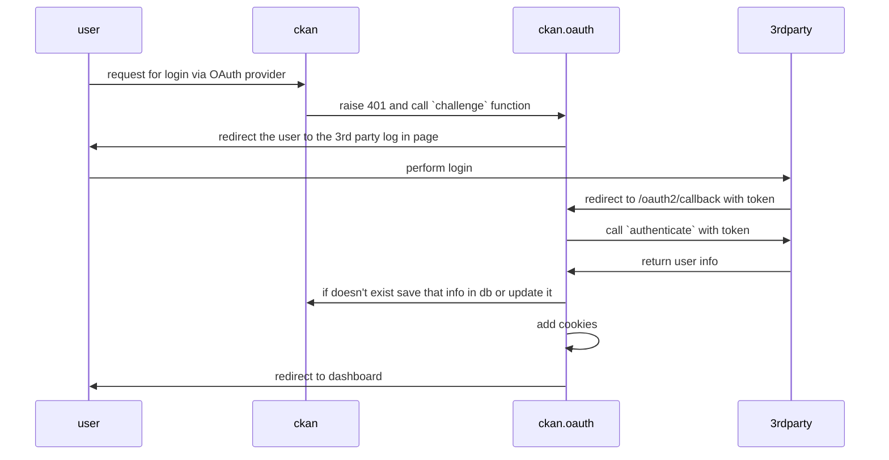
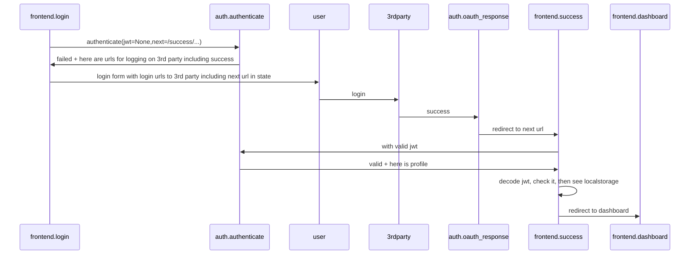
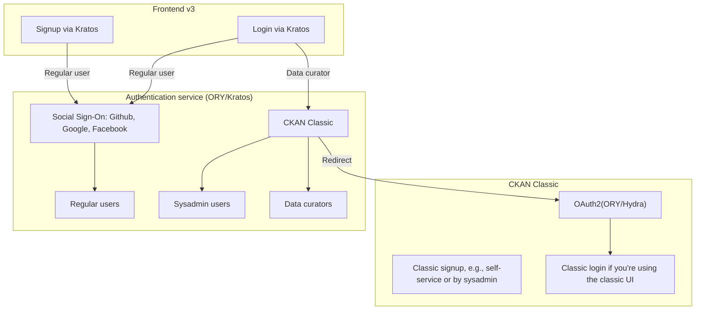

# Authentication

## Introduction

The core function of authentication is to **Identify** Users of the Portal (in a federated way) so we can base access on their identity.

There are 3 major conceptual components: Identity, Accounts and Sessions which come together in the following stages:

* **Root Identity Determination:** Determine Identity often via Delegation
* **Sessions:** Persistence of the identity in the web application in a secure way (without new identity determination on each request! I don't want to have to login via third party service every time)
* **Account (aka profile):** Storing Related Account/Profile Information in our application (not in third party identity) eg. email, name (other preferences)
  * This will get auto-created usually at first Identification
  * In limited case this can be seen as a cache of info from Identity system (e.g. your email)
  * However often richer info that is app specific that is generated (relevant for personalization)

### Root Identity Determination options :key:

The identity determination can be done in multiple ways. In this article we're considering following 3 options that we believe are widely used:

- Password authentication - traditional username and password pair
- Single Sign-on (SSO) via protocols such as OAuth, SAML, OpenID Connect
- One-time password (OTP) via email or SMS (aka passwordless connection)

#### Password authentication

Traditional way of authentication of users. When signing up user provides at least username and password pair which is then stored in a database for future authentication processes. Normally, additional information such as email address, full name etc. is also requested when registering.

Examples of password authentication in popular services:

- GitHub - https://github.com/join
- GitLab - https://gitlab.com/users/sign_up
- NPM - https://www.npmjs.com/signup

#### Single Sign-on (SSO)

The way of delegating identity determination process to some third-party service. Normally, popular social network services are used, e.g., Google, Facebook, Twitter etc. SSO implementations can be done using OAuth or SAML protocols. In addition, there is OpenID Connect protocol which is an extension of OAuth2.0.

- OAuth
  - JWT based
  - JSON based
  - 'webby'
- SAML
  - XML based
  - SOAP based
  - 'enterprisey'

List of OAuth providers:

https://en.wikipedia.org/wiki/List_of_OAuth_providers

Examples of SSO in popular projects:

- https://datahub.io/login
- https://vercel.com/signup

#### One-time password (OTP)

Also known as dynamic password, OTP also solves limitations of traditional password authentication method. Usually, the one time passwords are received via email or SMS.

### Account (aka profile) 

- Storage of user profile information (email, fullname, gravatar etc.)
- Retrieving user profile information via API
- Updating profile
- Deleting profile

### Sessions

- Log out: DePersisting the Session
- Invalidating all Sessions: e.g. if a security issue
- Sessions outside of browsers

## Key Job Stories

When a user signs in, I want to know her/his identity so that I can limit access and editing based on who she/he is.

When a user visits the data portal for the first time, I want to provide him/her a way to register easily/quickly so that more people uses the data portal.

When I visit the data portal for the first time, I want to sign up using my existing social network account so that I don't need to remember yet another credentials.

When I'm using the CLI app (or anything else outside browser), I want to be able to login so that I can work from the terminal (e.g., have write access: editing datasets etc.).

[More job stories](#more-job-stories).

## CKAN 2 (CKAN Classic)

### Basic CKAN authentication

In classic system, we have basic CKAN authentication. Below is how registration page looks like:

Registration flow in CKAN Classic:

We can extend basic CKAN authentication with:

- LDAP
  - https://extensions.ckan.org/extension/ldap/
  - https://github.com/NaturalHistoryMuseum/ckanext-ldap
- OAuth - see below
- SAML - https://extensions.ckan.org/extension/saml2/

### CKAN Classic as OAuth client

CKAN Classic can also be used as OAuth client:

- https://github.com/conwetlab/ckanext-oauth2 - this is the only one that's maintained.
- https://github.com/etalab/ckanext-oauth2 - outdated, the one above is based on this.
- https://github.com/okfn/ckanext-oauth - last commit 9 years ago.
- https://github.com/ckan/ckanext-oauth2waad - Windows Azure Active Directory specific and outdated.

How it works:

## CKAN 3 (Next Gen)

We have considered some of popular and/or modern solutions for identity management that we can implement in CKAN 3:

https://docs.google.com/spreadsheets/d/1qXZyzAbA2NtpnoSZRJ2K_EbaWJnvxkrKVzQ_2rD5eQw/edit#gid=0

Shortlist based on scores from the spreadsheet above:

- Auth0
- AuthN
- Ory/Kratos

Recommendation:

All projects from the shortlist can be considered for a project. It worth to give a try for each of them and find out what works best for your project's needs. Testing out Auth0 should be straightforward and take less than an hour. AuthN and Ory/Kratos would require to build docker images and to run it locally but overall it should not be time consuming.

### Existing work

In datahub.io we have implemented SSO via Google/Github. Below is sequence diagram showing the auth flow with datopian/auth + frontend express app (similar to CKAN 3 frontend):

## CKAN 2 to CKAN 3 (aka Next Gen)

How does this conceptual framework map to an evolution of CKAN 2 to CKAN 3?

Sequence diagram of login process:

[](https://mermaid-js.github.io/mermaid-live-editor/#/edit/eyJjb2RlIjoic2VxdWVuY2VEaWFncmFtXG5cdEJyb3dzZXItPj5Gcm9udGVuZDogUmVxdWVzdCB0byBgL2F1dGgvbG9naW5gXG4gIEZyb250ZW5kLT4-S3JhdG9zOiBBdXRoIHJlcXVlc3RcbiAgS3JhdG9zLT4-QnJvd3NlcjogUmVkaXJlY3QgdG8gYC9hdXRoL2xvZ2luP3JlcXVlc3Q9e2lkfWAgcGFyYW1cbiAgQnJvd3Nlci0-PkZyb250ZW5kOiBHZXQgYC9hdXRoL2xvZ2luP3JlcXVlc3Q9e2lkfWBcbiAgRnJvbnRlbmQtPj5LcmF0b3M6IEZldGNoIGRhdGEgZm9yIHJlbmRlcmluZyB0aGUgZm9ybVxuICBLcmF0b3MtPj5Gcm9udGVuZDogTG9naW4gb3B0aW9uc1xuICBGcm9udGVuZC0-PkJyb3dzZXI6IFJlbmRlciB0aGUgbG9naW4gZm9ybSB3aXRoIGF2YWlsYWJsZSBvcHRpb25zXG4gIEJyb3dzZXItPj5Gcm9udGVuZDogU3VwcGx5IGZvcm0gZGF0YVxuICBGcm9udGVuZC0-PktyYXRvczogVmFsaWRhdGUgYW5kIGxvZ2luXG4gIEtyYXRvcy0-PkZyb250ZW5kOiBTZXQgc2Vzc2lvblxuICBGcm9udGVuZC0-PkJyb3dzZXI6IFJlZGlyZWN0IHRvIC9kYXNoYm9hcmRcblxuXG5cdFx0XHRcdFx0IiwibWVybWFpZCI6eyJ0aGVtZSI6ImRlZmF1bHQifSwidXBkYXRlRWRpdG9yIjpmYWxzZX0)

From ORY/Kratos:

[![](https://mermaid.ink/img/eyJjb2RlIjoic2VxdWVuY2VEaWFncmFtXG4gIHBhcnRpY2lwYW50IEIgYXMgQnJvd3NlclxuICBwYXJ0aWNpcGFudCBLIGFzIE9SWSBLcmF0b3NcbiAgcGFydGljaXBhbnQgQSBhcyBZb3VyIEFwcGxpY2F0aW9uXG5cblxuICBCLT4-SzogSW5pdGlhdGUgTG9naW5cbiAgSy0-PkI6IFJlZGlyZWN0cyB0byB5b3VyIEFwcGxpY2F0aW9uJ3MgL2xvZ2luIGVuZHBvaW50XG4gIEItPj5BOiBDYWxscyAvbG9naW5cbiAgQS0tPj5LOiBGZXRjaGVzIGRhdGEgdG8gcmVuZGVyIGZvcm1zIGV0Y1xuICBCLS0-PkE6IEZpbGxzIG91dCBmb3JtcywgY2xpY2tzIGUuZy4gXCJTdWJtaXQgTG9naW5cIlxuICBCLT4-SzogUE9TVHMgZGF0YSB0b1xuICBLLS0-Pks6IFByb2Nlc3NlcyBMb2dpbiBJbmZvXG5cbiAgYWx0IExvZ2luIGRhdGEgdmFsaWRcbiAgICBLLS0-PkI6IFNldHMgc2Vzc2lvbiBjb29raWVcbiAgICBLLT4-QjogUmVkaXJlY3RzIHRvIGUuZy4gRGFzaGJvYXJkXG4gIGVsc2UgTG9naW4gZGF0YSBpbnZhbGlkXG4gICAgSy0tPj5COiBSZWRpcmVjdHMgdG8geW91ciBBcHBsaWNhaXRvbidzIC9sb2dpbiBlbmRwb2ludFxuICAgIEItPj5BOiBDYWxscyAvbG9naW5cbiAgICBBLS0-Pks6IEZldGNoZXMgZGF0YSB0byByZW5kZXIgZm9ybSBmaWVsZHMgYW5kIGVycm9yc1xuICAgIEItLT4-QTogRmlsbHMgb3V0IGZvcm1zIGFnYWluLCBjb3JyZWN0cyBlcnJvcnNcbiAgICBCLT4-SzogUE9TVHMgZGF0YSBhZ2FpbiAtIGFuZCBzbyBvbi4uLlxuICBlbmRcbiIsIm1lcm1haWQiOnsidGhlbWUiOiJuZXV0cmFsIiwic2VxdWVuY2VEaWFncmFtIjp7ImRpYWdyYW1NYXJnaW5YIjoxNSwiZGlhZ3JhbU1hcmdpblkiOjE1LCJib3hUZXh0TWFyZ2luIjowLCJub3RlTWFyZ2luIjoxNSwibWVzc2FnZU1hcmdpbiI6NDUsIm1pcnJvckFjdG9ycyI6dHJ1ZX19fQ)](https://mermaid-js.github.io/mermaid-live-editor/#/edit/eyJjb2RlIjoic2VxdWVuY2VEaWFncmFtXG4gIHBhcnRpY2lwYW50IEIgYXMgQnJvd3NlclxuICBwYXJ0aWNpcGFudCBLIGFzIE9SWSBLcmF0b3NcbiAgcGFydGljaXBhbnQgQSBhcyBZb3VyIEFwcGxpY2F0aW9uXG5cblxuICBCLT4-SzogSW5pdGlhdGUgTG9naW5cbiAgSy0-PkI6IFJlZGlyZWN0cyB0byB5b3VyIEFwcGxpY2F0aW9uJ3MgL2xvZ2luIGVuZHBvaW50XG4gIEItPj5BOiBDYWxscyAvbG9naW5cbiAgQS0tPj5LOiBGZXRjaGVzIGRhdGEgdG8gcmVuZGVyIGZvcm1zIGV0Y1xuICBCLS0-PkE6IEZpbGxzIG91dCBmb3JtcywgY2xpY2tzIGUuZy4gXCJTdWJtaXQgTG9naW5cIlxuICBCLT4-SzogUE9TVHMgZGF0YSB0b1xuICBLLS0-Pks6IFByb2Nlc3NlcyBMb2dpbiBJbmZvXG5cbiAgYWx0IExvZ2luIGRhdGEgdmFsaWRcbiAgICBLLS0-PkI6IFNldHMgc2Vzc2lvbiBjb29raWVcbiAgICBLLT4-QjogUmVkaXJlY3RzIHRvIGUuZy4gRGFzaGJvYXJkXG4gIGVsc2UgTG9naW4gZGF0YSBpbnZhbGlkXG4gICAgSy0tPj5COiBSZWRpcmVjdHMgdG8geW91ciBBcHBsaWNhaXRvbidzIC9sb2dpbiBlbmRwb2ludFxuICAgIEItPj5BOiBDYWxscyAvbG9naW5cbiAgICBBLS0-Pks6IEZldGNoZXMgZGF0YSB0byByZW5kZXIgZm9ybSBmaWVsZHMgYW5kIGVycm9yc1xuICAgIEItLT4-QTogRmlsbHMgb3V0IGZvcm1zIGFnYWluLCBjb3JyZWN0cyBlcnJvcnNcbiAgICBCLT4-SzogUE9TVHMgZGF0YSBhZ2FpbiAtIGFuZCBzbyBvbi4uLlxuICBlbmRcbiIsIm1lcm1haWQiOnsidGhlbWUiOiJuZXV0cmFsIiwic2VxdWVuY2VEaWFncmFtIjp7ImRpYWdyYW1NYXJnaW5YIjoxNSwiZGlhZ3JhbU1hcmdpblkiOjE1LCJib3hUZXh0TWFyZ2luIjowLCJub3RlTWFyZ2luIjoxNSwibWVzc2FnZU1hcmdpbiI6NDUsIm1pcnJvckFjdG9ycyI6dHJ1ZX19fQ)

Kratos to Hydra in CKAN Classic:

WIP

Questions

* Does CKAN Classic allow us to store arbitrary account information (are there "extras")
* How would we avoid having to support identity persistence, delegation etc in both NG frontend and Classic Admin UI?
  * Can we share cookies (e.g. via using subdomains)
* How is login, identity determination etc done at least for frontend in DataHub.io
* Should account UI really be in NG frontend vs Classic Admin UI?
* how can we handle "invite a user" to my org set up ... (it's basically post processing after sign up ...)

## Appendix

### More job stories

When a user visits the data portal, I want to provide multiple options for him/her to sign up so that I have more users registered and using the data portal.

When a user needs to change his/her profile info, I want to make sure it is possible, so that I have the up-to-date information about users.

When my personal info (email etc.) is changed, I want to edit it in my profile so that I provide up-to-date information about me and I receive messages (eg, notifications) properly.

When I decide to stop using the data portal, I want to be able to delete my account, so that my personal details aren't stored in the service that I don't need anymore.
