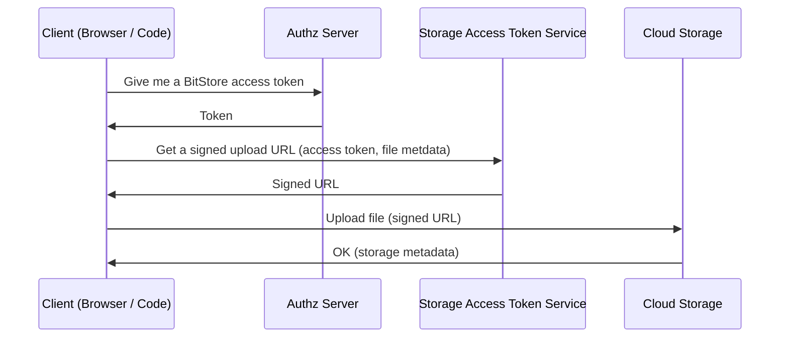
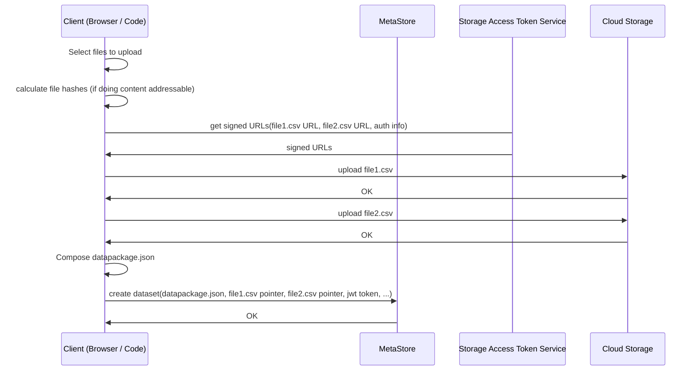

# Blob Storage

## Introduction

DMS and data portals often need to *store* data as well as metadata. As such, they require a system for doing this. This page focuses on Blob Storage aka Bulk or Raw storage (see [storage](/docs/dms/storage) page for an overview of all types of storage).

Blob storage is for storing "blobs" of data, that is a raw stream of bytes like files on a filesystem. For blob storage think local filesystem or cloud storage like S3, GCS, etc.

Blob Storage in a DMS can be provided via:

* Local file system: storing on disk or storage directly connected to the instance
* Cloud storage like S3, Google Cloud Storage, Azure storage etc

Today, cloud storage would be the default in most cases.

### Features

* Storage: Persistent, cost-efficient storage
* Download: Fast, reliable download (possibly even with support for edge distribution)
* Upload: reliable and rapid upload 
  * Direct upload to (cloud) storage by clients i.e. without going via the DMS. Why? Because cloud storage has many features that it would be costly replicate (e.g. multipart, resumable etc), excellent performance and reliability for upload. It also cuts out the middleman of the DMS backend thereby saving bandwidth, reducing load on the DMS backend and improving performance
  * Upload UI: having an excellent UI for doing upload. NB: this UI is considered part of the [publish feature](/docs/dms/publish)
* Cloud: integrate with cloud storage
* Permissions: restricting access to data stored in blob storage based on the permissions of the DMS. For example, if Joe does not have access to a dataset on the DMS he should not be able to access associated blob data in the storage system

## Flows

### Direct to Cloud Upload

Want: Direct upload to cloud storage ... But you need to authorize that ... So give them a token from your app

A sequence diagram illustrating the process for a direct to cloud upload:

Here's a more elaborate version showing storage of metadata into the MetaStore afterwards (and skipping the Authz service):

## CKAN 2 (Classic)

Blob Storage is known as the FileStore in CKAN v2 and below. The default is local disk storage.

There is support for cloud storage via a variety of extensions the most prominent of which is `ckanext-cloudstorage`: https://github.com/TkTech/ckanext-cloudstorage

There are a variety of issues:

* Cloud storage is not a first class citizen in CKAN: CKAN defaults to local file storage but cloud storage is the default in the world and has much better scalability, performance as well as integratability with cloud deployment
* The FileStore interface definition has a poor separation of concerns (for example, blob storage file paths is set in the FileStore component not in core CKAN) which makes it hard / hacky to extend and use for key use cases e.g. versioning.
* `ckanext-cloudstorage` (the default cloud storage extension) is ok but has many issues e.g.
  * No direct to cloud upload: it uses CKAN backend as a middleman so all data must go via ckan backend
  * Implements its own (sometimes unreliable) version of multipart upload (which means additional code which isn't as reliable as cloud storage providers interface)
  * No access to advanced features such as resumability etc

Generally, we at Datopian have seen a lot of issues around multipart / large file upload stability with clients and are still seeing issues when a lot of large files are uploaded via scripts. Fixing and refactoring code related to storage is very costly, and tends to result in client specific "hacks".

## CKAN v3

An approach to blob storage that leverages cloud blob storage directly (i.e. without having to upload and serve all files via the CKAN web server), unlocking the performance characteristics of the storage backend directly. It is designed with a microservice approach and supports direct to cloud uploads and downloads. The key components are listed in the next section. You can read more about the overall design approach in the [design section below](#Design).

It is backwards compatible with CKAN v2 and has been successfully deployed with CKAN v2.8 and v2.9.

**Status: Production.**

### Components

* [ckanext-blob-storage](https://github.com/datopian/ckanext-blob-storage) (formerly known as ckanext-external-storage)
  * Hooking CKAN to Giftless replacing resource storage
  * Depends on giftless-client and ckanext-authz-service
  * Doesn't implement IUploader - completely overrides upload / download routes for resources
* [Giftless](https://github.com/datopian/giftless) - Git LFS compatible implementation for storage with some extras on top. This hands out access tokens to store data in cloud storage.
  * Docs at https://giftless.datopian.com
  * Backends for Azure, Google Cloud Storage and local
  * Multipart support (on top of standard LFS protocol)
  * Accepts JWT tokens for authentication and authorization
* [ckanext-authz-service](https://github.com/datopian/ckanext-authz-service/) - This extension uses CKAN’s built-in authentication and authorization capabilities to: a) Generate JWT tokens and provide them via CKAN’s Web API to clients and b) Validate JWT tokens.
  * Allows hooking CKAN's authentication and authorization capabilities to generate signed JWT tokens, to integrate with external systems
  * Not specific for Giftless, but this is what it was built for
* [ckanext-asset-storage](https://github.com/datopian/ckanext-asset-storage) - this takes care of storing non-data assets e.g. organization images etc.
  * CKAN IUploader for assets (not resources!)
  * Pluggable backends - currently local and Azure
  * Much cleaner than older implementations (ckanext-cloudstorage etc.)

Clients:

* [giftless-client-py](https://github.com/datopian/giftless-client) - Python client for Git LFS and Giftless-specific features
  * Used by ckanext-blob-storage and other tools
* [giftless-client-js](https://github.com/datopian/giftless-client-js) - Javascript client for Git LFS and Giftless-specific features
  * Used by ckanext-blob-storage and other tools for creating uploaders in the UI

## Design

### Purpose

The goal of this project is to create a more **_flexible_** system for storing **_data files_** (AKA “resources”) for **_CKAN_ and _other implementations_** of a data portal so that CKAN can support versioning, large file upload (and great file upload UX), plug easily into cloud and local file storage backends and, in general, is easy to customize both for storage layer and for CKAN client code of that layer

### Features

* Do one thing and do it well: provide an API to store and retrieve files from storage, in a way that is pluggable into a micro-services based application and to existing CKAN (2.8 / 2.9)
* Does not force, and in fact is not aware of, a specific file naming logic (i.e. resource file names could be based on a user given name, a content hash, a revision ID or any mixture of these - it is up to the using system to decide)
* Does not force a specific storage backend; Should support Amazon S3, Azure Storage and local file storage in some way initially but in general backend should be pluggable
* Does not force a specific authentication scheme; Expects a signed JWT token, does not care who signed it and how the user got authenticated
* Does not force complex authorization scheme; Leave it to external system to do complex authorization if needed;
  * By default, the system can work in an “admin party” mode where all authenticated users have full access to all files. This will be “good enough” for many DMS implementations including CKAN.
  * Potentially, allow plugging in a more complex authorization logic that relies on JWT claims to perform granular authorization checks

### For Data Files (i.e. Blobs)

This system is about storing and providing access to blobs, or streams of bytes; It is not about providing access to the data stored within (i.e. it is not meant to replace CKAN’s datastore).

### For CKAN – whilst not necessarily CKAN Specific

While the system’s design should not be CKAN specific in any way, our current client needs require us to provide a CKAN extension that integrates with this system.

CKAN’s current IUploader interface has been identified to be too narrow to provide the functionality required by complex projects (resource versioning, direct cloud uploads and downloads, large file support and multipart support). While some of these needs could be and have been “hacked” through the IUploader interface, the implementations have been over complex and hard to debug.

Our goal should be to provide a CKAN extension that provides the following functionality directly:

* Uploading and downloading resource files directly from the client if supported by the storage backend
  *   Multipart upload support if supported by storage backend
  *   Handling of signed URLs for uploads and private downloads
  *   Client side code for handling multipart uploads
  *   TBD: If storage backend does not support direct uploads / downloads, fall back to …

In addition, this extension should provide an API for other extensions to do things like:

*   Set the file naming scheme (We need this for ckanext-versions)
*   Lower level file access, e.g. move and delete files. We may need this in the future to optimize storage and deduplicate files as proposed for ckanext-versions

In addition, this extension must “play nice” with common CKAN features such as the datastore extension and related datapusher / xloader extensions.

### Usable For other DMS implementations

There should be nothing in this system, except for the CKAN extension described above, that is specific to CKAN. That will allow to re-use and re-integrate this system as a micro-service in other DMS implementations such as ckan-ng and others.
In fact, the core part of this system should be a generic, abstract storage service with a light authorization layer. This could make it useful in a host of situations where storage micro-service is needed.

### High Level Principles

Common Principles

* Uploads and downloads directly from cloud provides to browser
* Signed uploads / downloads - for private / authorized only data access
* Support for AWS, Azure and potentially GCP storage
* Support for local (non cloud) storage, potentially through a system like [https://min.io/](https://min.io/)
* Multipart / large file upload support (a few GB in size should be supported for Gates)
* Not opinionated about file naming / paths; Allow users to set file locations under some pre-defined patchs / buckets
* Client side support - browser widgets / code for uploading and downloading files / multipart uploads directly to different backends
* Well-documented flow for using from API (not browser)
* Provided API for deleting and moving files
* Provided API for accessing storage-level metadata (e.g. file MD5) (do we need this could be useful for processes that do things like deduplicate storage)
* Provided API for managing storage-level object level settings (e.g. “Content-disposition” / “Content-type” headers, etc.)
* Authorization based on some kind of portable scheme (JWT)

CKAN integration specific (implemented as a CKAN extension)

* JWT generation based on current CKAN user permissions
* Client widgets integration (or CKAN specific widgets) in right places in CKAN templates
* Hook into resource upload / download / deletion controllers in CKAN
* API to allow other extensions to control storage level object metadata (headers, path)
* API to allow other extensions to hook into lifecycle events - upload completion, download request, deletion etc.

### Components

The Decoupled Storage solution should be split into several parts, with some parts being independent of others:

* [External] Cloud Storage service (or API similar if local file system) e.g. S3, GCS, Azure Storage, Min.io (for local file system)
* Cloud Storage Access Service
* [External] Permissions Service for granting general permission tokens that give access to Cloud Storage Access Service
  * JWT tokens can be generated by any party that has the right signing key. Thus, we can initially do without this if JWT signing is implemented as part of the CKAN extension
* Browser based Client for Cloud Storage (compatible with #1 and with different cloud vendors)
* CKAN extension that wraps the two parts above to provide a storage solution for CKAN

### Questions

* What is file structure in cloud ... i.e. What is the file path for uploaded files? Options:
  * Client chooses a name/path
  * Content addressable i.e. the name is given by the content? How? Use a hash.]
    * Beauty of that: standard way to name things. The same thing has the same name (modulo collisions)
    * Goes with versioning => same file = same name, diff file = diff name
* And do you enforce that from your app
  * Request for token needs to include the destination file path
