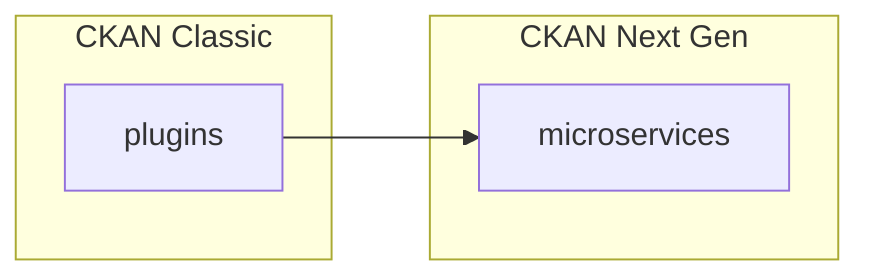
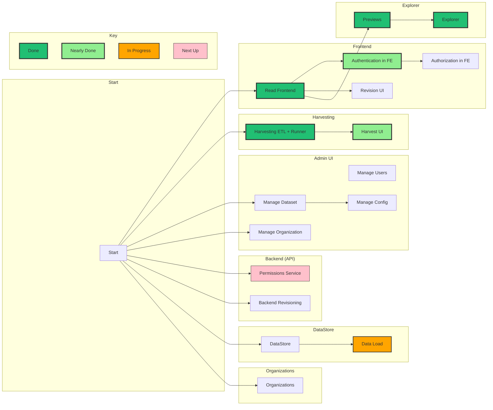
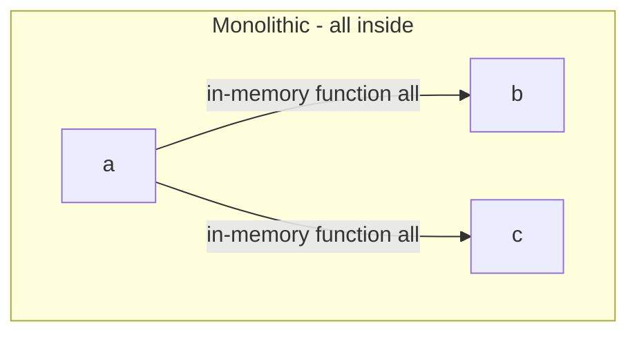
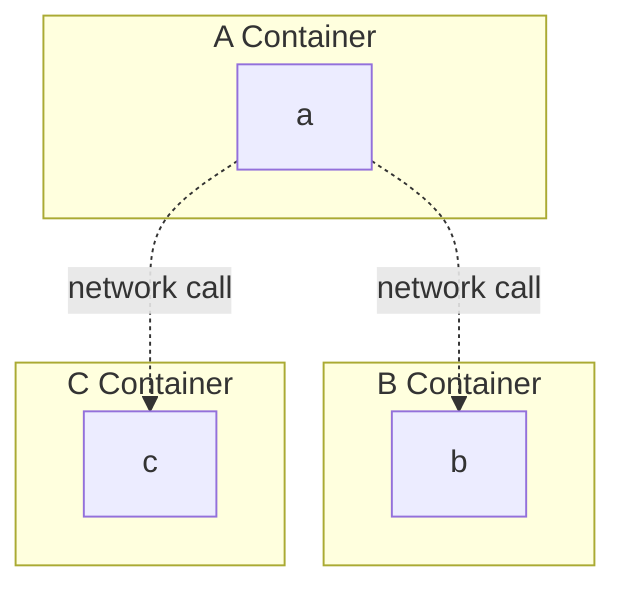

# Next Gen

“Next Gen” (NG) is our name for the evolution of CKAN from its current state as “CKAN Classic”.

Next Gen has a decoupled, microservice architecture in contrast to CKAN Classic's monolithic architecture. It is also built from the ground up on the Frictionless Data principles and specifications which provide a simple, well-defined and widely adopted set of core interfaces and tooling for managing data.

## Classic to Next Gen

CKAN classic: monolithic architecture -- everything is one big python application. Extension is done at code level and "compiled in" at compile/run-time (i.e. you end up with one big docker file).

CKAN Next Gen: decoupled, service-oriented -- services connected by network calls. Extension is done by adding new services,

You can read more about monolithic vs microservice architectures in the [Appendix below](#appendix-monolithic-vs-microservice-architecture).

## Next Gen lays the foundation for the future and brings major immediate benefits

Next Gen's new approach is important in several major ways.

### Microservices are the Future

First, decoupled microservices have become *the* way to design and deploy (web) applications after first being pioneered by the likes of Amazon in the early 2000s. And in the last five to ten years have brought microservices "for the masses" with relevant tooling and technology standardized, open-sourced and widely deployed -- not only with containerization such as Docker, Kubernetes but also in programming languages like (server-side) Javascript and Golang.

By adopting a microservice approach CKAN can reap the the benefits of what is becoming a mature and standard way to design and build (web) applications. This includes the immediate advantages of being aligned with the technical paradigm such as tooling and developer familiarity.

### Microservices bring Scalability, Reliability, Extensibility and Flexibility

In addition, and even more importantly, the microservices approach brings major benefits in:

1. **Scalability**: dramatically easier and cheaper to scale up -- and down -- in size *and* complexity. Size-wise this is because you can replicate individual services rather than the whole application. Complexity-wise this is because monolithic architectures tend to become "big" where service-oriented encourages smaller lightweight components with cleaner interfaces. This means you can have a much smaller core making it easier to install, setup and extend. It also means you can use what you need making solutions easier to maintain and upgrade.
2. **Reliability**: easier (and cheaper) to build highly reliable, high availability solutions because microservices make isolation and replication easier. For example, in a microservice architecture a problem in CKAN's harvester won't impact your main portal because they run in separate containers. Similarly, you can scale the harvester system separately from the web frontend.
3. **Extensibility**: much easier to create and maintain extensions because they are a decoupled service and interfaces are leaner and cleaner.
4. **Flexibility** aka "Bring your own tech": services can be written in any language so, for example, you can write your frontend in javascript and your backend in Python. In a monolithic architecture all parts must be written in the same language because everything is compiled together. This flexibility makes it easier to use the best tool for the job. It also makes it much easier for teams to collaborate and cooperate and fewer bottlenecks in development.

ASIDE: decoupled microservices reflect the "unix" way of building networked applications. As with the "unix way" in general, whilst this approach better -- and simpler -- in the long-run, in the short-run it often needs sustantial foundational work (those Unix authors were legends!). It may also be, at least initially, more resource intensive and more complex infrastructurally. Thus, whilst this approach is "better" it was not suprising that it was initially used for for complex and/or high end applications e.g. Amazon. This also explains why it took a while for this approach to get adoption -- it is only in the last few year that we have robust, lightweight, easy to use tooling and patterns for microservices -- "microservices for the masses" if you like.

In summary, the Next Gen approach provides an essential foundation for the continuing growth and evolution of CKAN as a platform for building world-class data portal and data management solutions.

## Evolution not Revolution: Next Gen Components Work with CKAN Classic

*Gradual evolution from CKAN classic (keep what is working, keep your investments, incremental change)*

Next Gen components are specifically designed to work with CKAN "Classic" in its current form. This means existing CKAN users can immediately benefit from Next Gen components and features whilst retaining the value of their existing investment. New (or existing) CKAN-based solutions can adopt a "hybrid" approach using components from both Classic and Next Gen. It also means that the owner of a CKAN-based solution can incrementally evolve from "Classic" to "Next Gen" by replacing one component one at a time, gaining new functionality without sacrificing existing work.

ASIDE: we're fortunate that CKAN Classic itself was ahead of its time in its level of "service-orientation". From the start, it had a very rich and robust API and it has continued to develop this with almost almost all functionality exposed via the API. It is this rich API and well factored design that makes it relatively straightforward to evolve CKAN in its current "Classic" form towards Next Gen.

## New Features plus Existing Functionality Improved

In addition to its architecture, Next Gen provides a variety of improvements and extensions to CKAN Classic's functionality. For example:

* Theming and Frontend Customization: theming and customizing CKAN's frontend has got radically easier and quicker. See [Frontend section &raquo;][frontend]
* DMS + CMS unified: integrate the full power of a modern CMS into your data portal and have one unified interface for data and content. See [Frontend section &raquo;][frontend]
* Data Explorer: the existing CKAN data preview/explorer has been completely rewritten in modern React-based Javascript (ReclineJS is now 7y old!). See [Data Explorer section &raquo;][explorer]
* Dashboards: build rich data-driven dashboards and integrate. See [Dashboards section &raquo;][dashboards]
* Harvesting: simpler, more powerful harvesting built on modern ETL. See [Harvesting section &raquo;][harvesting]

And each of these features is easily deployed into an existing CKAN solution!

[frontend]: /docs/dms/frontend
[explorer]: /docs/dms/data-explorer
[dashboards]: /docs/dms/dashboards
[harvesting]: /docs/dms/harvesting

## Roadmap

The journey to Next Gen from Classic can proceed step by step -- it does not need to be a big bang. Like refurbishing and extending a house, we can add a room here or renovate a room there whilst continuing to live happily in the building (and benefitting as our new bathroom comes online, or we get a new conservatory!).

Here's an overview of the journey to Next Gen and current implementation status. More granular information on particular features may sometimes be found on the individual feature page, for example for [Harvesting here](/docs/dms/harvesting#design).

## Appendix: Monolithic vs Microservice architecture

Monolithic: Libraries or modules communicate via function calls (inside one big application)

Microservices: Services communicate over a network

The best introduction and definition of microservices comes from Martin Fowler https://martinfowler.com/microservices/

> Microservice architectures will use libraries, but their primary way of componentizing their own software is by breaking down into services. We define libraries as components that are linked into a program and called using in-memory function calls, while services are out-of-process components who communicate with a mechanism such as a web service request, or remote procedure call. https://martinfowler.com/articles/microservices.html

### Monolithic

### Microservice

