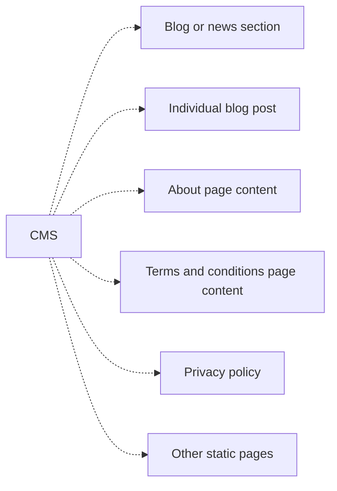

# Content Management System (CMS) for Data Portals

## Summary

When selecting a CMS solution for Data Portals, we always recommend using headless CMS solution as it provides full flexibility when building your system. Headless CMS means only content (no HTML, CSS, JS) is created in the CMS backend and delivered to Frontend via API.

> The traditional CMS approach to managing content put everything in one big bucket — content, images, HTML, CSS. This made it impossible to reuse the content because it was commingled with code. Read more - https://www.contentful.com/r/knowledgebase/what-is-headless-cms/.

## Features

Core features:

* Create and manage blog posts (or news), e.g., `/news/abcd`
* Create and manage static pages, e.g., `/about`, `/privacy` etc.

Important features:

* User management, e.g., ability to manage editors so that multiple users can edit content.
* User roles, e.g., ability to assign different roles for users so that we can have admins, editors, reviewers.
* Draft content, e.g., useful when working on content development for review/feedback loop. However, this is not essential if you have multiple environments.
* A syntax for writing content with text formatting, multi-level headings, links, images, videos, bullet points. For example, markdown.
* User-friendly interface (text editor) to write content.

## Options

Headless CMS options:

* WordPress (headless option)
* Drupal (headless option)
* TinaCMS - https://tina.io/
* Git-based CMS - custom soltion based on Git repository.
* Strapi - https://docs.strapi.io/developer-docs/latest/getting-started/introduction.html
* Ghost - https://ghost.org/docs/ 
* CKAN Pages (built-in CMS option) - https://github.com/ckan/ckanext-pages 

*Note, there are loads of CMS available both in open-source and proprietary software. We are only considering few of them in this article and our requirement is that we should be able to fetch content via API (headless CMS). Readers are welcome to add more options into the list.*

Comparison criteria:

* Self-hosting (note this isn't criteria for most of projects and using managed hosting is a better option sometimes)
* Free and open source
* Multi language posts (unnecessary if your portal is single language)

Comparison:

| Options  | Hosting  | Free     | Multi language |
| -------- | -------- | -------- | -------------- |
| Drupal   | Tedious  | Yes      | Not straigtforward|
| WordPress| Tedious  | Yes      | Terrible UX    |
| TinaCMS  | Medium   | Yes      | Limited        |
| Git-based| Easy     | Yes      | Custom         |
| Strapi   | Medium   | Yes      | Simple         |
| Ghost    | Medium   | Yes      | Simple         |
| CKAN Pages| Easy    | Yes      | ?              |

## Conclusion and recommendation

Final decision should be made based on the following items:

* How often editors will create content? E.g., daily, weekly, monthly, occasionally.
* How much content you already have and need to migrate?
* How many content editors you are planning to have? What are their technical expertise?
* Is there any specific requirements, e.g., you must host in your cloud?

By default, we would recommend considering options such as Strapi, TinaCMS and Git-based CMS. We can even start with simple CKAN's built-in Pages and only move to sophisticated CMS once it is required.