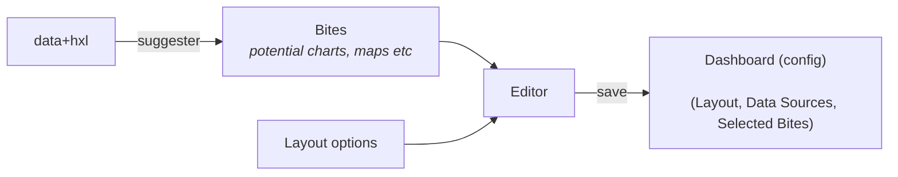
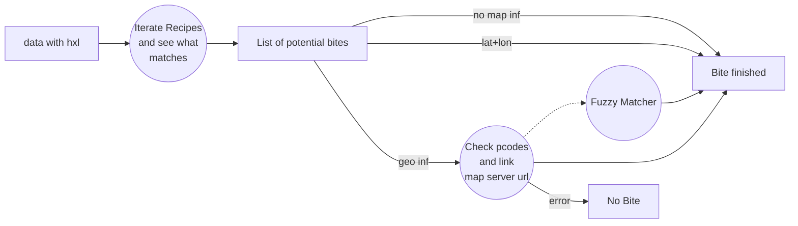
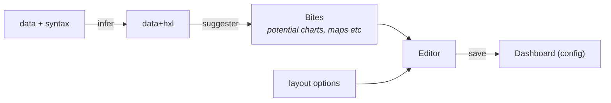
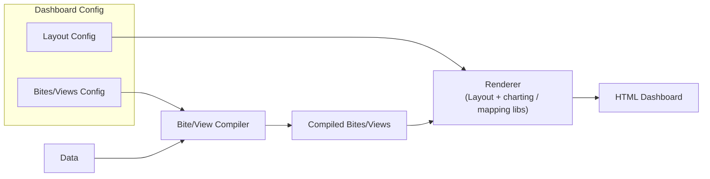

# HDX Technical Architecture for Quick Dashboards

Notes from analysis and discussion in 2018.

# Concepts

* Bite (View): a description of an individual chart / map / fact and its data (source)
  * bite (for Simon): title, desc, data (compiled), uniqueid, map join info
  * view (Data Package views): title, desc, data sources (on parent data package), transforms, ...
  * compiled view: title, desc, data (compiled)
* Data source:
  * Single HXL file (Currently, Simon's approach requires that all the data is in a single table so there is always a single data source.)
  * Data Package(s)
* Creator / Editor: creating and editing the dashboard (given the source datasets)
* Renderer: given dashboard config render the dashboard 

# Dashboard Creator




## Bite generation



## Extending to non-HXL data

It is easy to extend this to non-HXL data by using base HXL types and inference e.g. 

```
date            => #date
geo             => #geo+lon
geo             => #geo+lat
string/category => #indicator
```



# Dashboard Renderer

Rendering the dashboard involves:




## Compiled View generation

See https://docs.datahub.io/developers/views/


----

# Architecture Proposal

* data loader library
  * File: rows, fields (rows, columns)
* type inference (?)
  * syntax: table schema infer
  * semantics (not now)
* data transform library (include hxl support)
* suggester library
* renderer library

Interfaces / Objects

* File
* (Dataset)
* Transform
* Algorithm / Recipe
* Bite / View
* Ordered Set of Bites
* Dashboard

## File (and Dataset)

http://okfnlabs.org/blog/2018/02/15/design-pattern-for-a-core-data-library.html

https://github.com/datahq/data.js

File
  rows
  descriptor
    schema
  schema

## Recipe

```json=
{
  'id':'chart0001',
  'type':'chart',
  'subType':'row',
  'ingredients':[{'name':'what','tags':['#activity-code-id','#sector']}],
  'criteria':['what > 4', 'what < 11'],
  'variables': ['what', 'count()'],
  'chart':'',
  'title':'Count of {1}',
'priority': 8,
}
```

## Bite / Compiled View

```json=
{  
  bite: array [...data for chart...],  
  id: string "...chart bite ID...",  
  priority: number,  
  subtype: string "...bite subtype - row, pie...",  
  title: string "...title of bite...",  
  type: string "...bite type...",  
  uniqueID: string "...unique ID combining bite and data structure",  
}  
```

=>


## Dashboard

```json=
{
  "title":"",
  "subtext":"",
  "filtersOn":true,
  "filters":[],
  "headlinefigures":0,
  "headlinefigurecharts":[
  ],
  "grid":"grid5",
  "charts":[				
    {
      "data":"https://proxy.hxlstandard.org/data.json?filter01=append&append-dataset01-01=https%3A%2F%2Fdocs.google.com%2Fspreadsheets%2Fd%2F1FLLwP6nxERjo1xLygV7dn7DVQwQf0_5tIdzrX31HjBA%2Fedit%23gid%3D0&filter02=select&select-query02-01=%23status%3DFunctional&url=https%3A%2F%2Fdocs.google.com%2Fspreadsheets%2Fd%2F1R9zfMTk7SQB8VoEp4XK0xAWtlsQcHgEvYiswZsj9YA4%2Fedit%23gid%3D0",
      "chartID":""
    },      
    {
      "data":"https://proxy.hxlstandard.org/data.json?filter01=append&append-dataset01-01=https%3A%2F%2Fdocs.google.com%2Fspreadsheets%2Fd%2F1FLLwP6nxERjo1xLygV7dn7DVQwQf0_5tIdzrX31HjBA%2Fedit%23gid%3D0&filter02=select&select-query02-01=%23status%3DFunctional&url=https%3A%2F%2Fdocs.google.com%2Fspreadsheets%2Fd%2F1R9zfMTk7SQB8VoEp4XK0xAWtlsQcHgEvYiswZsj9YA4%2Fedit%23gid%3D0",
      "chartID":""
    }
  ]
}
```

```
var config = {
  layout: 2x2 // in city-indicators dashboard is handcrafted in layout
  widgets: [
    {
      elementId / data-id: ...
      view: {
        metadata: { title, sources: "World Bank"}
        resources: rule for creating compiled list of resources. [ { datasetId: ..., resourceId: ..., transform: ...} ]
        specType: 
        viewspec: 
      }
    },
    {
    
    },
  ]
  datasets: [
    list of data package urls ...
  ]
}
```

Simon's example

https://simonbjohnson.github.io/hdx-iom-dtm/

```javascript=
{
   // metadata for dashboard
  "title":"IOM DTM Example",
  "subtext":" ....",
  "headlinefigures": 3,
  "grid": "grid5", // user chosen layout for dashboard. Choice of 10 grids
  "headlinefigurecharts": [ //widgets - headline widget
    {
      "data": "https://beta.proxy.hxlstandard.org/data/1d0a79/download/africa-dtm-baseline-assessments-topline.csv",
      "chartID": "text0013/#country+name/1" // bite Id
      // elementId: ... // implicit from order in grid ...
    },
    {
      "data": "https://beta.proxy.hxlstandard.org/data/1d0a79/download/africa-dtm-baseline-assessments-topline.csv",
      "chartID": "text0012/#affected+hh+idps/5"
    },
    {
      "data": "https://beta.proxy.hxlstandard.org/data/1d0a79/download/africa-dtm-baseline-assessments-topline.csv",
      "chartID":"text0012/#affected+idps+ind/6"
    }
  ],
  "charts": [	// chart widgets			
    {
      "data": "https://beta.proxy.hxlstandard.org/data/1d0a79/download/africa-dtm-baseline-assessments-topline.csv",
      "chartID": "map0002/#adm1+code/4/#affected+idps+ind/6",
      "scale":"log"  // chart config ... 
    },
    {
      "data": "https://beta.proxy.hxlstandard.org/data/1d0a79/download/africa-dtm-baseline-assessments-topline.csv",
      "chartID": "chart0009/#country+name/1/#affected+idps+ind/6",
      "sort":"descending"
    }
  ]
}
```

Algorithm

1. Extract the data references to a common list of datasets and fetch them
2. You generate compiled data via hxl.js plus own code transforming to final data for charting etc
  
    ```
    function transformChart(rawSourceData (csv parsed), bite) => [ [ ...], [...]] - data for chart
      
      hxl.js
      custom code
      
    function transformMap
    
    function transformText ...
    ```
    
    
    https://github.com/SimonbJohnson/hxlbites.js

    https://github.com/SimonbJohnson/hxlbites.js/blob/master/hxlBites.js#L957

    ```
    hb.reverse(bite) => compiled bite (see above) (data, chartConfig)
    ```

3. generate dashboard html and compute element ids in actual page element ids computed from grid setup
4. Now have a final dashboard config


    ```
    widgets: [
      {
        data: [ [...], [...]]
        widgetType: text, chart, map ...
        elementId: // element to bind to ... 
      }
    ]
    ```
5. Now use specific renderer libraries e.g. leaflet, plotly/chartist etc to render out into page

    https://github.com/SimonbJohnson/hxldash/blob/master/js/site.js#L294

### Notes

"Source" version of dashboard with data uncompiled.

Compiled version of dashboard with final data inline ... 

hxl.js takes an array of arrays ... and outputs array of arrays ... 

```
{
  schema: [...]
  data: [...]
}
```

# Renderer

* Renderer for the dashboard
* Renderer for each widget


```
function createChart(bite, elementId) => svg in bite
```

## Charts

* Data Package View => svg/png etc 
  * plotly
  * vega (d3)
  * https://github.com/frictionlessdata/datapackage-render-js
* chartist
* react-charts

## Map

* Leaflet
* react-leaflet

## Tables

...


