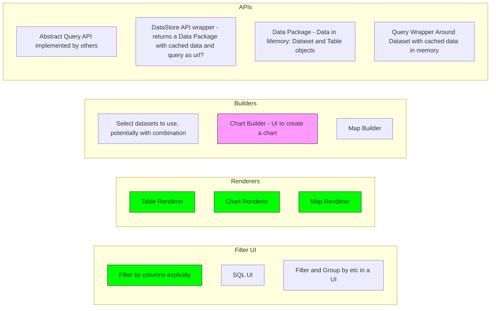
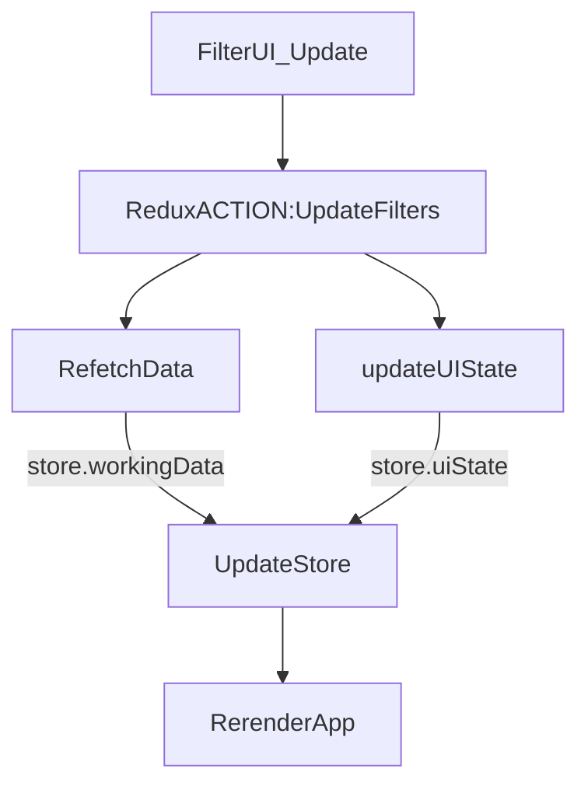

# Data Explorer Design

>[!note]
Design sketches from Aug 2019. This remains a work in progress though a good part was implemented in the new [Data Explorer](/docs/dms/data-explorer).

## Job Stories

[Preview] As a Data Consumer I want to have a sense of what data there is in a dataset's resources before I download it (or download an individual resource) so that I don't waste my time and get interested

[Preview] As a Data Consumer I want to view (the most important contents) of a resource without downloading it and opening it so i save time (and don't have to get specialist tools)

[Preview - with tweaks] As a Data Consumer I want to be able to display tabular data with geo info on a map so that I can see it in an easily comprehensible way 

[Explorer] As a Viewer I want to explore (filter, facet?) a dataset so I can find the data i'm looking for ... 

[Explorer - map] As a viewer i want to filt4er down the data i dispaly on the map so that I can see the data i want

[Map / Dash Creator] As a Publisher i want to create a custom map or dashboard so that I can display my data to viewers powerfully

[View the data] As a User, I want to see my city related data (eg, crime, road accidents) on the map so that:
  * I can easily understand which area is safe for me.
  * I can evaluate different neighbourhoods when planning a move.

As a User from city council, I want to see my city related data (eg, traffic) on the map so that I can take better actions to improve the city (make it safe for citizens).

> is this self-service created, a custom map made by publisher, an auto-generated map (e.g. preview)

[Data Explorer] As a Power User I want to do SQL queries on the datastore so that I can dsiplay / download the results and get insight without having to download into my own tool and do that wrangling 

## Architecture



Filter UI updates Redux Store using a one-way data binding as the ONLY way to modify application state or component state (except internal state of components as needed):




## Interfaces to define

```
dataset => data package
query[Query - source data package + cached data + filter state]
workingdataset[Working Dataset in Memory]
chartconfig[]
mapconfig[]
```

### Redux store / top level state

```javascript=
queryuistate: {
  // url / data package rarely changes during lifetime of explorer usually
  url: datastore url / or an original data package
  filters: ...
  sqlstatement: 
}
// list of datasets / resources we are working with ...
datasets/resources: [

]
layout: [
  // this is the switcher layout where you only see one widget at a time 
  layouttype: chooser; // chooserr aka singleton, stacked, custom ... 
  views: [list of views in their order]
] 
views: [
  {
    type:
    resource:
    char
  }
]
```

## Research

### Our One


### Redash


### Metabase

https://github.com/metabase/metabase


### CKAN Classic


### Rufus' Data Explorer (2014)


