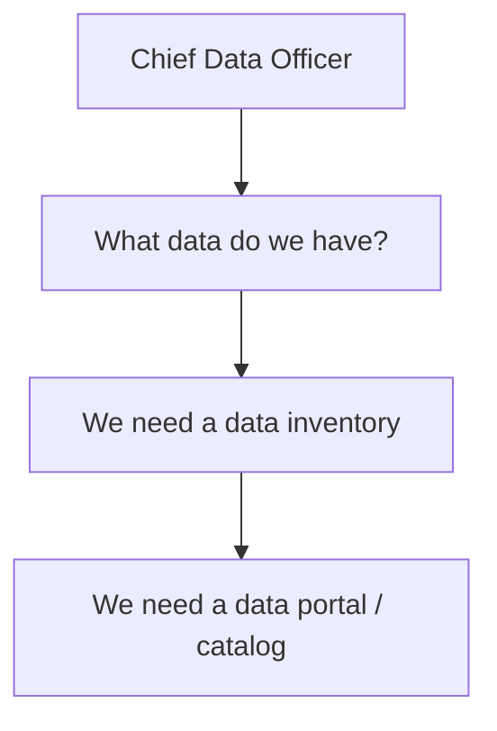
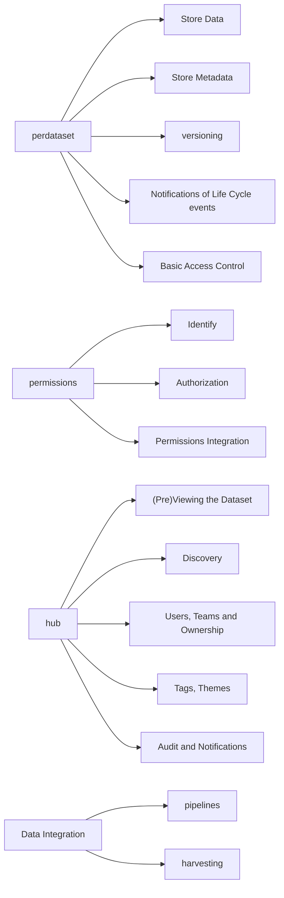
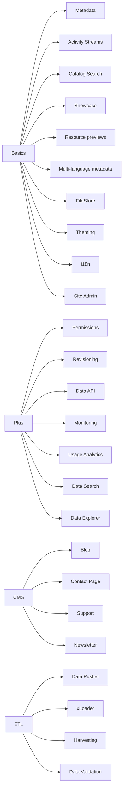

# Data Portals

> *Data Portals have become essential tools in unlocking the value of data for organizations and enterprises ranging from the US government to Fortune 500 pharma companies, from non-profits to startups. They provide a convenient point of truth for discovery and use of an organization's data assets. Read on to find out more.*

## Introduction: Data Portals are Gateways to Data

A Data Portal is a gateway to data. That gateway can be big or small, open or restricted. For example, data.gov is open to everyone, whilst an enterprise "intra" data portal is restricted to that enterprise (and perhaps even to certain people within it).

A Data Portal's core purpose is to enable the rapid discovery and use of data. However, as a flexible, central point of truth on an organizations data assets, a Data Portal can become essential data infrastructure and be extended or integrated to provide many additional features:

* Data storage and APIs
* Data visualization and exploration
* Data validation and schemas
* Orchestration and integration of data
* Data Lake coordination and organization

The rise of Data Portals reflect the rapid growth in the volume and variety of data that organizations hold and use. With so much data available internally (and externally) it is hard for users to discover and access the data they need. And with so many potential users and use-cases it is hard to anticipate what data will be needed, when.

Concretely: how does Jane in the new data science team know that Geoff in accounting has the spreadsheet she needs for her analysis for the COO? Moreover, it is not enough just to have a dataset's location: if users are easily to discover and access data it has to be suitably organized and presented.

Data portals answer this need: by making it easy to find and access data, a data portal helps solve these problems. As a result, data portals have become essential tools for organizations to bring order to the "data swamp" and unlock the value of their data assets.[^1]

[^1]: The nature of the problem that Data Portals solve (i.e. bringing order to diverse, distributed data assets) explains why data portals first arose in Government and as *open* data portals. Government had lots of useful data, much of it shareable, but poorly organized and strewn all over the place. In addition, much of the value of that data lay in unexpected or unforeseen uses. Thus, Data Portals in their modern form started in Government in the mid-late 2000s. They then spread into large companies and then with the spread of data into all kinds of organizations big and small.

## Why Data Portals?

### Data Variety and Volume have Grown Enormously

The volume and variety of data available has grown enormously. Today, even small organizations have dozens of data assets ranging from spreadsheets in their cloud drive to web analytics. Meanwhile, large organizations can have an enormous -- and bewildering -- amount and variety of data ranging from Hadoop clusters and data warehouses to CRM systems plus, of course, plenty of internal spreadsheets, databases etc.

In addition to this diversity of *supply* there has been a huge growth in the potential and diversity of *demand* in the form of users and use cases. Self-service business intelligence, machine learning and even tools like google spreadsheets have democratized and expanded the range of users. Meanwhile, data is no longer limited to a single purpose: much of the *new* value for data for enterprises comes from unexpected or unplanned uses and from combining data across divisions and systems.

### This Creates a Challenge: Getting Lost in Data

As organizations seek to reap the benefits of this data cornucopia they face a problem: with so much data around its easy to get lost -- or even just not know that data even exists. And, as supply and demand have expanded and diversified it has got both harder and more important to match them up.

The addition of data integration and data engineering can actually makes this problem even worse -- do we need to create this new dataset X from Y and Z or do we already have that somewhere? And how can people find X once we have created it? Is X a finished a dataset that people can rely on or is it a one-off. Even if a one-off do we want to record that we created this kind of dataset so we can create it again in the future if we need it?[^lakes]

### Data Portals are a Platform that Connect Supply and Demand for Data

By making it easy to find and access data, a data portal helps address all these problems. As a platform it connects creators and users of data in a single place. As a single source of base metadata it provides essential infrastructure for data integration. By acting as a central repository of data it enables new forms of publication and sharing. Data Portals therefore play a central role in unlocking the value of data for organizations.

[^lakes]: Ditto for data lakes: the growth of data lakes have made data portals (and metadata management) even more important because without them your data lake quickly turns into a data swamp where data is hard to locate and even if found lacks esssential metadata and structure that would make make it usable.

### Data Portals as the First Step in an Agile Data Strategy

Data portals also play an initial, concrete step in data engineering / data strategy. Suppose you are a newly arrived CDO.

The first questions you will be asking are things like: what data do we have, where is it, what state is it in? (And secondarily, what data use cases do we have? Who has them? Do they match against the data we have?).

This immediately leads to a need do a data inventory. And for a data inventory you need a tool to hold the results (and structure this) = a data portal.

Even in more sophisticated situations, a data portal is a great place to start. Suppose you are a newly arrived CDO at an organization with an existing data lake and a rich set of data integration and data analytics workflows.

There is a good chance your data lake is rapidly becoming a data swamp and there is nothing to track dependencies and connections in those data and analytics pipelines. Again a simple data portal is a great place to start in bringing some order to this: lightweight, vendor-independent and (if you choose CKAN) open source infrastructure that gives you a simple solution for collecting and tracking metadata across datasets and data workflows.

### Summary: Data Portals make Data Discoverable and Accessible and provide a Foundation for Integration

In summary, Data Portals deliver value in three distinct, interlocking and incremental ways by:

* Making data discoverable: ranging from Excel files to Hadoop clusters. The portal does this by providing the infrastructure *and* process for reliable, cross-system metadata management and access (via humans *and* machines)
* Make data accessible: whether its an Excel file or a database cluster, the portal's combination of common metadata, data showcases and data APIs make data easily and quickly accessible to technical and non-technical users. Data can now be previewed and even explored in one location prior to use.
* Making data reliable and integrable: as central store of metadata and data access points, the data portal can be naturally used as a starting point for enriching data with data dictionaries (what does column `custid` mean?), data mappings (this column in this data file is a customer ID and the customer master data is in this other dataset there), and data validation (does this column of dates contain valid dates, are some of them out of range?)

In addition, in terms of proper data infrastructure and data engineering, a Data Portal provides both initial starting point, simple scaffolding and a solid foundation. It is an organizing point and rosetta stone for data discovery and metadata.

* TODO: this really links into the story of how to start doing data engineering / building a data lake / doing agile data etc etc
* For example, suppose you want to do some non-trivial business intelligence. You'll need a list of the datasets you'll need -- maybe sales, plus analytics, plus some public economic data. Where are you going to track those datasets? Where are you going to track the resulting datasets you produce?
* For example, suppose your data engineering team are building out data pipelines. These pipelines pull in a variety of datasets, integrate and transform them and then save the results. How are they going to track what datasets they are using and what they have produced? They are going to need a catalog. Rather than inventing their own (the classic "json file in git or spreadsheet in google docs etc" you want them to use a proper catalog (or integrate with your existing one).
* Using an open source service-oriented data portal framework like CKAN you can rapidly integrate and scale out your data orchestration. It provides a "small pieces, loosely joined" approach to developing your data infrastructure starting from the basics: what datasets do you have, what datasets do you want to create?

## What does a Data Portal do?

### A Data Portal provides a Catalog

In its most basic essence, a Data Portal is a catalog of datasets. Even here there are degrees: at its simplest a catalog is just a list of dataset names and links; whilst more sophisticated catalogs will have elaborate metadata on each dataset.

### And Much More ...

Along with the essential basic catalog features, modern portals now incorporate an extensive range of functionality for organizing, structuring and presenting data including:

* **Publication workflow and metadata management**: rich editing interfaces and workflows (for example, approval steps), bulk editing of metadata etc
* **Showcasing and presentation of datasets** extending to interactive exploration. For example, if a dataset contains an Excel file, in addition to linking to that file the portal will also display the contents in a table, allow users to create visualizations, and even to search and explore the data
* **Data storage and APIs**: as well as cataloging metadata and linking to data stored elsewhere, data portals can also store data. Building off this, data portals can provide "data APIs" to the underlying data to complement direct access and download. These APIs make it much quicker and easier for users to build their own rich applications and analytics workflows.
* **Permissions**: fine-grained permissions to control access to data and related materials.
* **Data ingest and transformation:** ETL style functionality e.g. for bulk harvesting metadata, or preparing or excerpting data for presentation (for example, loading data to power data APIs)

Moreover, as a flexible, central point of truth on an organizations data assets a Data Portal can become the foundations for broader data infrastructure and data management, for example:

* Orchestration of data integration: as a central repository of metadata, data portals are perfectly placed to integrate with wider data engineering and ETL workflows
* Data quality and provenance tracking
* Data Lake coordination and organization

## What are the main features of a Data Portal?

Focus on "functional" features vs technical features.

E.g. each technical feature may require one or more of these technical features:

* Storage
* API
* Frontend
* Admin UI (WebUI, possibly CLI, Mobile etc)

### High Level Overview

### Coggle Detailed Overview

https://coggle.it/diagram/Xiw2ZmYss-ddJVuK/t/data-portal-feature-breakdown

<iframe width='853' height='480' src='https://embed.coggle.it/diagram/Xiw2ZmYss-ddJVuK/b24d6f959c3718688fed2a5883f47d33f9bcff1478a0f3faf9e36961ac0b862f' frameborder='0' allowfullscreen></iframe>

### Detailed Feature Breakdown

* Theming - customizing the look and feel of the portal
  * i18n
* CMS - e.g., news/ideas/about/docs. Learn about CMS options - [CMS](/docs/dms/data-portals/cms).
  * Blog
  * Contact page?
  * Help / Support / Chat
  * Newsletter
* DMS Basic - Catalog: manage/catalog multiple formats of data
  * Activity Streams
  * Data Showcase (aka Dataset view page) - 
    * Resource previews
  * Metadata creation and managemet
    * Multi-language metadata 
  * Data import and storage
    * Storing data
  * Data Catalog searching
  * Data searching
  * Multiple Formats of data
  * Tagging and Grouping of Datasets
  * Organization as publishers and teams
* DMS Plus
  * Permissions: identity, authentication, accounts and authorization (including "teams/groups/orgs")
  * Revisioning of data and metadata
  * DataStore and Data API: ....
  * Monitoring: who is doing what, audit log etc
  * Usage Analytics: e.g. number of views, amount of downloads, recent activity
* ETL: automated metadata and data import and processing (e.g. to data store), data transformation ...
  * Harvesting: metadata and data harvesting
  * DataPusher
  * xLoader
* (Data) Explorer: Visualizations and Dashboards

Data Validation

DevOps

* CKAN Cloud: multi-instance deployment and management
* Backups / Disaster recovery

Not sure they merit an item ...

* Cross Platform
* Data Sharing: A place to store data, with a permanent link to share to the public.
* Discussions
* RSS
* Multi-file download

## CKAN the Data Portal Software

CKAN is the leading data portal software.

It is both usable out of the box and can also be utilized as a powerful framework for creating tailored solutions.

CKAN's combintation of open source codebase and enterprise support make it uniquely attractive for organizations looking to build customized, enterprise-grade solutions.

## Appendix

TODO: From Data Portal to DataHub (or Data Management System).

### Is a Data Catalog the same as a Data Portal? (Yes)

Is a data catalog the same as a data portal? Yes. Data Portals are the evolution of data catalogs. 

Data Portals were originally called a variety of names including "Data Catalog". As catalogs grew in features they have evolved into a full portal.

### Open Data Portals and Internal Data Portals.

Many initial data portals were "open" or public: that is anyone could access them -- and the data they listed. This reflected the fact that these data portals were set up by governments seeking to maximize the value of their data by sharing it as widely as possible.

However, there is no reason a data portal need be "open". In fact, data portals internal to an enterprise are usually restricted to the organization or even specific teams within the enterprise.
