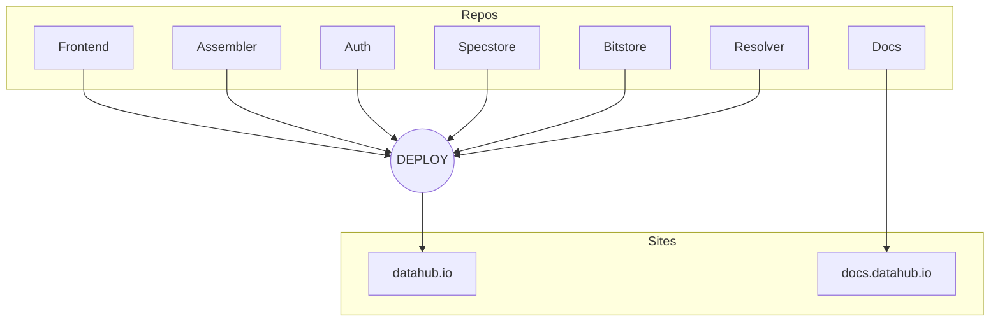

# Developers

This section of the DataHub documentation is for developers. Here you can learn about the design of the platform and how to get DataHub running locally or on your own servers, and the process for contributing enhancements and bug fixes to the code.

## Internal docs

* [API](/docs/dms/datahub/developers/api)
* [Deploy](/docs/dms/datahub/developers/deploy)
* [Platform](/docs/dms/datahub/developers/platform)
* [Publish](/docs/dms/datahub/developers/publish)
* [User Stories](/docs/dms/datahub/developers/user-stories)
* [Views Research](/docs/dms/datahub/developers/views-research)
* [Views](/docs/dms/datahub/developers/views)

## Repositories

We use following GitHub repositories for DataHub platform:

* [DEPLOY][deploy] - Automated deployment
* [FRONTEND][frontend] - Frontend application in node.js
* [ASSEMBLER][assembler] - Data assembly line
* [AUTH][auth] - A generic OAuth2 authentication service and user permission manager.
* [SPECSTORE][specstore] - API server for managing a Source Spec Registry
* [BITSTORE][bitstore] - A microservice for storing blobs i.e. files.
* [RESOLVER][resolver] - A microservice for resolving datapackage URLs into more human readable ones

* [DOCS][docs] - Documentations

[deploy]: https://github.com/datahq/deploy
[frontend]: https://github.com/datahq/frontend
[assembler]: https://github.com/datahq/assembler
[auth]: https://github.com/datahq/auth
[specstore]: https://github.com/datahq/specstore
[bitstore]: https://github.com/datahq/bitstore
[resolver]: https://github.com/datahq/resolver
[docs]: https://github.com/datahq/docs

## Install

We use several different services to run our platform, please follow the installation instructions here:

* [Install Assembler](https://github.com/datahq/assembler#assembler)

* [Install Auth](https://github.com/datahq/auth#datahq-auth-service)

* [Install Specstore](https://github.com/datahq/specstore#datahq-spec-store)

* [Install Bitstore](https://github.com/datahq/bitstore#quick-start)

* [Install DataHub-CLI](https://github.com/datahq/datahub-cli#usage)

* [Install Resolver](https://github.com/datahq/resolver#quick-start)

## Deploy

For deployment of the application in a production environment, please see [the deploy page][deploydocs].

[deploydocs]: /docs/dms/deploy

## DataHub CLI

The DataHub CLI is a Node JS lib and command line interface to interact with an DataHub instance.

[CLI code](https://github.com/datahq/datahub-cli)
