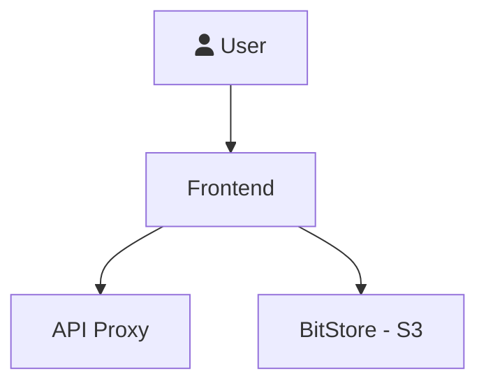
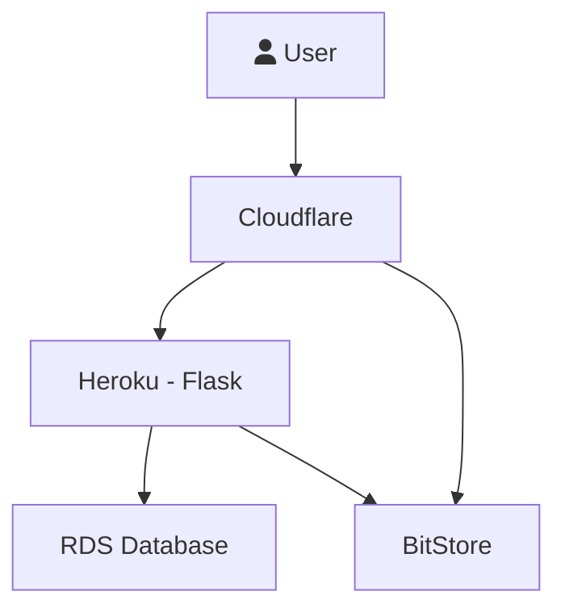
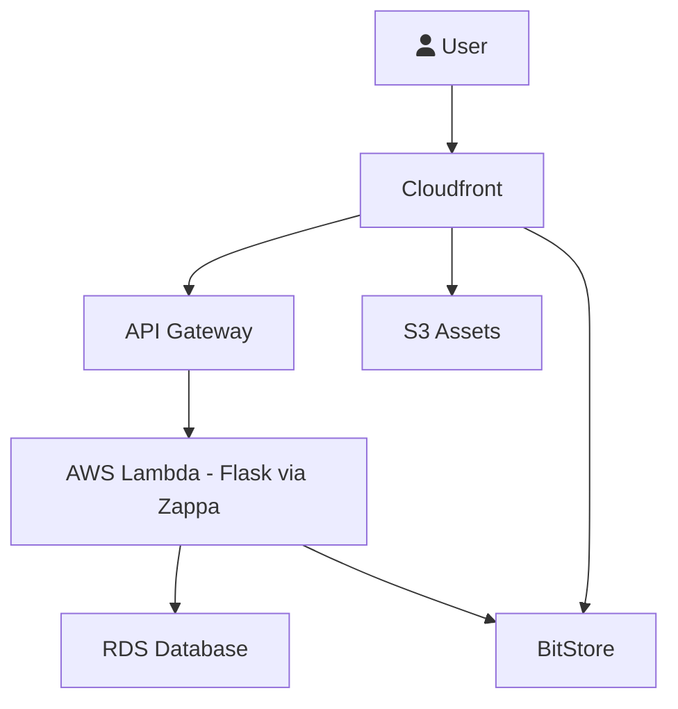

## DevOps - Production Deployment

We use various cloud services for the platform, for example AWS S3 for storing data and metadata, and the application runs on Docker Cloud.

We have fully automated the deployment of the platform including the setup of all necessary services so that it is one command to deploy. Code and instructions here:

https://github.com/datahq/deploy

Below we provide a conceptual outline.

### Outline - Conceptually



### New Structure

This diagram shows the current deployment architecture.

```mermaid
graph LR

cloudflare --> haproxy

haproxy --> frontend

subgraph auth
  postgres
  authapp
end

subgraph rawstore
  rawobjstore
  rawapp
end

subgraph pkgstore
  pkgobjstore
  pkgapp
end

subgraph metastore
  elasticsearch
  metastore
end

haproxy --/auth--> authapp
haproxy --/rawstore--> rawapp

haproxy --> pkgapp
haproxy --/metastore--> metastore
```

### Old Structures

#### Heroku



#### AWS Lambda - Flask via Zappa

We are no longer using AWS and Heroku in this way. However, we have kept this for historical purposes and in case we return to any of them.


