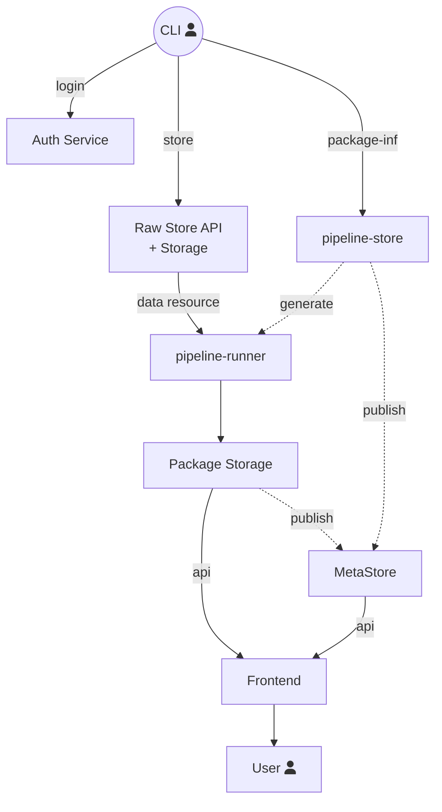
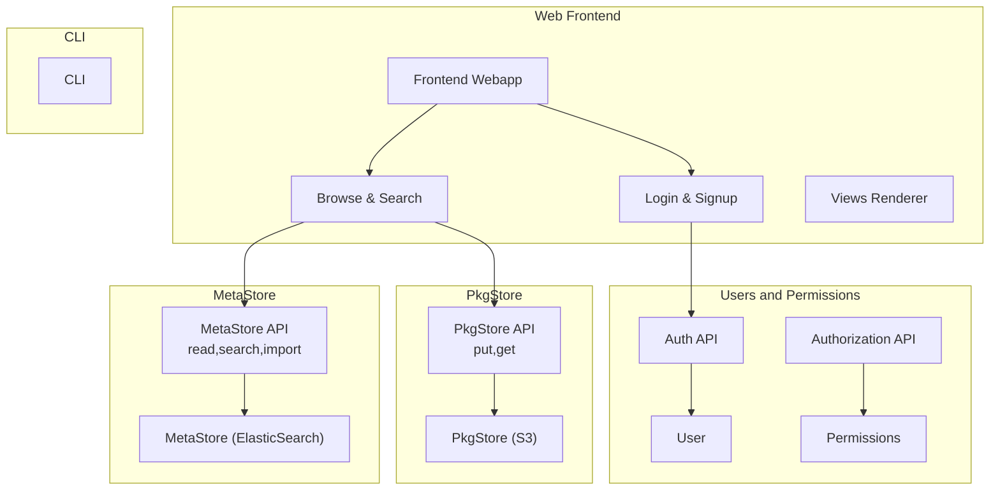
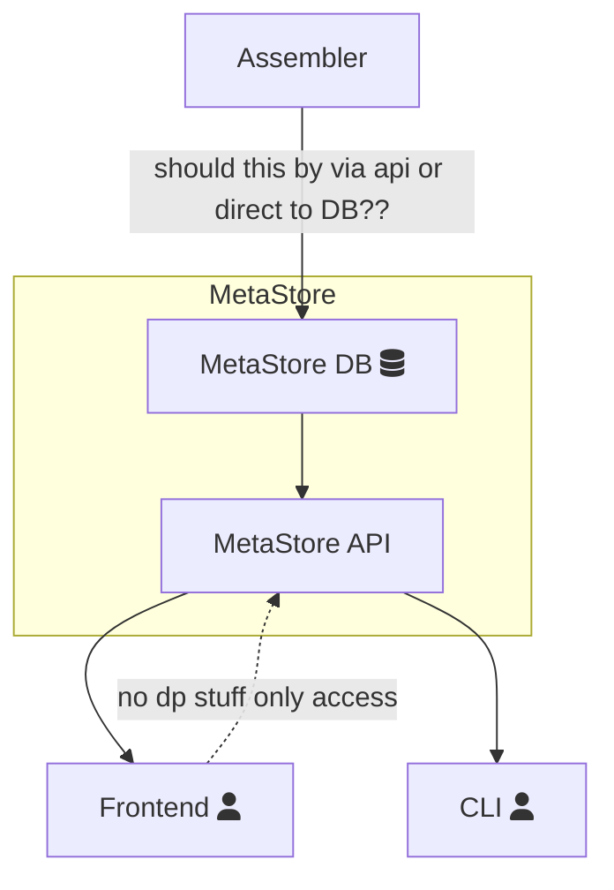
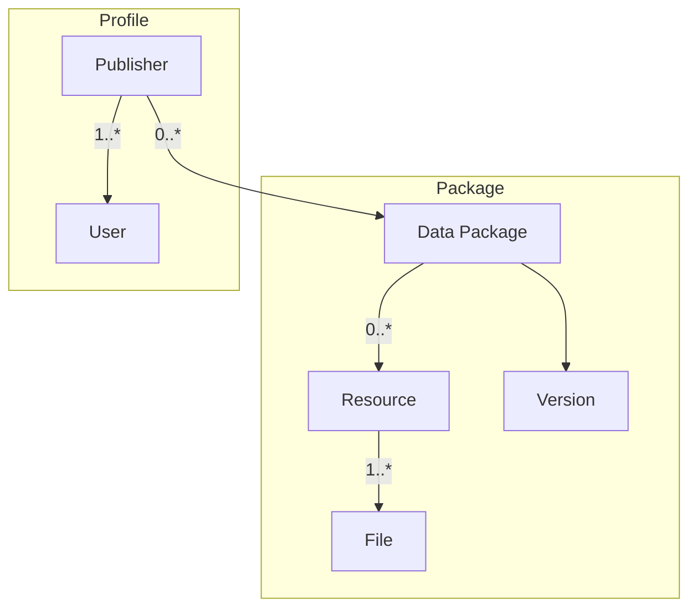

# Platform

The DataHub platform follows a service oriented architecture. It is built from a set of loosely coupled components, each performing distinct functions related to the platform as a whole.

## Architecture

<p style={{textAlign: "center"}}>Fig 1: Data Flow through the system</p>



<p style={{"textAlign": "center"}}>Fig 2: Components Perspective - from the Frontend</p>



## Information Architecture

```
datahub.io            # frontend
api.datahub.io        # API - see API page for structure
rawstore.datahub.io   # rawstore - raw bitstore
pkgstore.datahub.io   # pkgstore - package bitstore
```

## Components

### Frontend Web Application

Core part of platform - Login & Sign-Up and Browse & Search Datasets

https://github.com/datahq/frontend

#### Views and Renderer

JS Library responsible for visualization and views.

See [views][] section for more about Views.

### Assembler

TODO

### Raw Storage

We first save all raw files before sending to pipeline-runner.
**Pipeline-runner** is a service that runs the data package pipelines. It is used to normalise and modify the data before it is displayed publicly

- We use AWS S3 instance for storing data

### Package Storage

We store files after passing pipeline-runner

- We use AWS S3 instance for storing data

### BitStore

We are preserving the data byte by byte.

- We use AWS S3 instance for storing data

### MetaStore

The MetaStore provides an integrated, searchable view over key metadata for end user services and users. Initially this metadata will just be metadata on datasets in the Package Store. In future it may expand to provide a unified to include other related metadata such as pipelines. It also includes summary metadata (or the ability to compute summary data) e.g. the total size of all your packages

#### Service architecture



### Command Line Interface

The command line interface.

https://github.com/datahq/datahub-cli

[views]: /docs/dms/views
[web-app]: http://datahub.io/

## Domain model

There are two main concepts to understand in DataHub domain model - [Profile](#profile) and [Package](#data-package)



### Profile

Set of an authenticated and authorized entities like publishers and users. They are responsible for publishing, deleting or maintaining data on platform.

**Important:** Users do not have Data Packages, Publishers do. Users are *members* of Publishers.

#### Publisher

Publisher is an organization which "owns" Data Packages. Publisher may have zero or more Data Packages. Publisher may also have one or more user.

#### User

User is an authenticated entity, that is member of Publisher organization, that can read, edit, create or delete data packages depending on their permissions.

#### Package

A Data Package is a simple way of “packaging” up and describing data so that it can be easily shared and used. You can imagine as collection of data and and it's meta-data ([datapackage.json][datapackage.json]), usually covering some concrete topic Eg: *"Gold Prices"* or *"Population Growth Rate In My country"* etc.

Each Data Package may have zero or more resources and one or more versions.

**Resources** - think like "tables" - Each can map to one or more physical files (usually just one). Think of a data table split into multiple CSV files on disk.

**Version of a Data Package** - similar to git commits and tags. People can mean different things by a "Version":

* Tag - Same as label or version - a nice human usable label e.g. *"v0.3"*, *"master"*, *"2013"*
* Commit/Hash - Corresponds to the hash of datapackage.json, with that datapackage.json including all hashes of all data files

We interpret Version as *"Tag"* concept. *"Commit/Hash"* is not supported

[datapackage.json]: http://frictionlessdata.io/guides/data-package/#datapackagejson
