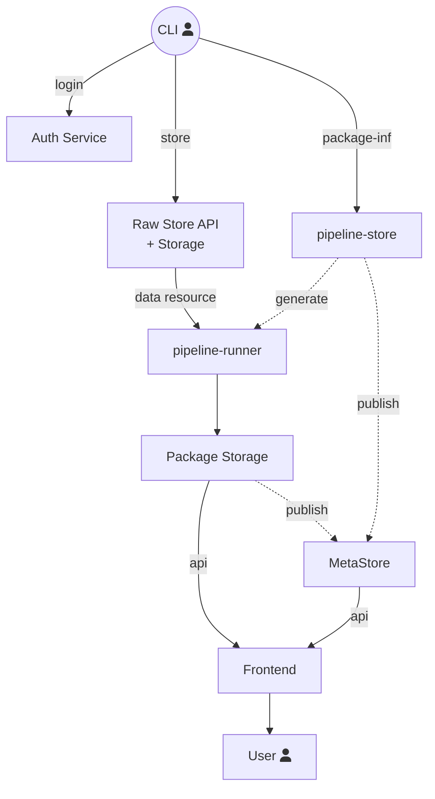
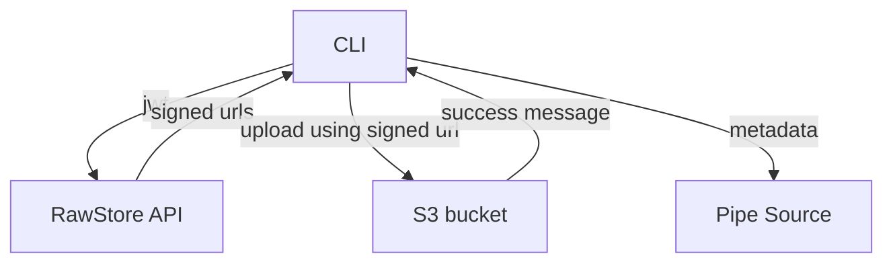
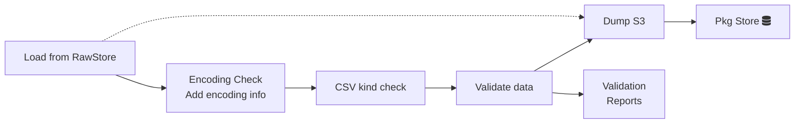
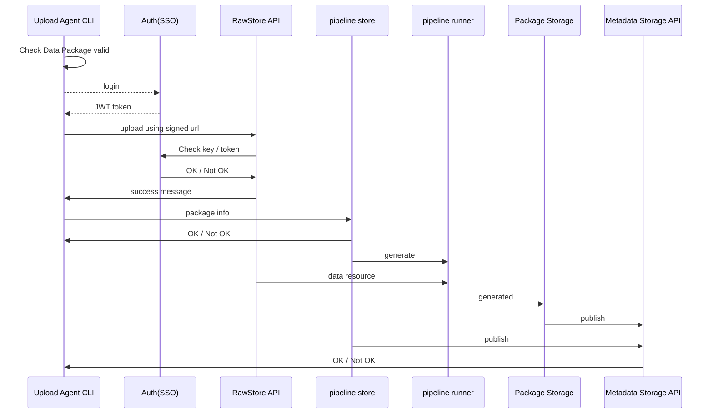

# Publish

Explanation of DataHub publishing flow from client and back-end perspectives.

## Diagram for upload process

## Identity Pipeline

**Context: where this pipeline fits in the system**

**Detailed steps**

## Client Perspective

Publishing flow takes the following steps and processes to communicate with DataHub API:

 

* Upload API - see `POST /source/upload` in *source* section of [API][api]
* Authentication API - see `GET /auth/check` in *auth* section of [API][api].
* Authorization API - see `GET /auth/authorize` in *auth* section of [API][api].

See example [code snippet in DataHub CLI][publish-code]

[api]: /docs/dms/datahub/developers/api
[publish-code]: https://github.com/datahq/datahub-cli/blob/b869d38073248903a944029cf93eddf3ef50001a/bin/data-push.js#L34

[api]: /docs/dms/datahub/developers/api

