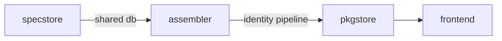
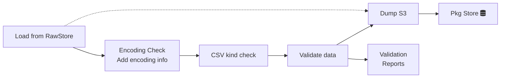
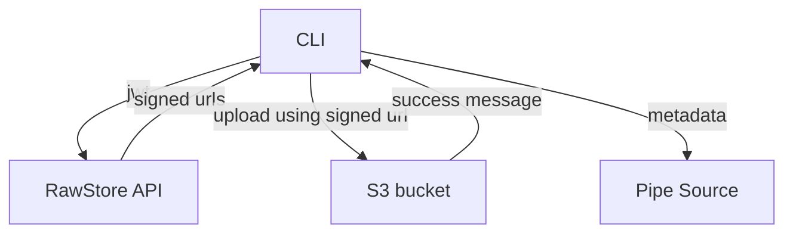

# User Stories

DataHub is the place where *people* can **store, share and publish** their data, **collect, inspect and process** it with **powerful tools**, and **discover and use** data shared by others. [order matters]

People = data wranglers = those who use machines (e.g. code, command line tools) to work with their data rather than editing it by hand (as, for example, many analysts do in Excel). (Think people who use Python vs people who use Excel for data work)

* Data is not chaotic and is in some sense neat
* Can present your data with various visualization tools (graphs, charts, tables etc.) 
* Easy to publish
* Specific data (power) tools and integrations
	* Can validate your data before publishing
	* Data API
	* Data Conversion / Bundling: zip the data, provide sqlite
  	* Generate a node package of your data
	* (Versioning)

## Personas

* **[Geek] Publisher**. Knows how to use a command line or other automated tooling. Wants to publish their data package in order to satisfy their teams requirements to publish data.
	* Non-Geek Publisher. Tbc …
* **Consumer**: A person or organization looking to use data packages (or data in general)
	* Data Analyst
	* Coder (of data driven applications)
	* …
* **Admin**: A person or organization who runs an instance of a DataHub

## Stories v2

### Publishing data

As a Publisher I want to publish a file/dataset and view/share just with a few people (or even just myself)

* ~~"Private" link: {'/{username}/{uuid}'}~~
* I want JSON as well as CSV versions of my data
* I want a preview
* I want to be notified clearly if something went wrong and what I can do to fix it.

As a Publisher I want to publish a file/dataset and share publicly with everyone

* Viewable on my profile
* Public link: nice urls {'/{username}/{dataset-name}'}

For the pipeline =>

**Context: where this pipeline fits in the system**



**Detailed steps**



### Push Package

#### Diagram for upload process



### Push File

Levels:

0. Already have Data Package (?)
1. Good CSV
2. Good Excel
3. Bad data (i.e. has ...)
3. Something else

```
data push {file-or-directory}
```

How does data push work?

```
# you are pushing the raw file
# and the extraction to get one or more data tables ...
# in the background we are creating a data package + pipeline
data push {file}

Algorithm:

1. Detect type / format
2. Choose the data (e.g. sheet from excel)
3. Review the headers
4. Infer data-types and review
5. [Add constraints]
6. Data validation
7. Upload
8. Get back a link - view page (or the raw url) e.g. http://datapackaged.com/core/finance-vix
  * You can view, share, publish, [fork]

1. Detect file type
 => file extension
  1. Offer guess
  2. Probable guess (options?)
  3. Unknown - tell us

1B. Detect encoding (for CSV)

2. Choose the data
  1. 1 sheet => ok
  2. Multiple sheets guess and offer
  3. Multiple sheets - ask them (which to include)

2B: bad data case - e.g. selecting within table

3. Review the headers
  * Here is what we found
  * More than one option for headers - try to reconcile
  * 


### Upload:

* raw file with name a function of the md5 hash
  * Pros: efficient on space (e.g. same file stored once but means you need to worry about garbage collection?)
* the pipeline description: description of data and everything else we did [into database]

Then pipeline runs e.g. load into a database or into a data package

* stores output somewhere ...

Viewable online ...

Note:
data push url # does not store file
data push file # store in rawstore

### BitStore

/rawstore/ - content addressed storage (md5 or sha hashed)
/packages/{owner}/{name}/{tag-or-pipeline}
```


Try this for a CSV file

```
data push mydata.csv

# review headers

# data types ...


Upload

* csv file gets stored as blob md5 ...
* output of the pipeline stored ...
  * canonical CSV gets generated ...
```

Data Push directory

```
data push {directory}

# could just do data push file for each file but ...
# that could be tedious
# once I've mapped one file you try reusing that mapping for others ...
# .data directory that stores the pipeline and the datapackage.json
```


## Stories

### 1. Get Started

#### 1. Sign in / Sign up [DONE]

As a Geek Publisher I want to sign up for an account so that I can publish my data package to the registry and to have a publisher account to publish my data package under.

*Generally want this to be as minimal, easy and quick as possible*

* Sign in with a Google account
	* (?) what about up other social accounts?
* Essential profile information (after sign in we prompt for this)
	* email address
	* Name
	* (?) - future. Credit card details for payment - can we integrate with payment system (?)
* They need to choose a user name which is url friendly unique human readable name for our app. Can be used in sign in and in many other places.
	* WHY? Where would we need this? For url on site & for publisher
	* Same as publisher names (needed for URLs): [a-z-_.]
	* Explain: they cannot change this later e.g. "Choose wisely! Once you set this it cannot be changed later!"
* Send the user an email confirming their account is set up and suggesting next steps

Automatically:

* Auto-create a publisher for them
	* Same name as their user name but a publisher
	* That way they can start publishing straight away …

**TODO: (??) should we do *all* of this via the command line client (a la npmjs) **

#### Sign up via github (and/or google) [DONE]

As a Visitor I want to sign up via github or google so that I don’t have to enter lots of information and remember my password for yet another website

* How do we deal with username conflicts? What about publisher name conflicts?
	* This does not arise in simple username system because we have only pool of usernames

#### Next Step after Sign Up

As a Geek Publisher I want to know what do next after signing up so that I can get going quickly.

Things to do:

* Edit your profile
* Download a client / Configure your client (if you have one already)
	* Instructions on getting relevant auth credentials
	* Note they will *need* to have set a username / password in their profile
* Join a Publisher (understand what a publisher is!)

#### Invite User to Join Platform

As an Admin (or existing Registered User?) I want to invite someone to join the platform so that they can start contributing or using data

* Get an invitation email with a sign up link
* *Some commonality with Publisher invite member below*

### 2. Publish Data Packages

#### Publish with a Client [DONE]

As a Geek Publisher I want to import (publish) my data package into the registry so my data has a permanent online home so that I and others can have access

On command line looks like:

```
$ cd my/data/package
$ data publish

> … working …
>
> SUCCESS
```

Notes

* Permissions: must be a member of the Publisher
	* Internally: DataPackageCreate or DataPackageUpdate capability
* Handle conflicts: if data package already exists, return 409. Client instructions should be already exists and use "--force" or similar to overwrite
* API endpoint behind the scenes: POST {'{api}/package/'}
* TODO: private data packages
	* And payment!

##### Configure Client [DONE]

As a Geek Publisher I want to configure my client so I can start publishing data packages.

Locally in $HOME store store something like:

```
.dpm/credentials # stores your API key and user name

.dpm/config      # stores info like your default publisher
```

#### Update a Data Package [DONE]

As a Geek Publisher I want to use a publish command to update a data package that is already in the registry so it appears there

* Old version will be lost (!)

#### Delete a Data Package

As a Geek Publisher I want to unpublish (delete) a data package so it is no longer visible to anyone

#### Purge a Data Package

As a Geek Publisher I want to permanently delete (purge) a data package so that it no longer takes up storage space


#### Validate Data in Data Package

##### Validate in CLI [DONE]

As a Publisher [owner/member] I want to validate the data I am about to publish to the registry so that I publish “good” data and know that I am doing so and do not have to manually check that the published data looks ok (e.g. rendering charts properly) (and if wrong I have to re-upload)

```
data datavalidate [file-path]
```

* [file-path] - run this against a given file. Look in the resources to see if this file is there and if so use the schema. Otherwise just do goodtables table …
	* If no file provided run validate against each resource in turn in the datapackage
* Output to stdout.
	* Default: human-readable - nice version of output from goodtables.
	* Option for JSON e.g. --json to put machine readable output
		* check goodtables command line tool and follow if possible. Can probably reuse code
* Auto-run this before publish unless explicit suppression (e.g. --skip-datavalidate)
* Use goodtables (?)

##### Validate on Server

As a Publisher [owner] i want my data to be validated when I publish it so that I know immediately if I have accidentally “broken” my data or have bugs and can take action to correct

As a Consumer I want to know that the data I am downloading is “good” and can be relied on so that I don’t have to check it myself or run into annoying bugs later on

* Implies showing something in the UI e.g. “Data Valid” (like build passing)

**Implementation notes to self**

* Need a new table to store results of validation and a concept of a “run”
	* Store details of the run [e.g. time to complete, ]
* How to automate doing validation (using goodtables we assume) - do we reuse a separate service (goodtables.io in some way) or run ourselves in a process like ECS ???
* Display this in frontend

#### Cache Data Package Resource data (on the server)

As a Publisher I want to publish a data package where its resource data is stored on my servers but the registry caches a copy of that data so that if my data is lost or gets broken I still have a copy people can use

As a Consumer I want to be able to get the data for a data package even if the original data has been moved or removed so that I can still use is and my app or analysis keeps working

* TODO: what does this mean for the UI or command line tools. How does the CLI know about this, how does it use it?

#### Publish with Web Interface

As a Publisher I want to publish a data package in the UI so that it is available and published

* Publish => they already have datapackage.json and all the data. They just want to be able to upload and store this.

As a Publisher I want to create a data package in the UI so that it is available and published

* Create => no datapackage.json - just data files. Need to add key descriptors information, upload data files and have schemas created etc etc.

#### Undelete data package

[cli] As a Publisher I want to be able to restore the deleted data package via cli, so that it is back visible and available to view, download (and searchable)

```
dpmpy undelete
```

[webui] As a Publisher i want to undelete the deleted data packages, so that the deleted data packages is now visible again.

#### Render (views) in data package in CLI before upload

As a Publisher, I want to be able to preview the views (graphs and table (?)) of the current data package using cli prior to publishing so that I can refine the json declarations of datapackage view section to achieve a great looking result.

### 3. Find and View Data Packages

#### View a Data Package Online [DONE]

**EPIC: As a Consumer I want to view a data package online so I can get a sense of whether this is the dataset I want**

* *Obsess here about “whether this is the dataset I want”*
* *Publishers want this too … *
* *Also important for SEO if we have good info here*

Features

* Visualize data in charts - gives one an immediate sense of what this is
	* One graph section at top of page after README excerpt
	* One graph for each entry in the “views”
* Interactive table - allows me to see what is in the table
	* One table for each resource

This user story can be viewed from two perspectives:

* From a publisher point of view
* From a consumer point of view

As a **publisher** i want to show the world how my published data is so that it immediately catches consumer’s attention (and so I know it looks right - e.g. graph is ok)

As a **consumer** i want to view the data package so that i can get a sense of whether i want this dataset or not.

Acceptance criteria - what does done mean!

* A table for each resource
* Simple graph spec works => converts to plotly
	* Multiple time series
* Plotly spec graphs work
* All core graphs work (not sure how to check every one but representative ones)
* Recline graphs specs (are handled - temporary basis)
* Loading spinners whilst data is loading so users know what is happening

Bonus:

* Complex examples e.g. time series with a log scale … (e.g. hard drive data …)

Features: [*DP view status*](fonts/Alegreya-regular.ttf)

* Different options to view data as graph.
	* Recline
	* Vega-lite
	* Vega
	* [Plotly]
* General Functionality
	* Multiple views [wrongly done. We iterate over resource not views]
	* Table as a view
* Interactive table so that consumer can do
	* Filter
	* Join


#### (Pre)View a not-yet-published Data Package Online

As a (potential) Publisher I want to preview a datapackage I have prepared so that I can check it works and share the results (if there is something wrong with others)

* Be able to supply a URL to my datapackage (e.g. on github) and have it previewed as it would look on DPR
* Be able to upload a datapackage and have it previewed

*Rufus: this was a very common use case for me (and others) when using data.okfn.org. Possibly less relevant if the command line tool can do previewing but still relevant IMO (some people may not have command line tool, and it is useful to be able to share a link e.g. when doing core datasets curation and there is something wrong with a datapackage).*

*Rufus: also need for an online validation tool*

#### See How Much a Data Package is Used (Downloaded) {'{2d}'}

As a Consumer i want to see how much the data has been downloaded so that i can choose most popular (=> probably most reliable and complete) in the case when there are several alternatives for my usecase (maybe from different publishers)

#### Browse Data Packages [DONE]

As a potential Publisher, unaware of datapackages, I want to see real examples of published packages (with the contents datapackage.json), so that I can understand how useful and simple is the datapackage format and the registry itself.

As a Consumer I want to see some example data packages quickly so I get a sense of what is on this site and if it is useful to look further

* Browse based on what properties? Most recent, most downloaded?
	* Most downloaded
	* Start with: we could just go with core data packages

#### Search for Data Packages [DONE]

As a Consumer I want to search data packages so that I can find the ones I want

* Essential question: what is it you want?
	* Rufus: in my view generic search is actually *not* important to start with. People do not want to randomly search. More useful is to go via a publisher at the beginning.
* Search results should provide enough information to help a user decide whether to dig further e.g. title, short description
	* For future when we have it: [number of downloads], stars etc
* Minimum viable search (based on implementation questions)
	* Filter by publisher
	* Free text search against title
		* Description could be added if we start doing actual scoring as easy to add additional fields
	* Scoring would be nice but not essential

* Implementation questions:
	* Search:
		* Should search perform ranking (that requires scoring support)
		* Free text queries should search against which fields (with what weighting)?
	* Filtering: On what individual properties of the data package should be able to filter?
	* Themes and profiles:
		* Searching for a given profile: not possible atm.
		* Themes: Should we tag data packages by themes like finance, education and let user find data package by that?
				* Maybe but not now - maybe in the future
	* If we follow the go via a publisher at the beginning then should we list the most popular publisher on the home page of user[logged-in/ not logged in]?
	* If most popular publisher then by what mesaure?
		* Sort by Most published?
		* Sort by Most followers?
		* Sort by most downloads?
		* Or all show top5 in each facet?

Sub user stories:

> *[WONTFIX?] As a Consumer i want to find the data packages by profile (ex: spending) so that I can find the kind of data I want quickly and easily and in one big list*
>
> *As a Consumer i want to search based on description of data package, so that I can find package which related to some key words*

#### Download Data Package Descriptor

As a Consumer I want to download the data package descriptor (datapackage.json) on its own so that …

*Rufus: I can’t understand why anyone would want to do this *

#### Download Data Package in One File (e.g. zip)

As a Consumer I want to download the data package in one file so that I don’t have to download descriptor and each resource by hand

*Only useful if no cli tool and no install command*

### 4. Get a Data Package (locally)

Let’s move discussion to the github: *https://github.com/frictionlessdata/dpm-py/issues/30

*TODO add these details from the requirement doc*

* *Local “Data Package” cache storage (`.datapackages` or similar)*
	* *Stores copies of packages from Registry*
	* *Stores new Data Packages the user has created*
	* *This* [**Ruby lib**](fonts/Lato-boldItalic.ttf) *implements something similar*

#### Use DataPackage in Node (package auto-generated)

As a NodeJS developer I want to use data package as a node lib in my project so that I can depend on it using my normal dependency framework

* See this [*real-world example*](fonts/SourceSansPro-regular.ttf) of this request for country-list
* => auto-building node package and publishing to npm (not that hard to do …)
	* Convert CSV data to json (that’s what you probably want from node?)
	* Generate package.json
	* Push to npm (register the dataset users)
	* Rufus: My guess here is that to implement here we want something a bit like github integrations – specific additional hooks which also get some configuration (or do it like travis - github integration plus a tiny config file - in our case rather than a .travis.yml we have a .node.yml or whatever)
* Is it configurable for user that enable to push to npm or not?
	* Yes. Since we need to push to a specific npm user (for each publisher) this will need to be configured (along with authorization - where does that go?)
* Is this something done for *all* data packages or does user need to turn something on? Probably want them to turn this on …

Questions:

* From where we should push the data package to npm repo.
	* Is it from dpmpy or from server? Obviously from a server - this needs to be automated. But you can use dpmpy if you want (but I’m not sure we do want to …)
* What to do with multiple resources? Ans: include all resources
* Do we include datapackage.json into the node package? Yes, include it so they get all the original metadata.

*Generic version is:*

*As a Web Developer I want to download a DataPackage (like currency codes or country names) so that I can use it in the web service I am building [...]*

#### Import DataPackage into R [DONE?]

As a Consumer [R user] I want to load a Data Package from R so that I can immediately start playing with it

* Should we try and publish to CRAN?
	* Probably not? Why? think it can be quite painful getting permission to publish to CRAN and very easy to load from the registry
		* On the CRAN website I can't find a way to automate publishing. It seems possible by filling web-form, but to know the status we have to wait and parse email.
* Using this library: https://github.com/ropenscilabs/datapkg
* Where can i know about this?
	* On each data package view page …

*Generic version:*

*As a Data Analyst I want to download a data package, so that I can study it and wrangle with it to infer new data or generate new insights.*

*As a Data Analyst, I want to update previously downloaded data package, so that I can work with the most recent data.*

#### Import DataPackage into Pandas [DONE?]

TODO - like R

#### SQL / SQLite database

As a Consumer I want to download a DataPackage’s data one coherent SQLite database so that I can get it easily in one form

Question:

* Why does we need to store datapackage data in sqlite. Is not it better to store in file structure?

We can store the datapackage like this way:

```
~/.datapackage/<publisher>/<package>/<version>/*
```

This is the way maven/gradle/ivy cache jar locally.

#### See changes between versions

As a Data Analyst I want to compare different versions of some datapackage locally, so that I can see schema changes clearly and adjust my analytics code to the desired schema version.

#### Low Priority

As a Web Developer of multiple projects, I want to be able to install multiple versions of the same datapackage separately so that all my projects could be developed independently and deployed locally. (virtualenv-like)

As a Developer I want to list all DataPackages requirements for my project in the file and pin the exact versions of any DataPackage that my project depends on so that the project can be deterministically deployed locally and won’t break because of the DataPackage schema changes. (requirements.txt-like)

### 5. Versioning and Changes in Data Packages

When we talk about versioning we can mean two things:

* Explicit versioning: this is like the versioning Of releases “v1.0” etc. This is conscious and explicit. Main purpose:
	* to support other systems depending on this one (they want the data at a known stable state)
	* easy access to major staging points in the evolution (e.g. i want to see how things were at v1)
* Implicit versioning or “revisioning”: this is like the commits in git or the autosave of a word or google doc. It happens frequently, either with minimum effort or even automatically. Main purpose:
	* Undelete and recovery (you save a every point and can recover if you accidentally write or delete something)
	* Collaboration and merging of changes (in revision control)
	* Activity logging

#### Explicit Versioning - Publisher

As a Publisher I want to tag a version of my data on the command line so that … [see so that’s below]

dpmpy tag {'{tag-name}'}

=> tag current “latest” on the server as {'{tag-name}'}

* Do we restrict {'{tag-name}'} to semver? I don’t think so atm.
* As a {'{Publisher}'} I want to tag datapackage to create a snapshot of data on the registry server, so that consumers can refer to it
* As a {'{Publisher}'} I want to be warned that a tag exists, when I try to overwrite it, so that I don’t accidentally overwrite stable tagged data, which is relied on by consumers.
* As a {'{Publisher}'} I want to be able to overwrite the previously tagged datapackage, so that I can fix it if I mess up.
* The versioning here happens server side
	* Is this confusing for users? I.e. they are doing something local.

Background “so that” user story epics:

* As a {'{Publisher}'} I want to version my Data Package and keep multiple versions around including older versions so that I do not break consumer systems when I change my Data Package (whether schema or data) [It is not just the publisher who wants this, it is a consumer - see below]
* As a {'{Publisher}'} I want to be able to get access to a previous version I tagged so that I can return to it and review it (and use it)
	* so that i can recover old data if i delete it myself or compare how things changed over time

#### Explicit Versioning - Consumer

As a {'{Consumer}'} (of a Data Package) I want to know full details when and how the data package schema has changed and when so that I can adjust my scripts to handle it.

Important info to know for each schema change:

* time when published
* for any ***changed*** field - name, what was changed (type, format, …?),
    > +maybe everything else that was not changed (full field descriptor)
* for any ***deleted*** field - name,
    > +maybe everything else (full field descriptor)
* for any ***added*** field - all data (full field descriptor)

*A change in schema would correspond to a major version change in software (see http://semver.org/)

***Concerns about explicit versioning**: we all have experience with consuming data from e.g. government publishers where the publishers change the data schema breaking client code. I am constatnly looking for a policy/mechanism to guide publishers to develop stable schema versioning for the data they produce, and help consumers to get some stability guarantees.*

***Automated versioning / automated tracking**: Explicit versioning relies on the publisher, and humans can forget or not care enough about others. So to help consumers my suggestion would be to always track schema changes of uploaded packages on the server, and allow users to review those changes on the website. (We might even want to implement auto-tagging or not allowing users to upload a package with the same version but a different schema without forcing)*

As a {'{Consumer}'} I want to get a sense how outdated is the datapackage, that I have downloaded before, so that I can decide if I should update or not.

* I want to preview a DataPackage changelog (list of all available versions/tags with brief info) online, sorted by creation time, so that I can get a sense how data or schema has changed since some time in the past. Important brief info:
	* Time when published
	* How many rows added/deleted for each resource data
	* What fields(column names) changed, added or deleted for each resource.

As a {'{Consumer}'} I want to view a Datapackage at a particular version online, so that I can present/discuss the particular data timeslice of interest with other people.

As a {'{Consumer}'} I want to download a Data package at a particular version so that I know it is compatible with my scripts and system

* Online: I want to pick the version I want from the list, and download it (as zip for ex.)
* CLI: I want to specify tag or version when using the `install` command.

##### Know when a package has changed re caching

Excerpted from: https://github.com/okfn/data.okfn.org-new/issues/7

_From @trickvi on June 20, 2013 12:37_

I would like to be able to use data.okfn.org as an intermediary between my software and the data packages it uses and be able to quickly check whether there's a new version available of the data (e.g. if I've cached the package on a local machine).

There are ways to do it with the current setup:

1. Download the datapackage.json descriptor file, parse it and get the version there and check it against my local version. Problems:
   - This solution relies on humans and that they update their version but there might not be any consistency in it since the data package standard describes the version attribute as: _"a version string conforming to the Semantic Versioning requirement"_
   - I have to fetch the whole datapackage.json (it's not big I know but why download all that extra data I might not even want)
2. Go around data.okfn.org and look directly at the github repository. Problems:
   - I have to find out where the repo is, use git and do a lot of extra stuff (I don't care how the data packages are stored, I just want a simple interface to fetch them)
   - What would be the point of data.okfn.org/data? In my mind it collects data packages and provides a consistent interface to get the data packages irrespective of how its stored.

I propose data.okfn.org provides an internal system to allow users to quickly check whether a new version might be released. This does not have to be an API. We could leverage HTTP's caching mechanism using an ETag header that would contain some hash value. This hash value can e.g. be the the sha value of heads ref objects served via the Github API:

```
https://api.github.com/repos/datasets/cpi/git/refs/heads/master
```

Software that works with data packages could then implement a caching strategy and just send a request with an If-None-Match header along with a GET request for datapackage.json to either get a new version of the descriptor (and look at the version in that file) or just serve the data from its cache.

_Copied from original issue: frictionlessdata/ideas#51_


#### Revisioning - Implicit Versioning

…

#### Change Notifications

As a Consumer I want to be notified of changes to a package i care about so that I can check out what has changed and take action (like downloading the updated data)

As a Consumer I want to see how active the site is to see if I should get involved

### 6. Publishers

#### Create a New Publisher

TODO

#### Find a Publisher (and users?)

As a Consumer I want to browse and find publishers so that I can find interesting publishers and their packages (so that I can use them)

#### View a Publisher Profile

*view data packages associated to a publisher or user*

Implementation details: [*https://hackmd.io/MwNgrAZmCMAcBMBaYB2eAWR72woghmLNIrAEb4AME+08s6VQA===*](fonts/SourceSansPro-boldItalic.ttf)

As a Consumer I want to see a publisher’s profile so that I can discover their packages and get a sense of how active and good they are

**As a Publisher I want to have a profile with a list of my data packages so that:**

* Others can find my data packages quickly and easily
* Can see how many data packages i have
* **I can find a data package i want to look at quickly [they can discover their own data]**
* **I can find the link for a data package to send to someone else**
	* *People want to share what they have done. This is probably the number one way the site gets prominence at the start (along with simple google traffic)*
* so that I can check that members do not abuse their rights to publish and only publish topical data packages.

As a Consumer I want to view a publisher’s profile so that I can see who is behind a particular package or to see what other packages they produce [navigate up from a package page] [so that: i can trust on his published data packages to reuse.]

**Details**

* Profile =
	* Full name / title e.g. “World Bank”, identifier e.g. world-bank
		* *picture, short description text (if we have this - we don’t atm)*
		* *(esp important to know if this is the world bank or not)*
	* *Total number of data packages*
	* List of data packages
		* View by most recently created (updated?)
		* For each DataPackage want to see: title, number of resources (?), first 200 character of description, license (see data.okfn.org/data/ for example)
		* Do we limit / paginate this list? No, not for the moment
	* *[wontfix atm] Activity - this means data packages published, updated*
	* *[wontfix atm] Quality … - we don’t have anything on this*
	* *[wontfix atm] List of users*
* What are the permissions here?
	* Do we show private data packages? No
		* Do we show them when “owner” viewing or sysadmin? Yes (but flag as “private”)
* What data packages to show? All the packages you own.
	* What about pinning? No support for this atm.

##### Search among publishers packages

As a Consumer i want to search among all data packages owned by a publisher so that I can easily find one data package amongst all the data packages by this publisher.

##### Registered Users Profile and packages

*As a Consumer i want to see the profile and activity of a user so that …*

*As a Registered User I want to see the data packages i am associated with **so that** [like publisher]*

#### Publisher and User Leaderboard

As a ??? I want to see who are the top publihers and users so that I can emulate them or ???

#### Manage Publisher

##### Create and Edit Profile

As {'{Owner ...}'} I want to edit my profile so that it is updated with new information

##### Add and Manage Members

As an {'{Owner of a Publisher in the Registry}'} I want to invite an existing user to become a member of my publisher

* Auto lookup by user name (show username and fullname) - standard as per all sites
* User gets a notification on their dashboard + email with link to accept invite
* If invite is accepted notify the publisher (?) - actually do not do this.

As an {'{Owner of a Publisher in the Registry}'} I want to invite someone using their email to sign up and become a member of my Publisher so that they are authorized to publish data packages under my Publisher.

As an {'{Publisher Owner}'} I want to remove someone from membership in my publisher so they no longer have ability to publish or modify my data packages

As a {'{Publisher Owner}'} I want to view all the people in my organization and what roles they have so that I can change these if I want

As a {'{Publisher Owner}'} I want to make a user an “owner” so they have full control

As a {'{Publisher Owner}'} I want to remove a user as an “owner” so they are just a member and no longer have full control

### 7. Web Hooks and Extensions

TODO: how do people build value added services around the system (and push back over the API etc …) - OAuth etc

### 8. Administer Site

#### Configure Site

As the Admin I want to set key configuration parameters for my site deployment so that I can change key information like the site title

* Main config database is the one thing we might need

#### See usage metrics

As an Admin I want to see key metrics about usage such as users, API usage, downloads etc so that I know how things are going

* Total users are signed up, how many signed up in last week / month etc
* Total publishers …
	* Users per publisher distribution (?)
* API usage
* Downloads
* Billing: revenue in relevant periods
* Costs: how much are we spending on storage

#### Pricing and Billing

As an Admin I want to have a pricing plan and billing system so that I can charge users and make my platform sustainable

As a Publisher I want to know if this site has a pricing plan and what the prices are so that I can work out what this will cost me in the future and have a sense that these guys are sustainable (‘free forever’ does not work very well)

As a Publisher I want to sign up for a given pricing plan so that I am entitled to what it allows (e.g. private stuff …)

### Private Data Packages

cf npmjs.com

As a Publisher I want to have private data packages that I can share just with my team

### Sell My Data through your site

**EPIC: As a Publisher i want to sell my data through your site so that I make money and am able to sustain my publishing and my life …**

