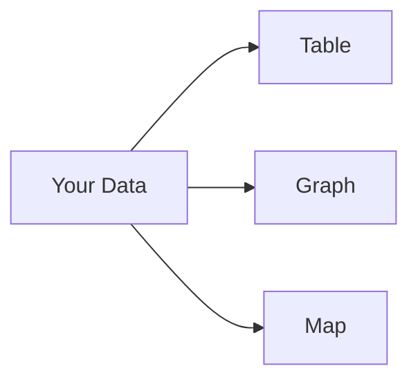
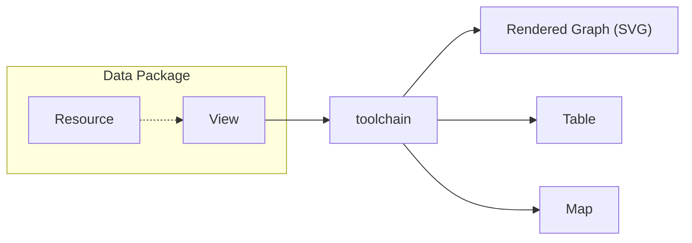
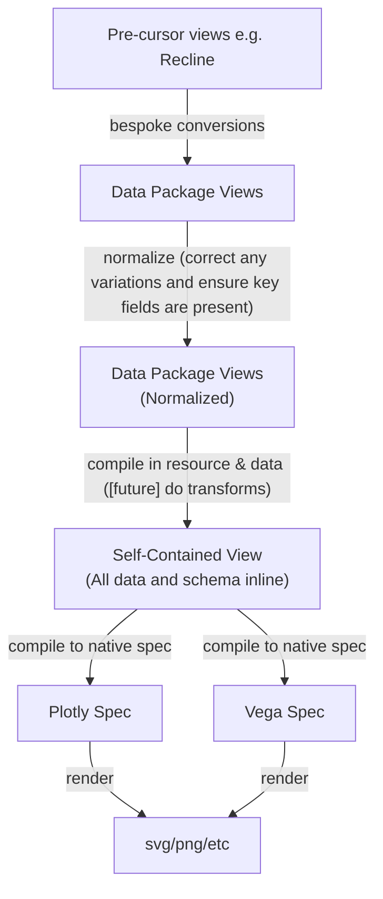
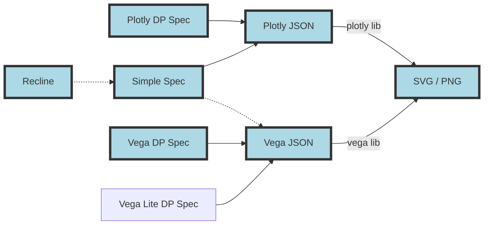
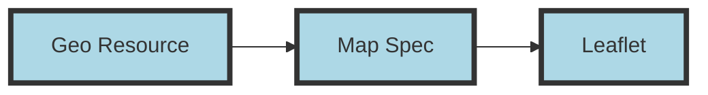
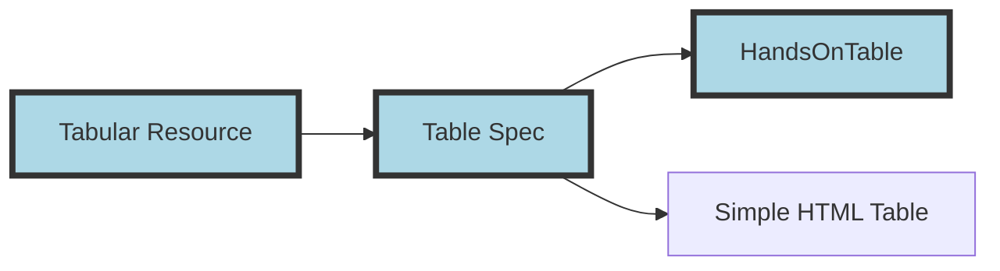
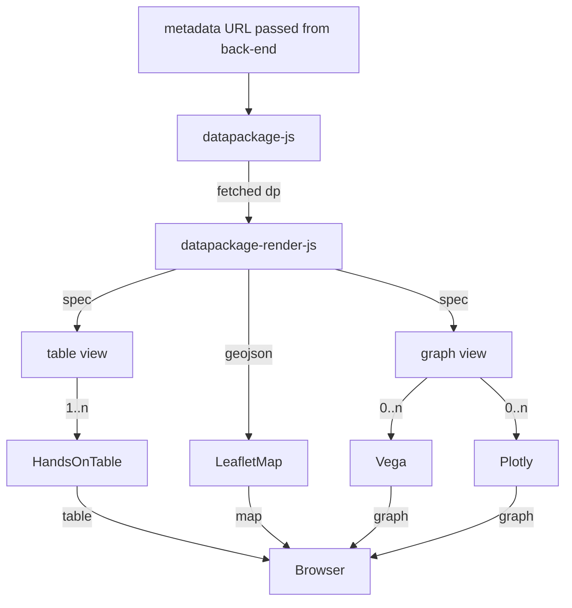

# Views

Producers and consumers of data want to have data presented in tables and graphs -- "views" on the data. They want this for a range of reasons, from simple eyeballing to drawing out key insights.

To achieve this we need to provide:

* A tool-chain to create these views from the data.
* A descriptive language for specifying views such as tables, graphs, map.

These requirements are addressed through the introduction of Data Package "Views" and associated tooling.

This section describes the details of how we support [Data Package Views][views] in the DataHub.

It consists of two parts, the first describes the general tool chain we have. The second part describes how we use that to generate graphs in the showcase page.

**Quick Links**

* [Data Package Views introduction and spec][views]
* [datapackage-render-js][] - this is the library that implements conversion from the data package views spec to vega/plotly and then svg or png

[views]: /docs/dms/publishers/views
[datapackage-render-js]: https://github.com/frictionlessdata/datapackage-render-js
[dpr-js]: https://github.com/frictionlessdata/dpr-js

## The Tool Chain

***Figure 1: From Data Package View Spec to Rendered output***

**IMPORTANT**: an important "convention" we adopt for the "compiling-in" of data is that resource data should be inlined into an `_values` attribute. If the data is tabular this attribute should be an array of *arrays* (not objects).

### Graphs

***Figure 2: Conversion paths***

Notes:

* Implemented paths are shown in lightblue - code for this is in [datapackage-render-js][]
* Left-most column (Recline): pre-specs that we can convert to our standard specs
* Second-from-left column: DP View spec types.
* Second-from-right column: the graphing libraries we can use (which all output to SVG)

### Geo support

**Note**: support for customizing map is limited to JS atm - there is no real map "spec" in JSON yet beyond the trivial version.

**Note**: vega has some geo support but geo here means full geojson style mapping.

### Table support

### Summary

***Figure 3: From Data Package View to Rendered output flow (richer version of diagram 1)***

## Views in the Showcase

To render Data Packages in browsers we use DataHub views written in JavaScript. The module implemented in ReactJS framework and it can render tables, maps and various graphs using third-party libraries.

Implementing code can be found in:

* [dpr-js repo][dpr-js] - which in turn depends on [datapackage-render-js][]

Notice that DataHub views render a table view per tabular resource. If GeoJSON resource is given, it renders a map. Graph views should be specified in `views` property of a Data Package.

## Appendix

There is a separate page with [additional research material regarding views specification and tooling][views-research].

[views-research]: /docs/dms/datahub/developers/views-research

