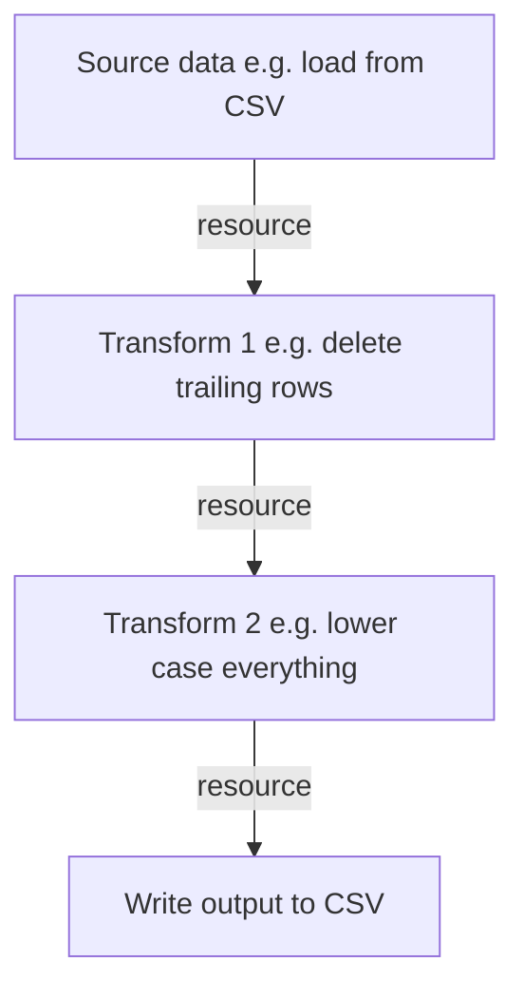
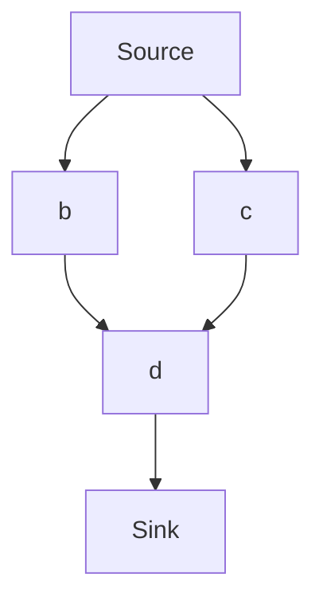

# Data Processing: Data Flows and Data Factories

## Introduction

A common aspect of data management is **processing** data in some way or another: cleaning it, converting it from one format to another, integrating different datasets together etc. Such processing usually takes place in what are termed data (work)flows or pipelines. Each flow or pipeline consists of one or more stages with one particular operation (task) being done with the data at each stage. Finally, there is a need for something to manage and orchestrate the data flows/pipelines. This overall system which includes both the flows themselves and the framework for managing them needs a name. We call it  a "Data Factory".

Let's have some concrete examples of simple pipelines:

* Loading a raw CSV file into a database (e.g. to power the data API)
* Converting a file from one format to another e.g. CSV to JSON
* Loading a file, validating it and then computing some summary statistics

Fig 1: A simple data pipeline to clean up a CSV file

### Domain Model

* Tasks: a single processing step that is applied to data
* Flows (DAGs): a flow or pipeline of tasks. These tasks form a "directed acyclic graph" (DAG) where each task is a node.
* Factory: a system for creating and managing (orchestrating, monitoring etc) those flows.

Each flow or pipeline consists of one or more stages with one particular operation (task) being done with the data at each stage.

In a basic setup a flow is linear: the data arrives, operation A happens, then operation B, and, finally operation C. However, more complex flows/pipelines can involve branching e.g. the data arrives, then operation A, then there is a branch and operation B and C can happen independently.

**Fig 2: An illustration of a Generic Branching Flow (DAG)**

## CKAN v2

CKAN v2 has two implicit data factory system embedded in other functionality. These systems are technically entirely independent:

* Data Load system for loading data to the DataStore -- see [Data Load page &raquo;](/docs/dms/load/)
* Harvesting system for importing dataset metadata from other catalogs -- see [Harvesting page &raquo;](/docs/dms/harvesting/)

## CKAN v3

The Data Factory system is called AirCan and is built on top of AirFlow. AirCan itself can be used on its own or integrated with CKAN.

AirCan:

* Runner: Apache AirFlow
* Pipelines/DAGs: https://github.com/datopian/aircan. This is a set of AirFlow DAGs designed for common data processing operations in a DMS such as loading data into Data API storage.

CKAN integration:

* CKAN extension: https://github.com/datopian/ckanext-aircan. This hooks key actions from CKAN into AirCan and provides an API to run the flows (DAGs).
* GUI: Under development.

**Status**: Beta. AirCan and ckanext-aircan are in active use in production. GUI is under development.

**Documentation**: including setup and use of the all the components including CKAN integration can be found in https://github.com/datopian/aircan 

### Design

See [Design page](/docs/dms/flows/design).

## Links

* [Research](/docs/dms/flows/research) - list of tools and concepts with some analysis
* [History](/docs/dms/flows/history) - some previous thinking and work (2016-2019)

## Appendix: Our Previous Work

See also [History page](/docs/dms/flows/history).

* http://www.dataflows.org/ - new system Adam + Rufus designed in spring 2018 and Adam led development on
  * https://github.com/datahq/dataflows
  * https://github.com/datahq/dataflows/blob/master/TUTORIAL.md
  * https://github.com/datahq/dataflows/blob/master/PROCESSORS.md
* https://github.com/datopian/dataflow-demo - Rufus outline on a very simple tool from April 2018
* https://github.com/datopian/factory - datahub.io Factory "The service is responsible for running the flows for datasets that are frequently updated and maintained by Datahub. Service is using Datapackage Pipelines is a framework for declarative stream-processing of tabular data, and DataFlows to run the flows through pipelines to process the datasets."
