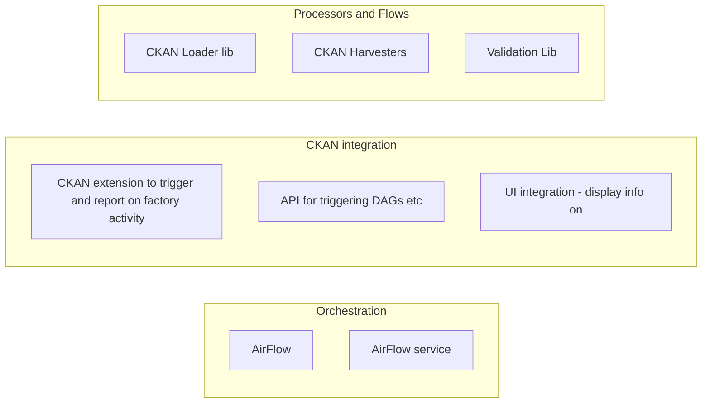

# Data Factory Design

Our Data Factory system is called AirCan. A Data Factory is a set of services/components to process and integrate data (coming from different sources). Plus patterns / methods for integrating with CKAN and the DataHub.

## Components



## DataStore Load job story

### Reporting Integration

When I upload a file to CKAN and it is getting loaded to the datastore (automatically), I want to know if that succeeded or failed so that I can share with my users that the new data is available (or do something about the error).

For a remote Airflow instance (let's say on Google Composer), describe the DAG tasks and the process. i.e.

* File upload on CKAN triggers the ckanext-aircan connector
* which makes API request to airflow on GCP and triggers a DAG with following parameters
  * A f11s resource orject including
    * the remote location of the CSV file and the reource ID
    * The target resource id
  * An API key to use when loading to CKAN datastore
  * [A callback url]
* The DAG
  * deletes the datatore table
  * if it exists, creates a new datastore table
  * loads CSV from the specified location (inforation available on DAG parameters)
  * converts the CSV to JSON. The output of the converted JSON file will be in a bucket on GCP.
  * upserts the JSON data row by row into the CKAN DataStore via CKAN's DataStore API
    * This is what we have now: {'invoke{"message":"Created <DagRun ckan_api_load_gcp @ 2020-07-14 13:04:43+00:00: manual__2020-07-14T13:04:43+00:00, externally triggered: True>"}'} `/api/3/action/datastore_create` and passing the contents of the json file
      * OR using upsert with inserts (faster) NB: datapusher just pushes the whole thing into `datastore_create` so stick with that.
    * OR: if we are doing postgres copy we need direct access to postgres DB
  * ... [tbd] notifies CKAN instance of this (?)

Error Handling and other topics to consider

* How can we let CKAN know something went wrong? Shall we create a way to notify a certain endpoint on ckannext-aircan connector? 
* Shall we also implement a timeout on CKAN? 
* What are we going to display in case of an error?
* The "tmp" bucket on GCP will eventually get full of files; shall we flush it? How do we know when it's safe to delete a file? 
  * Lots of ways up this mountain.
* What do we do for large files? 

## AirCan API

AirCan is built on AirFlow so we have same basic API TODO: insert link

However, we have standard message formats to pass to DAGs following these principles: All dataset and data resource objects should following the Frictionless specs

Pseudo-code showing how we call the API:

```python=
airflow.dag_run({
  "conf": {
    "resource": json.dumps({  # f11s resource object
        resource_id: ...
        path: ...
        schema: ...
    })
    "ckan_api_key: ...
    "ckan_api_endpoint": demo.ckan.org/api/
  }
})
```

See for latest, up to date version: https://github.com/datopian/ckanext-aircan/blob/master/ckanext/aircan_connector/action.py#L68

## CKAN integration API

There is a new API as follows:

`http://ckan:5000/api/3/action/aircan_submit?dag_id=...&dataset=...&resource` 

Also DAGs can get triggered on events ... TODO: go look at Github actions and learn from it ...

## Architecture

Other principles of architecture:

* AirFlow tasks and DAGs should do very little themselves and should hand off to separate libraries. Why? To have better separation of concerns and **testability**. AirCan is reasonably cumbersome to test but an SDK is much more testable.
  * Thus AirFlow tasks are often just going to pass through arguments TODO: expand this with an example ...
* AirFlow DAG will have incoming data and config set in "global" config for the DAG and so available to every task ...
* Tasks should be as decoupled as possible. Obviously there *is* some data and metadata passing between tasks and that should be done by writing those to a storage bucket. Metadata MUST be stored in f11s format.
  * See this interesting blog post (not scientific) about why the previous approach, with side effcts, is not very resilient in the long run of a project https://medium.com/@maximebeauchemin/functional-data-engineering-a-modern-paradigm-for-batch-data-processing-2327ec32c42a
  * don't pass data explicitly between tasks (rather it is passed implicitly via an expectation of where the data is stored ...)
  * tasks and flows should be re-runnable ... (no side effects principle)

Each task can write to this location:

```
bucket/dagid/runid/taskid/resource.json
bucket/dagid/runid/taskid/dataset.json
bucket/dagid/runid/taskid/... # data files
```


## UI in DMS

URL structure on a daaset

```
# xxx is a dataset
/@myorg/xxx/actions/
/@myorg/xxx/actions/runs/{id}
```

Main question: to display to user we need some way to log what jobs are associated with what datasets (and users) and perhaps their status

* we want to keep factory relatively dumb (it does not know about datasets etc etc)
* in terms of capabilities we need a way to pass permissions into the data factory (you hand over the keys to your car)

Simplest approach:

* MetaStore (CKAN metadata db) has Jobs table which have structure of `| id | factory_id | job_type | created | updated | dataset | resource | user | status | info |` (where info is json blob)
  * status = one of `WAITING | RUNNING | DONE | FAILED | CANCELLED`. If failed we should have stuff in info about that.
  * `job_type` = one of `HARVEST | LOAD | VALIDATE ...` it is there so we could have several different factory jobs in one db
  * `info`: likely stuff
    * run time
    * error information (on failure)
    * success information: what was outcome, where are outputs if any etc
* On creating a job in the factory, the factory returns a factory id. the metastore stores the factory id into a new job object along with dataset and user info ...
  * Qu: why have id and factory_id separate? is there any situation where you have a job w/o a factory id?
* Then on loading a job page in frontend you can poll the factory for info and status (if status is WAITING or RUNNING)
  * => do we need the `info` column on the job (it's just a cache of this info)?
    * Ans: useful for jobs which are complete so we don't keep polling the factory (esp if factory deletes stuff)
* Can list all jobs for a given dataset (or resource) with info about them

Qus:

* For Data Factory what do I do with Runs that are stale etc - how do I know who they are associated with. Can I store metadata on my Runs like who requested it etc.

### UI Design

Example from Github:


## Appendix

### Notes re AirCan API

https://medium.com/@ptariche/interact-with-apache-airflows-experimental-api-3eba195f2947

```
{"message":"Created <DagRun ckan_api_load_gcp @ 2020-07-14 13:04:43+00:00: manual__2020-07-14T13:04:43+00:00, externally triggered: True>"}

GET /api/experimental/dags/<string:dag_id>/dag_runs/<string:execution_date>

GET /api/experimental/dags/ckan_api_load_gcp/dag_runs/2020-07-14 13:04:43+00:00

https://b011229e45c662be6p-tp.appspot.com/api/experimental/dags/ckan_api_load_gcp/dag_runs/2020-07-14T13:04:43+00:00

Resp: `{"state":"failed"}`
```

### Google Cloud Composer

Google Cloud Composer is a hosted version of AirFlow on Google Cloud.

#### How Google Cloud Composer differs from local AirFlow

* File handling: On GCP, all the file handling must become interaction with a bucket ~rufus: what about from a url online (but not a bucket)
Specifying the csv resource location (on a local Airflow) must become sending a resource to a bucket (or just parsing it from the JSON body). When converting it to a JSON file, it must become an action of creating a file on a bucket.
* Authentication: TODO

### AirFlow Best Practices

* Should you and how do you pass information between tasks?
  * https://medium.com/datareply/airflow-lesser-known-tips-tricks-and-best-practises-cf4d4a90f8f
  * https://towardsdatascience.com/airflow-sharing-data-between-tasks-7bbaa27eeb1

### What terminology should we use?

ANS: we use AirFlow terminology:

* Task
* DAG
* DagRun

For internals what are the options?

* Task or Processor or ...
* DAG or Flow or Pipeline?

TODO: table summarizing options in AirFlow, Luigi, Apache Beam etc.

#### UI Terminology

* Actions
* Workflows

Terminology options

* Gitlab
  * Pipelines: you have
  * Jobs (runs of those
  * Schedules
* Github
  * Workflows
  * Runs
  * (Schedules - not explicit)
* Airflow
  * DAGs
    * Tasks
  * DAG Runs

