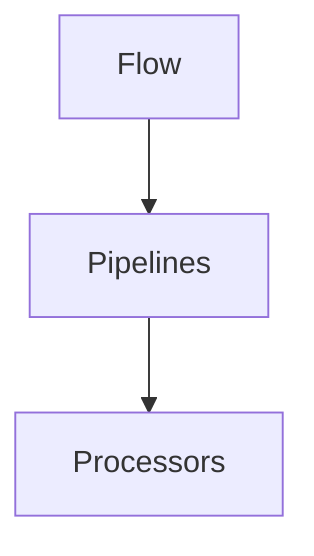
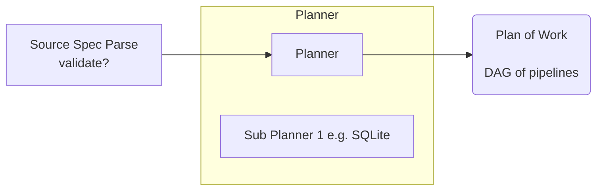
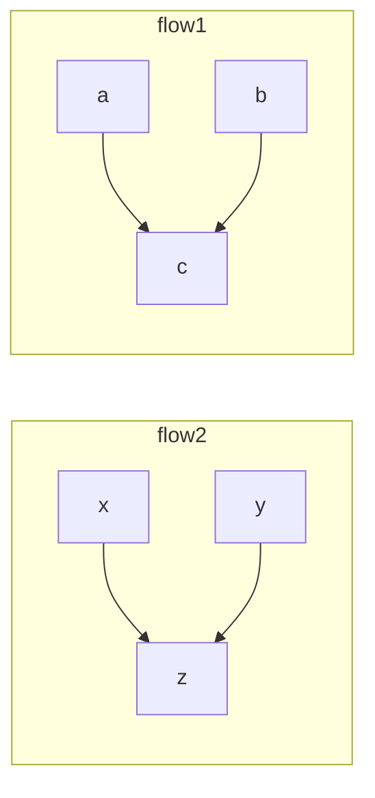
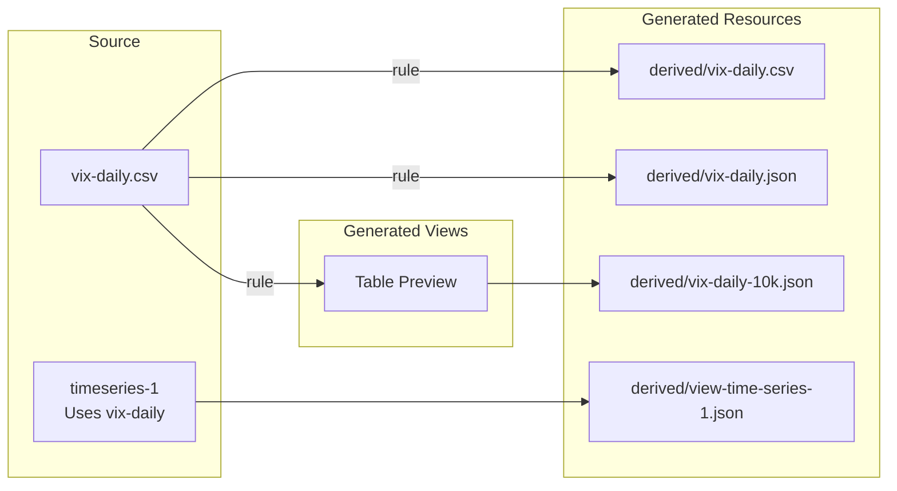
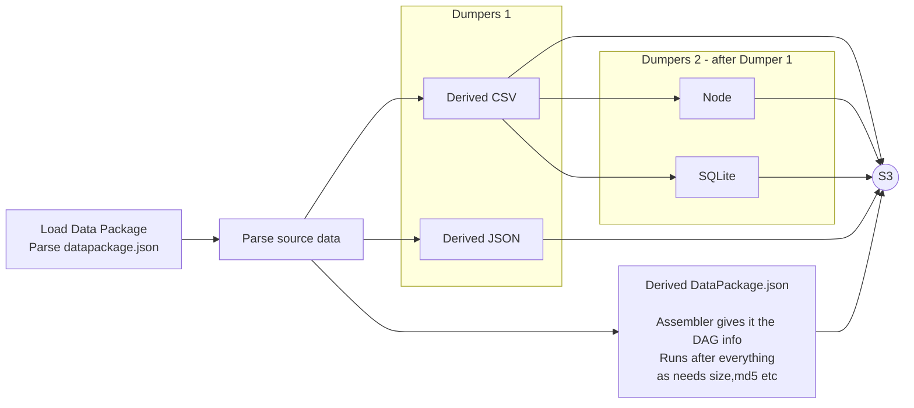
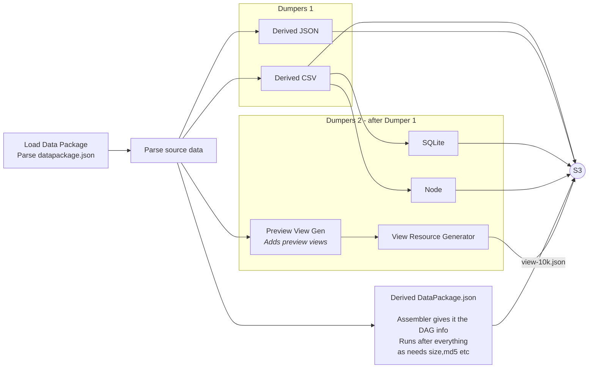
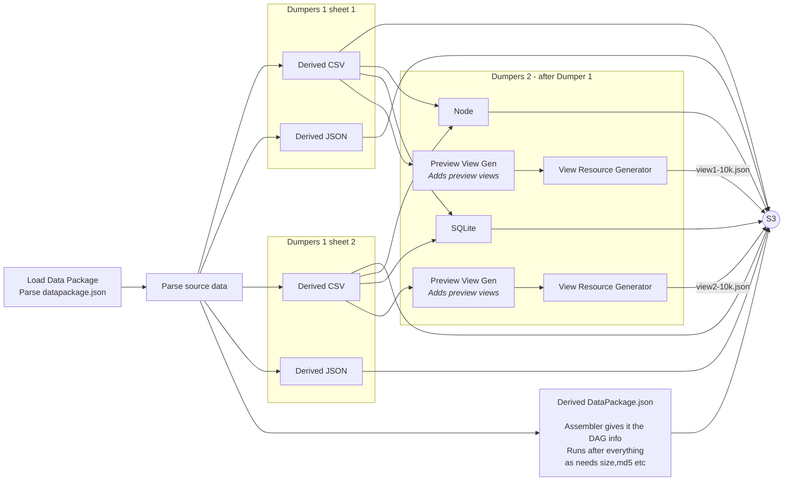

# Data Factory and Flows Design - Oct 2017 to Apr 2018

Date: 2018-04-08

> [!note]
>This is a miscellaneous content from various HackMD docs. I'm preserving because either a) there is material to reuse here that I'm not sure is elsewhere b) there were various ideas in here we used later (and it's useful to see their origins).
>
>Key content:
>
>* March-April 2018: first planning of what became dataflows (had various names including dataos). A lot of my initial ideas ended up in this micro-demo https://github.com/datopian/dataflow-demo. This evolved with Adam into https://github.com/datahq/dataflows
>* Autumn 2017: planning of Data Factory which was the data processing system inside DataHub.io. This was more extensive than dataflows (e.g. it included a runner, an assembler etc) and was based original data-package-pipelines and its runner. Issues with that system was part of the motivation for starting work on dataflows.
>
>~Rufus May 2020


## Plan April 2018

* tutorial (what we want our first post to look like)
  * And then implement minimum for that
* programmatic use of pipelines and processors in DPP
  * processor abstraction defined ...
    * DataResource and DataPackage object that looks like [Frictionless Lib pattern][frictionless-lib]
    * processors library split out
  * code runner you can call dataos.run.runSyncPipeline
* dataflow init => python and yaml
* @adam Write up Data Factory architecture and naming as it currently stands [2h]

[frictionless-lib]: http://okfnlabs.org/blog/2018/02/15/design-pattern-for-a-core-data-library.html

## 8 April 2018

Lots of note on DataFlow which are now moved and refactored into https://github.com/datahq/dataflow-demo

The Domain Model of Factory

* Staging area
* Planner
* Runner
* Flow
  * Pipelines
  * Processors



Assembler ...


=> Assembler generates a DAG.

- dest filenames in advance ...
- for each pipeline: pipelines it dpeends on
  - e.g. sqlite: depends on on all derived csv pipelines running
  - node depends: all csv, all json pipelines running
  - zip: depends on all csv running
- Pipelines





## 5 Oct 2017

Notes:

* Adam: finding more and more bugs (edge cases) and then applying fixes but then more issues
  * => Internal data model of pipelines was wrong ...
  * Original data model has a store: with one element the pipeline + a state (its idle, invalid, waiting to be executed, running, dirty)
  * Problem starts: you have a very long pipeline ...
    * something changes and pipeline gets re-added to the queue. then you have same pipeline in queue in two different states. Should not be a state of the pipeline but state of the execution of the pipeline.
  * Split model: pipeline (with their hash) + "runs" ordered by time of request

Questions:

* Tests in assembler ...

### Domain Model


* Pipelines have no branches they are always linear
  * Input: nothing or a file or a datapackage (source is stream or nothing)
  * Output: datapackage - usually dumped to something (could be stream)
  * Pipelines are a list of processors **and** their inputs
* A Flow is a DAG of pipelines
  * In our case: one flow produces a "Dataset" at a given "commit/run"
* Source Spec + DataPackage[.json] => (via assembler) => Flow Spec
* Runner
  * Pipelines runner: a set of DAG of pipelines (where each pipeline is schedule to run once all dependencies have been run)
* Events => lead to new flows or pipelines being created ... (or existing ones being stopped or destroyed)



State of Factory(flows, state)

f(event, state) => state

flow dependencies?

Desired properties

* We economise on runs: we don't rerun processors (pipelines?) that have same config and input data
  * => one reason for breaking down into smaller "operators" is that we economise here ...
* Simplicity: the system is understandable ...
* Processors (pipelines) are atomic - they get their configuration and run ...
* We can generate from a source spec and an original datapackage.json a full set of pipelines / processors.
* Pipelines as Templates vs Pipelines as instances ...

pipeline id = hash(pipeline spec, datapackage.json)

{'{pipelineid}'}/...

next pipeline can rely on {'{pipelineid}'}

Planner ...

=> a pipeline is never rerun (once it is run)

|              | Factory                    | Airflow   |
|--------------|----------------------------|-----------|
| DAG          | Implicit (no concept)      | DAG       |
| Node         | Pipelines (or processors?) | Operators |
| Running Node | ? Running pipelines        | Tasks     |
| Comments     |                            |           |

https://airflow.incubator.apache.org/concepts.html#workflows

# Analysis from work for Preview

As a Publisher I want to upload a 50Mb CSV so that the showcase page works - it does not crash by browser (because it is trying to load and display 50Mb of CSV)

*plus*

As a Publisher I want to customize whether I generate a preview for a file or not so that I don't get inappropriate previews

> As a Publisher I want to have an SQLite version of my data auto-built
>
> As a Publisher I want to upload an Excel file and have csv versions of each sheet and an sqlite version

### Overview

*This is what we want*



### How does this work?

#### Simple example: no previews, single CSV in source



```yaml=
meta:
  owner: <owner username>
  ownerid: <owner unique id>
  dataset: <dataset name>
  version: 1
  findability: <published/unlisted/private>
inputs:
 -  # only one input is supported atm
    kind: datapackage
    url: <datapackage-url>
    parameters:
      resource-mapping:
        <resource-name-or-path>: <resource-url>

outputs:
 - ...  see https://github.com/datahq/pm/issues/17
```

#### With previews



### With Excel (multiple sheets)

Source is vix-daily.xls (with 2 sheets)




datapackage.json

```javascript=
{
  resources: [
    {
      "name": "mydata"
      "path": "mydata.xls"
    }
  ]
}
```

```yaml=
meta:
  owner: <owner username>
  ownerid: <owner unique id>
  dataset: <dataset name>
  version: 1
  findability: <published/unlisted/private>
inputs:
 -  # only one input is supported atm
    kind: datapackage
    url: <datapackage-url>
    parameters:
      resource-mapping:
        <resource-name-or-path>: <resource-url>

processing:
 -
    input: <resource-name>   # mydata
    output: <resource-name>  # mydata_sheet1
    tabulator:
        sheet: 1
 -
    input: <resource-name>   # mydata
    output: <resource-name>  # mydata_sheet2
    tabulator:
        sheet: 2
```

```yaml=
meta:
  owner: <owner username>
  ownerid: <owner unique id>
  dataset: <dataset name>
  version: 1
  findability: <published/unlisted/private>
inputs:
 -  # only one input is supported atm
    kind: datapackage
    url: <datapackage-url>
    parameters:
      resource-mapping:
        <resource-name-or-path>: <resource-url> // excel file

=> (implictly and in cli becomes ...)

...

processing:
 -
    input: <resource-name>   # mydata
    output: <resource-name>  # mydata-sheet1
    tabulator:
        sheet: 1
```

Result

```javascript=
{
  resources: [
    {
      "name": "mydata",
      "path": "mydata.xls"
    },
    {
      "path": "derived/mydata.xls.sheet1.csv"
      "datahub": {
        "derivedFrom": "mydata"
      }
    },
    {
      "path": "derived/mydata.xls.sheet2.csv"
      "datahub": {
        "derivedFrom": "mydata"
      }
    }
  ]
}
```

### Overall component design

Assembler ...


=> Assembler generates a DAG.

- dest filenames in advance ...
- for each pipeline: pipelines it dpeends on
  - e.g. sqlite: depends on on all derived csv pipelines running
  - node depends: all csv, all json pipelines running
  - zip: depends on all csv running
- Pipelines


### NTS

```
function(sourceSpec) => (pipelines, DAG)

pipeline

  pipeline-id
  steps = n *
    processor
    parameters
  schedule
  dependencies
```
