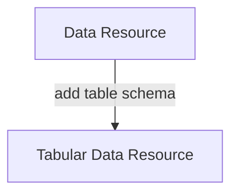
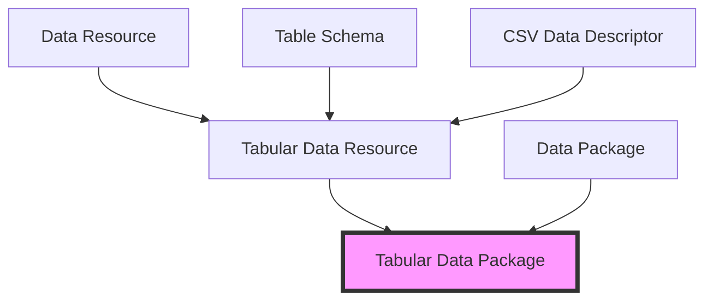

# Frictionless Data and Data Packages

## What's a Data Package?

A [Data Package](https://frictionlessdata.io/data-package/) is a simple container format used to describe and package a collection of data (a dataset).

A Data Package can contain any kind of data. At the same time, Data Packages can be specialized and enriched for specific types of data so there are, for example, Tabular Data Packages for tabular data, Geo Data Packages for geo data etc.

## Data Package Specs Suite

When you look more closely you'll see that Data Package is actually a *suite* of specifications. This suite is made of small specs, many of them usuable on their own, that you can also combine together.

This approach also reflects our philosophy of "small pieces, loosely joined" as well as "make the simple things simple and complex things possible": it easy to just use the piece you need as well to scale up to more complex needs.

For example, the basic Data Package spec can be combined with Table Schema spec for tabular data (plus CSV as the base data format) to create the Tabular Data Package specification.

We also decomposed the overall Data Package spec into Data Package and Data Resource with the Data Resource spec just describing an individual file and a Data Package being a collection of one or more Data Resources with additional dataset-level metadata.

**Example: Data Resource spec + Table Schema spec becomes a Tabular Data Resource spec**

**Example: How a Tabular Data Package is composed out of other specs**

Two different logics of grouping:

* By function e.g. Tabular stuff ... 
  * Tabular Data package
  * Tabular Data resource
* Inheritance / Composition structure
  * Resource -> Tabular Data Resource
  * Data Package -> Tabular Data Package

For developers of the specs latter may be better.

For ordinary users I imagine the former is better.

## Tutorials

Data Package Find-Prepare-Share Guide: https://datahub.io/docs/getting-started/datapackage-find-prepare-share-guide
