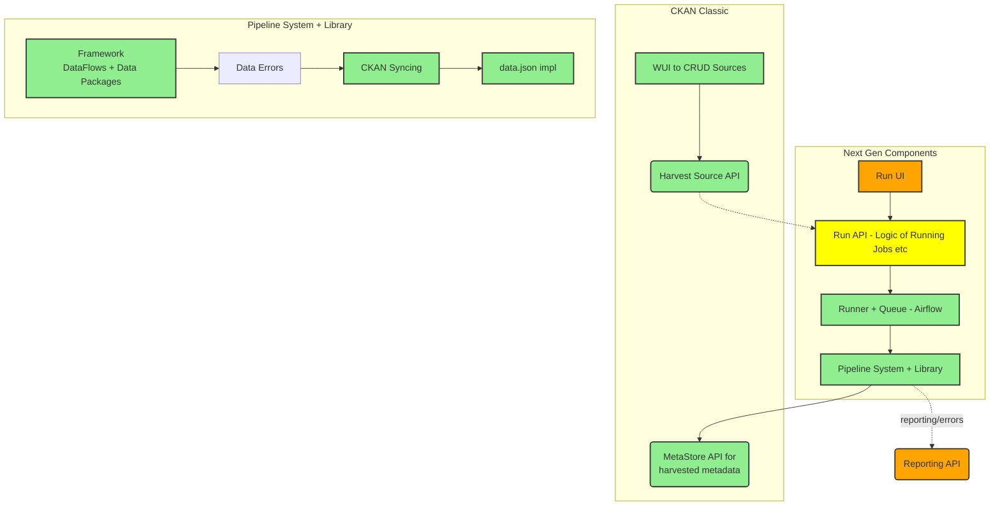
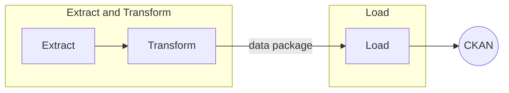
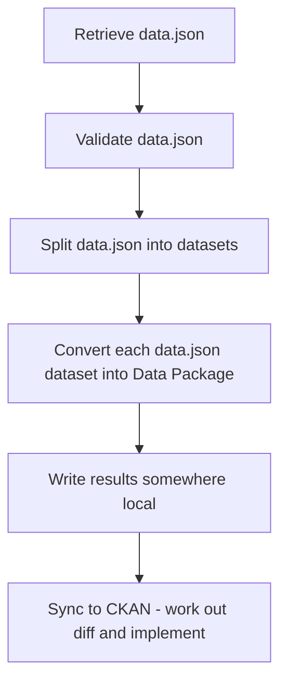
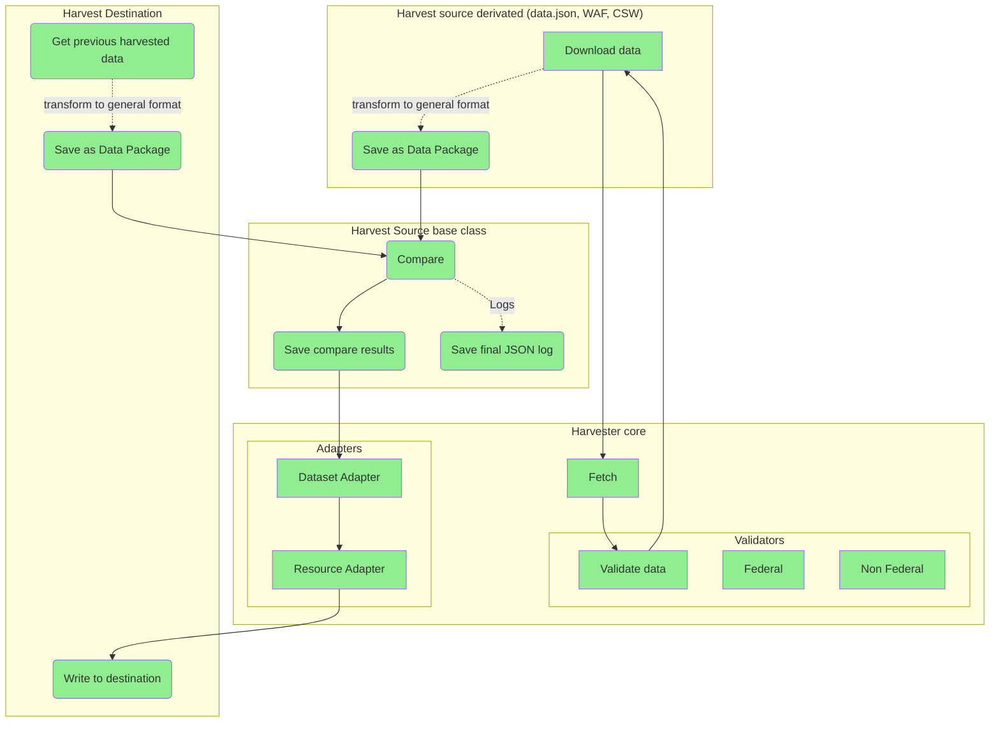
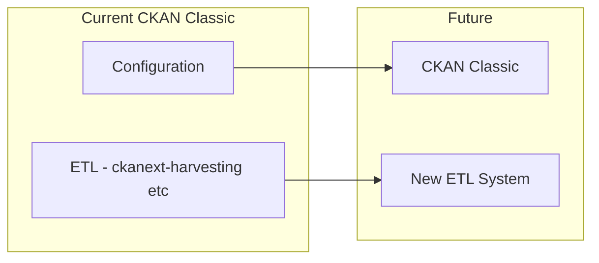
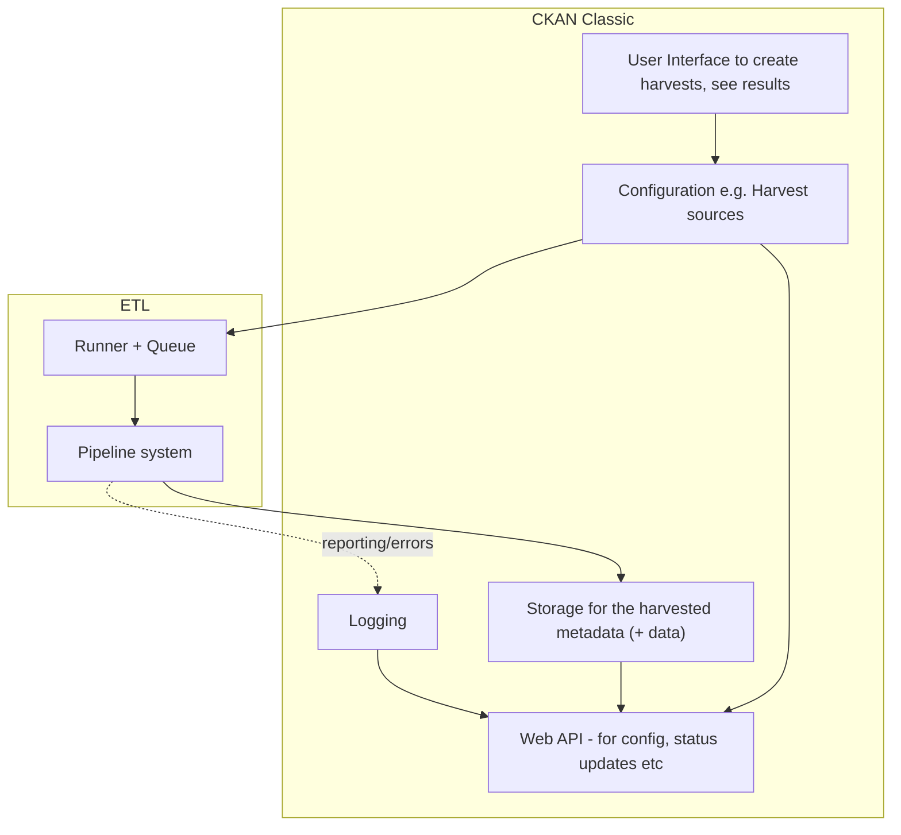
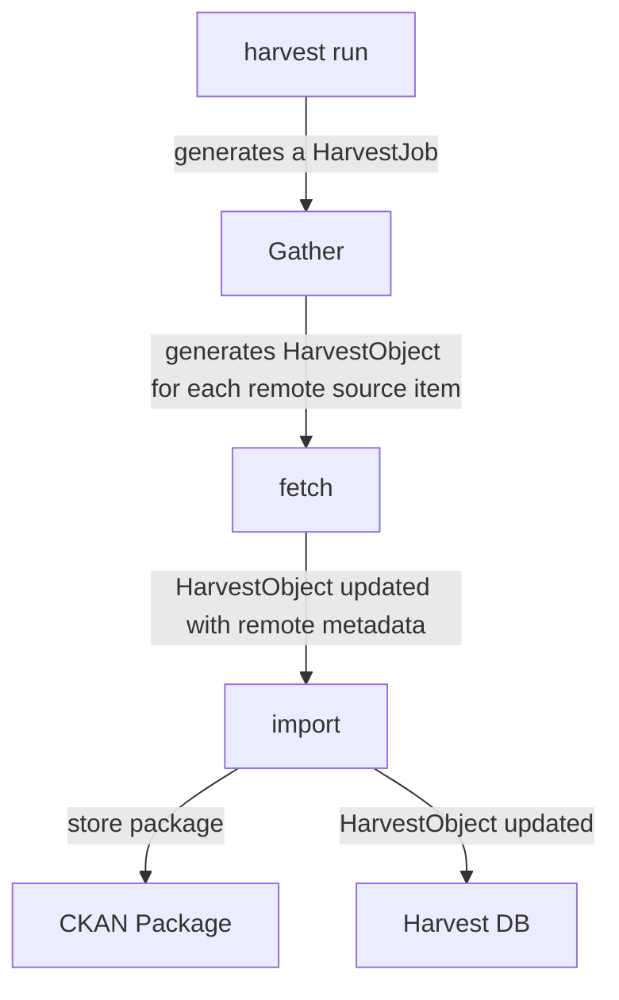

# Harvesting

## Introduction

Harvesting is the automated collection into a Data Portal of metadata (and maybe data) from other catalogs and sources.

The core epic is: As a Data Portal Manager I want to harvest datasets' metadata (and maybe data) from other portals into my portal so that all the metadata is in one place and hence searchable/discoverable there

### Features

Key features include:

* Harvest from multiple sources and with a variety of source metadata formats (e.g. data.json, DCAT, CKAN etc).
  * Implied is the ability to create and maintain (generic) harvesters for different types of metadata (e.g. data.json, DCAT) (below we call these pipelines)
  * Off-the-shelf harvesting for common metadata formats e.g. data.json, DCAT etc
* Incremental, efficient harvesting from a given source. For example, imagine a source catalog that has ~100k datasets and adds 100 new datasets every day. Assuming you have already harvested this catalog, you only want to harvest those 100 new datasets during your daily harvest (and not re-harvest all 100k). Similarly, you want to be able to handle deletions and modifications of existing datasets.
  * And even more complex case is where the harvested metadata is edited in the harvesting catalog and one has to handle merging of changes from the source catalog into the harvesting catalog (i.e. you can handle changes in both locations).
* Create and update harvest sources via API and UI
* Run and view harvests via API (and UI) and the background logging and monitoring to support that
* Detailed and useful feedback of harvesting errors so that harvest maintainers (or downstream catalog maintainers) can quickly and easily diagnose and fix issues
* Robust and reliable performance, for example supporting harvesting thousands or even millions of datasets a day

### Harvesting is ETL

"Harvesting" of metadata in its essence is exactly the same as any data collection and transformation process ("ETL"). "Metadata" is no different from any other data for our purposes (it is just quite small!).

This insight allows us to see harvesting as just like any other ETL process. At the same time, the specific nature of *this* ETL process e.g. that it is about collecting dataset metadata, allows us to design the system in specific ways.

We can use standard ETL tools to do harvesting, loosely coupling their operation to the CKAN Classic (or CKAN Next Gen) metastore. 

### Domain Model

The Harvesting Domain Model has the following conceptual components:

* **Pipeline**: a generic "harvester" pipeline for harvesting a particular data type e.g. data.json, dcat. A pipeline consists of Processors.
* **Source (aka Harvester)**: the entire spec of a repeatable harvest from a given source including the pipeline to use, the source info and any additional configuration e.g. the schedule on which to run this
* **Run (Job)**: a given run of a Source
* **Dataset**: a resulting dataset.
* **Log (Entry)**: (including errors)

NB: the term harvester is often used both for a pipeline (e.g. the DCAT Harvester) and for a Source e.g. "XYZ Agency data.json Harvester". Because of this confusion we prefer to avoid the term, or to reserve it for an active Source e.g. "the GSA data.json harvester".

### Components

A Harvesting system has the following key subsystems and components:

#### ETL

* **Pipelines**: a standard way of creating pipelines and processors in code
* **Runner**: a system for executing Runs of the harvesters. This should be queue based.
* **Logging**: a system for logging (and reporting) including of errors
* **Scratch (Store)**: Intermediate storage for temporary or partial outputs of the 
* **API**: interfaces the runner and errors

#### Sources and Configuration

* **Source Store**: database of Sources
* **API/UI**: UI, API and CLI usually covering Source Store plus reporting on them e.g. Runs, Errors etc

#### UI (web, command line etc)

* User interface (web and/or command line etc) to ETL e.g. runner, errors
* User interface to sources and configuration

#### MetaStore

* **MetaStore**: the store for harvested metadata -- this is considered to be outside the harvesting system itself

{/* <!-- TODO: explain how each of these is implemented in NG harvesting (maybe in a table) and compare with Classic --> */}


## CKAN v2

CKAN v2 implements harvesting via [ckanext-harvest extension][ckanext].

This extension stores configuration in the main DB and harvesters run off a queue process. A detailed analysis of how it works is in [the appendix below](#appendix-ckan-classic-harvesting-in-detail).

[ckanext]: https://github.com/ckan/ckanext-harvest

### Limitations 

The main problem is that ckanext-harvest builds its own bespoke mini-ETL system and builds this into CKAN. A bespoke system is less powerful and flexible, harder to maintain etc and building it in makes CKAN more bulky (conceptually, resource wise etc) and creates unnecessary coupling.

Good: Using CKAN as config store and having a UI for that

Not so good:

* An ETL system integrated with CKAN
  * Tightly coupled: so running tests of ETL requires CKAN. This makes it harder to creaate tests (with the result that many harvests have few or no tests).
  * Installation is painful (CKAN + 6 steps) making it harder to use, maintain and contribute to
  * Dependent on CKAN upgrade cycles (tied via code rather than service API)
  * CKAN is more complex
* Bespoke ETL system is both less powerful and harder to maintain
  * For example, the Runner is bespoke to CKAN rather than using something standard like e.g. Airflow
  * Rigid structure (gather, fetch, import) which may not fit many situations e.g. data.json harvesting (one big file with many datasets where everything done in gather) or where dependencies between stages
* Logging and reporting is not great and hard to customize (logs into CKAN)
* Maintenance Status - Some maintenance but not super it looks like but quite a lot outstanding (as of Aug 2019):
  * 47 [open issues](https://github.com/ckan/ckanext-harvest/issues)
  * 6 [open pull requests](https://github.com/ckan/ckanext-harvest/pulls) (some over a year old)
 

## CKAN v3

Next Gen harvesting decouples the core "ETL" part of harvesting into a small, self-contained microservice that is runnable on its own and communicates with the rest of CKAN over APIs. This is consistent with the general [next gen microservice approach](ckan-v3).

The design allows the Next Gen Harvester to be used with both CKAN Classic and CKAN Next Gen.

Perhaps most important of all, the core harvester can use standard third-party patterns and tools to make it both more powerful, easier to maintain and easier to use. For example, it can use Airflow for its runner rather than a bespoke system built into CKAN.

### Features

Specific aspects of the next gen approach:

* Simple: Easy to write harvesters -- just a python script and you can create harvesters without needing to know almost anything about CKAN
* Runnable and testable standalone (without the rest of CKAN) which makes running and testing much easier
* Uses the latest standard ETL techniques and technologies
* Multi-cluster support: run one harvester for multiple CKAN instances
* Data Package based

### Design

Here is an overview of the design. Further details on specific parts e.g. Pipelines in following sections. Coloring indicates implementation status:

* Green: Implemented
* Pink: In progress
* Grey: Next up




### User Journey

* Harvest Curator goes to WUI for Sources and does Create Harvest Source ...
* Fills it in ...
* Comes back to the harvest source dashboard
* To run a harvest source you go to the new Run UI interface
  * It lists all harvest sources like the harvest source ...
* Click on Run (even if this is just to set up the schedule ...)
* Go to Job page for this run which shows the status of this run and any results ... 
* [TODO: how do we link up harvest sources to runs]

### Pipelines

These follow a standard pattern:

* Built in Python
* Use DataFlows by default as way to structure the pipeline (but you can use anything)
* Produce data packages at each step
* Pipelines should be divided into two parts:
  * Extract and Transform: (fetch and convert) fetching remote datasets and converting them into a standard intermediate form (Data Packages)
  * Load: loading that intermediate form into the CKAN instance. This includes not only the format conversion but the work to synchronize state i.e. to create, update or delete in CKAN based on whether a given dataset from the source already has a representation in CKAN (harvests run repeatedly).



This pattern has these benefits:

* Load functionality to be reused across Harvest Pipelines (the same Load functionality can be used again and again)
* Cleaner testing: you can test extract and load without needing to have a CKAN instance 
* Ability to reuse Data Package tooling

#### Pipeline Example: Fetch and process a data.json

* **Extract**: Take say a data.json
  * Validate
* **Transform**: Split into datasets and then transform into data packages
  * Save to local
* **Transform 2** check the difference and write to the existing DB. 
* **Load**: Write to DB (CKAN metastore / DB)



#### Pipeline example detailed



### Runner

We use Apache Airflow for the Runner.

### Source Spec

This the specification of the Source object

You can compare this to [CKAN Classic HarvestSource objects below](#harvest-source-objects).

```javascript
id:
url:
title:
description:
date:
harvester_pipeline_id: // type in old CKAN
config:
enabled:              // is this harvester enabled at the moment
owner: // user_id
publisher_id: // what is this?? Maybe the org the dataset is attached to ...
frequency:  // MANUAL, DAILY etc
```

### UI

* Jobs UI: moves to next gen
* Source UI: stays in classic for now ...

### Installation

CKAN Next Gen is in active development and is being deployed in production.

You can find the code here:

https://github.com/datopian/ckan-ng-harvester-core

### Run it standalone

TODO

### How to integrate with CKAN Classic

Config in CKAN MetaStore, ETL in new System

* Keep storage and config in CKAN MetaStore (e.g. CKAN Classic)
* New ETL system for the actual harvesting process

**Pulling Config**

* Define a spec format for sources
* Script to convert this to Airflow DAGs
* Script to convert CKAN Harvest sources into the spec and hence into Airflow DAGs

**Showing Status and Errors**

* We create a viewer from Airflow status => JS SPA
* and then embed in CKAN Classic Admin UI



More detailed version:



### How do I ...

Support parent-child relationships in harvested datasets e.g. in data.json?

Enhance / transform incoming datasets e.g. assigning topics based on sources e.g. this is geodata


## Appendix: CKAN Classic Harvesting in Detail

https://github.com/ckan/ckanext-harvest

README is excellent and def worth reading - key parts of that are also below.

### Key Aspects

* Redis and AMQP (does anyone use AMQP)
* Logs to database with API access (off by default) - https://github.com/ckan/ckanext-harvest#database-logger-configurationoptional
* Dataset name generation (to avoid overwriting)
* Send mail when harvesting fails
* CLI - https://github.com/ckan/ckanext-harvest#command-line-interface
* Authorization - https://github.com/ckan/ckanext-harvest#authorization
* Built in CKAN harvester - https://github.com/ckan/ckanext-harvest#the-ckan-harvester
* Running it: you run the queue listeners (gather )

Existing harvesters

* CKAN - ckanext-harvest
* DCAT - https://github.com/ckan/ckanext-dcat/tree/master/ckanext/dcat/harvesters
* Spatial - https://github.com/ckan/ckanext-spatial/tree/master/ckanext/spatial/harvesters


### Domain model

See https://github.com/ckan/ckanext-harvest/blob/master/ckanext/harvest/model/__init__.py

* HarvestSource - a remote source for harvesting datasets from e.g. a CSW server or CKAN instance 
* HarvestJob - a job to do the harvesting (done in 2 stages: gather and then fetch and import). This is basically state for the overall process of doing a harvest.
* HarvestObject - job to harvest one dataset. Also holds dataset on the remote instance (id / url)
* HarvestGatherError
* HarvestObjectError
* HarvestLog

#### Harvest Source Objects

https://github.com/ckan/ckanext-harvest/blob/master/ckanext/harvest/model/__init__.py#L230-L245

```python
# harvest_source_table
Column('id', types.UnicodeText, primary_key=True, default=make_uuid),
Column('url', types.UnicodeText, nullable=False),
Column('title', types.UnicodeText, default=u''),
Column('description', types.UnicodeText, default=u''),
Column('config', types.UnicodeText, default=u''),
Column('created', types.DateTime, default=datetime.datetime.utcnow),
Column('type', types.UnicodeText, nullable=False),
Column('active', types.Boolean, default=True),
Column('user_id', types.UnicodeText, default=u''),
Column('publisher_id', types.UnicodeText, default=u''),
Column('frequency', types.UnicodeText, default=u'MANUAL'),
Column('next_run', types.DateTime), # not needed
```

#### Harvest Error and Log Objects

https://github.com/ckan/ckanext-harvest/blob/master/ckanext/harvest/model/__init__.py#L303-L331

```python
# New table
harvest_gather_error_table = Table(
    'harvest_gather_error',
    metadata,
    Column('id', types.UnicodeText, primary_key=True, default=make_uuid),
    Column('harvest_job_id', types.UnicodeText, ForeignKey('harvest_job.id')),
    Column('message', types.UnicodeText),
    Column('created', types.DateTime, default=datetime.datetime.utcnow),
)
# New table
harvest_object_error_table = Table(
    'harvest_object_error',
    metadata,
    Column('id', types.UnicodeText, primary_key=True, default=make_uuid),
    Column('harvest_object_id', types.UnicodeText, ForeignKey('harvest_object.id')),
    Column('message', types.UnicodeText),
    Column('stage', types.UnicodeText),
    Column('line', types.Integer),
    Column('created', types.DateTime, default=datetime.datetime.utcnow),
)
# Harvest Log table
harvest_log_table = Table(
    'harvest_log',
    metadata,
    Column('id', types.UnicodeText, primary_key=True, default=make_uuid),
    Column('content', types.UnicodeText, nullable=False),
    Column('level', types.Enum('DEBUG', 'INFO', 'WARNING', 'ERROR', 'CRITICAL', name='log_level')),
    Column('created', types.DateTime, default=datetime.datetime.utcnow),
)
```

### Key components

* Configuration: HarvestSource objects
* Pipelines: Gather, Fetch, Import stages in a given harvest extension
* Runner: bespoke queue system (backed by Redis or AMQP). Scheduler is external e.g. Cron
* Logging: logged into CKAN DB (as Harvest Errors)
* Interface: API, Web UI and CLI
* Storage:
  * Final: Datasets are in CKAN MetaStore
  * Intermediate: HarvestObject in CKAN MetaStore

### Flow

0. *Harvest run:* a regular run of the Harvester that generates a HarvestJob object. This is then passed to gather stage. This is what is generated by cron `harvest run` execution (or from web UI)
1.  The **gather** stage compiles all the resource identifiers that need to be fetched in the next stage (e.g. in a CSW server, it will perform a GetRecords operation).
2.  The **fetch** stage gets the contents of the remote objects and stores them in the database (e.g. in a CSW server, it will perform an GetRecordById operations).
3.  The **import** stage performs any necessary actions on the fetched resource (generally creating a CKAN package, but it can be anything the extension needs).



```python
def gather_stage(self, harvest_job):
    '''
    The gather stage will receive a HarvestJob object and will be
    responsible for:
        - gathering all the necessary objects to fetch on a later.
          stage (e.g. for a CSW server, perform a GetRecords request)
        - creating the necessary HarvestObjects in the database, specifying
          the guid and a reference to its job. The HarvestObjects need a
          reference date with the last modified date for the resource, this
          may need to be set in a different stage depending on the type of
          source.
        - creating and storing any suitable HarvestGatherErrors that may
          occur.
        - returning a list with all the ids of the created HarvestObjects.
        - to abort the harvest, create a HarvestGatherError and raise an
          exception. Any created HarvestObjects will be deleted.

    :param harvest_job: HarvestJob object
    :returns: A list of HarvestObject ids
    '''

def fetch_stage(self, harvest_object):
    '''
    The fetch stage will receive a HarvestObject object and will be
    responsible for:
        - getting the contents of the remote object (e.g. for a CSW server,
          perform a GetRecordById request).
        - saving the content in the provided HarvestObject.
        - creating and storing any suitable HarvestObjectErrors that may
          occur.
        - returning True if everything is ok (ie the object should now be
          imported), "unchanged" if the object didn't need harvesting after
          all (ie no error, but don't continue to import stage) or False if
          there were errors.

    :param harvest_object: HarvestObject object
    :returns: True if successful, 'unchanged' if nothing to import after
              all, False if not successful
    '''

def import_stage(self, harvest_object):
    '''
    The import stage will receive a HarvestObject object and will be
    responsible for:
        - performing any necessary action with the fetched object (e.g.
          create, update or delete a CKAN package).
          Note: if this stage creates or updates a package, a reference
          to the package should be added to the HarvestObject.
        - setting the HarvestObject.package (if there is one)
        - setting the HarvestObject.current for this harvest:
           - True if successfully created/updated
           - False if successfully deleted
        - setting HarvestObject.current to False for previous harvest
          objects of this harvest source if the action was successful.
        - creating and storing any suitable HarvestObjectErrors that may
          occur.
        - creating the HarvestObject - Package relation (if necessary)
        - returning True if the action was done, "unchanged" if the object
          didn't need harvesting after all or False if there were errors.

    NB You can run this stage repeatedly using 'paster harvest import'.

    :param harvest_object: HarvestObject object
    :returns: True if the action was done, "unchanged" if the object didn't
              need harvesting after all or False if there were errors.
    '''
```

### UI

Harvest admin portal


Add a Harvest Source


Clicking on Harvest Source gives you list of datasets harvested


Clicking on about gives you..


Admin view of a particular (Harvest) source


Edit harvester


Jobs summary


Individual jobs


