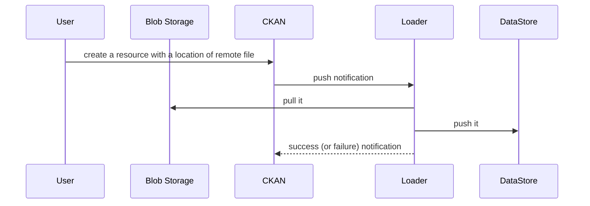
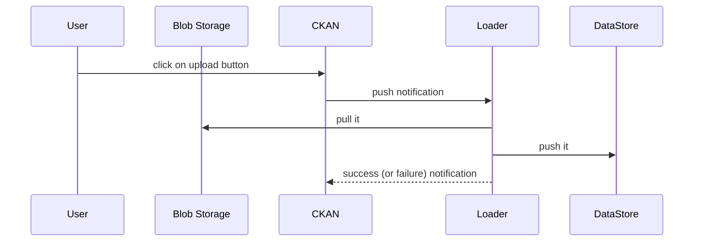
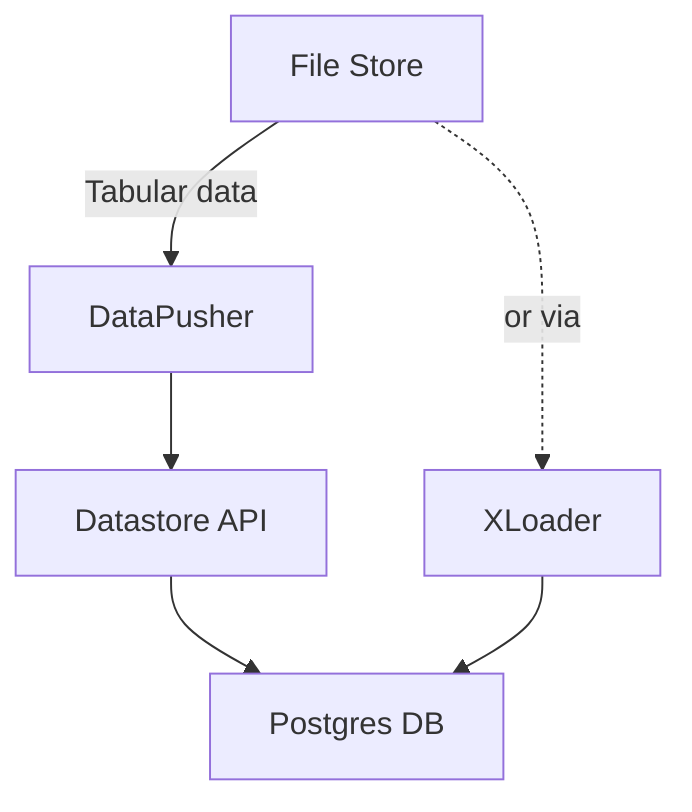
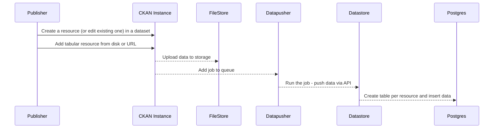

# Data Load

## Introduction

Data load covers functionality for automatedly loading structured data such as tables into a data management system. Data load is usually part of a larger [Data API (DataStore)][dapi] component.

Load is distinct from uploading raw files ("blobs") and from a "write" data API: from blobs because the data is structured (e.g. rows and columns) and that structure is expected to be preserved; from a write data API because the data is imported in bulk (e.g. a whole CSV file) rather than writing one row at a time.

The load terminology comes from ETL (extract, transform, load) though in reality this functionality will often include some extraction and transformation -- extracting the structured data from the source formats and potentially transformation if data needs some cleaning.

[dapi]: /docs/dms/data-api

### Features

As a Publisher i want to load my dataset (resource) into the DataStore quickly and reliably so that my data is available over the data API.

* Be “tolerant” where possible of bad data so that it still loads
* Get feedback on load progress, especially if something went wrong (with info on how I can fix it), so that I know my data is loaded (or if not what I can do about it)
* I want to update the schema for the data so that the data has right types (before and/or after load)
* I want to be able to update with a new resource file and only have it load the most recent

For sysadmins:

* Track Performance: As a Datopian Cloud Sysadmin I want to know if there are issues so that I can promptly address any problems for clients
* One Data Load Service per Cloud: As a Datopian Cloud Manager I may want to have one “DataLoad” service I maintain rather than one per instance for efficiency …

### Flows

#### Automatic load

* Users uploads a file to portal using the Dataset editor
  * This is stored into the blob storage (i.e. local or cloud storage)
* A "PUSH" notification is triggered to loader service
* Loader service load file to data API backend (a structured database with web API)

#### Sequence diagram for manual load

The load to the data API system can also be triggered manually:

## CKAN v2

The actual loading is provided by either DataPusher or XLoader. There is a common UI. There is no explicit API to trigger a load -- instead it is implicitly triggered, for example when a Resource is updated.

### UI

The UI shows runs of the data loading system with information on success or failure. It also allows eidtors to manually retrigger a load.

TODO: add more screenshots

### DataPusher

Service (API) For pushing tabular data to datastore. Do not confuse it with `ckanext/datapusher` in ckan core codbase which is simply an extension communicating with the DataPusher API. DataPusher itself is a standalone service, running separately from CKAN app.

https://github.com/ckan/datapusher

https://docs.ckan.org/projects/datapusher/en/latest/

https://docs.ckan.org/en/2.8/maintaining/datastore.html#datapusher-automatically-add-data-to-the-datastore

### XLoader

XLoader runs as async jobs within CKAN and bulk loads data via Postgres COPY command. This is fast but it does mean it only loads data as strings and explicit type-casting must be done after the load (the user must edit the data dictionary). XLoader was built to address 2 major issues with DataPusher:

* Speed: DataPusher converts data row by row and writes over the DataStore write API and hence is quite slow.
* Dirty data: DataPusher attempts to guess data types and then cast and this regularly led to failures which though logical were frustrating to users. XLoader gets the data in (as strings) and let's the user sort out types later.

https://github.com/ckan/ckanext-xloader

* `load_csv`: https://github.com/ckan/ckanext-xloader/blob/master/ckanext/xloader/loader.py#L40
* Loader: https://github.com/ckan/ckanext-xloader/blob/master/ckanext/xloader/jobs.py#L100

How does the queue system work: job queue is done by RQ, which is simpler and is backed by Redis and allows access to the CKAN model. Job results are currently still stored in its own database, but the intention is to move this relatively small amount of data into CKAN's database, to reduce the complication of install.

### Flow of Data in Data Load

Sequence diagram showing the journey of a tabular file into the DataStore:

### FAQs

Q: What happens with non-tabular data?
A: CKAN has a list of types of data it can process into the DataStore (TODO:link) and will only process those.

### What Issues are there?

Generally: the Data Load system is an hand-crafted, bespoke mini-ETL process. It would seem better to use high-quality third-party ETL tooling here rather than hand-roll be that for pipeline creation, monitoring, orchestration etc.

Specific examples:

* No connection between DataStore system and CKAN validation extension powered by GoodTables https://github.com/frictionlessdata/ckanext-validation Thus, for example, users may edit the DataStore Data Dictionary and be confused that this has no impact on validation. More generally, data validation and data loading might naturally be part of one overall ETL process but Data Load system is not architected in a way that makes this easy to add.
* No support for Frictionless Data spec sand their ability to specific incoming data structure (CSV format, encoding, column types etc).
	* Dependent on error-prone guessing of types or manual type conversion
	* Makes it painful to integrate with broader data processing pipeline (e.g. clean separation would allow type guessing to be optimized elsewhere in another part of the ETL pipeline)
* Excel loading won't work or won't load all sheets
* DataPusher
	* https://github.com/ckan/ckanext-xloader#key-differences-from-datapusher
	* Works terribly with loading a bit big data. It may for no reason crash after hour of loading. And after reload it goes along
	* Is slow esp for large datasets and even smallish datasets e.g. 25Mb
	* often fails due to e.g. data validation/casting errors but this not clear (and unsatisfying to the user)
* XLoader:
	* Doesn't work with XLS(X)
	* has problems fetching resources from Blob Storage (it fails and need to wait until the Resource is uploaded.)
	* raising Exception NotFound when CKAN has a delay creating resources
	* re-submits Resources when creating a new Resource
	* XLoader sets `datastore_active` before data is uploaded

## CKAN v3

The v3 implementation is named 💨🥫 AirCan: https://github.com/datopian/aircan

Its a lightweight, standalone service using AirFlow.

Status: Beta (June 2020)

* Runs as a separate microservice with zero coupling with CKAN core (=> gives cleaner separation and testing)
* Uses Frictionless Data patterns and specs where possible e.g. Table Schema for describing or inferring the data schema
* Uses AirFlow as the runner
* Uses common ETL / [Data Flows][] patterns and frameworks

[Data Flows]: /docs/dms/flows

### Design

See [Design page &raquo;](/docs/dms/load/design/)
