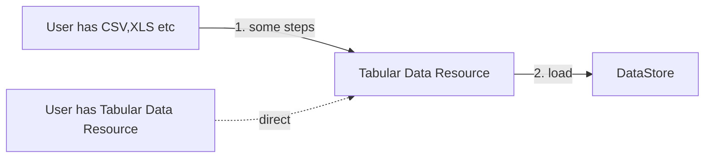
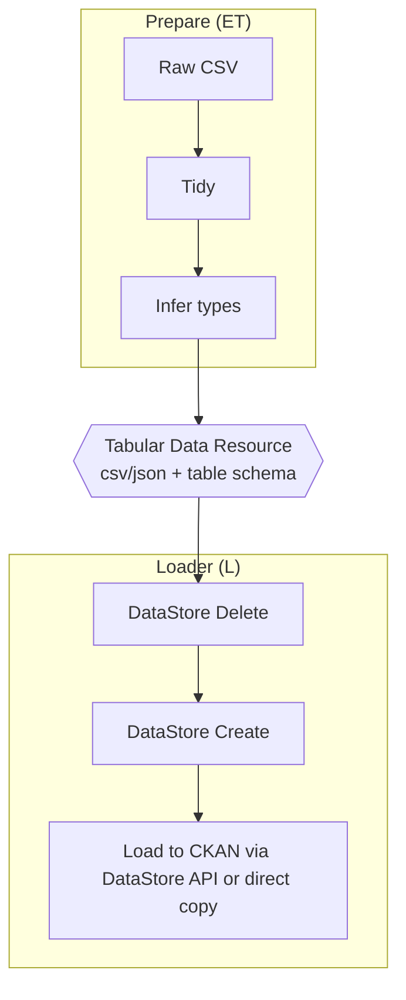
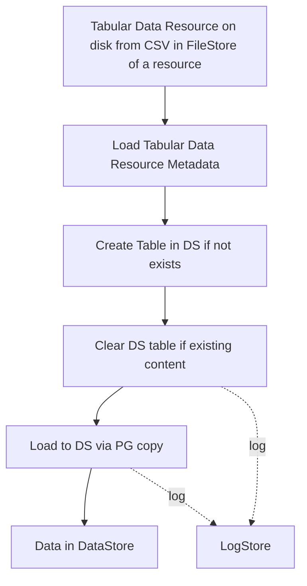
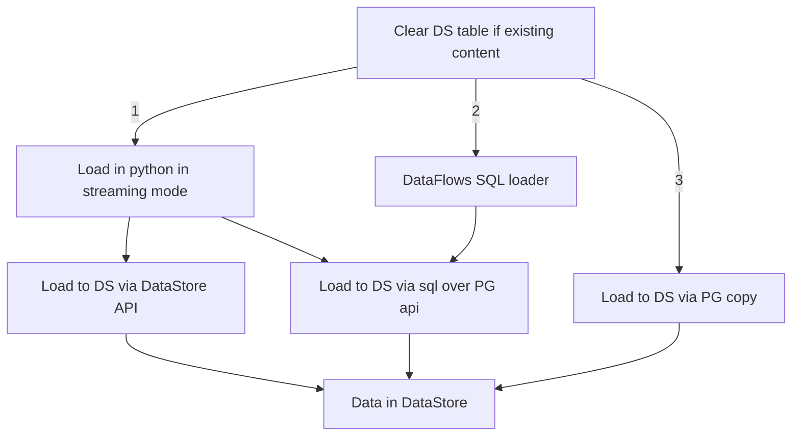

# Data Load Design

Key point: this is classic ETL so let's reuse those patterns and tooling.

## Logic



In more detail, dividing ET(transform) from L(oad):



### Load step in even more detail



## Runner

We will use AirFlow.


## Research

### What is a Tabular Data Resource?

See Frictionless Specs. For our purposes:

* A "Good" CSV file: Valid CSV - with one header row, No blank header etc...
* Encoding worked out -- usually we should have already converted to utf-8
* Dialect - https://frictionlessdata.io/specs/csv-dialect/
* Table Schema https://frictionlessdata.io/specs/table-schema

NB: even if you want to go direct loading route (a la XLoader) and forget types you still need encoding etc sorted -- and it still fits in diagram above (Table Schema is just trivial -- everything is strings).

### What is datastore and how to create the DataStore entry

https://github.com/ckan/ckan/tree/master/ckanext/datastore
* provides an ad hoc database for storage of structured data from CKAN resources
* Connection with Datapusher: https://docs.ckan.org/en/2.8/maintaining/datastore.html#datapusher-automatically-add-data-to-the-datastore
* Datastore API: https://docs.ckan.org/en/2.8/maintaining/datastore.html#the-datastore-api
  * Making Datastore API requests: https://docs.ckan.org/en/2.8/maintaining/datastore.html#making-a-datastore-api-request

#### Create an entry

```
curl -X POST http://127.0.0.1:5000/api/3/action/datastore_create -H "Authorization: {YOUR-API-KEY}"

resource
-d '{
  "resource": {"package_id": "{PACKAGE-ID}"},
  "fields": [ {"id": "a"}, {"id": "b"} ]
  }'
```

https://docs.ckan.org/en/2.8/maintaining/datastore.html#ckanext.datastore.logic.action.datastore_create

### Options for Loading

There are 3 different paths we could take:



#### Pros and Cons of different approaches

|Criteria | Datastore Write API | PG Copy | Dataflows |
|---------|:--------- |:------- | ---------: |
| Speed   | Low       |  High   | ???     |
|Error Reporting| Yes |  Yes    | No(?)   |
|Easy of implementation|  Yes | No(?) | Yes |
Works Big data| No | Yes | Yes(?) |
|Works well in parrallel| No | Yes(?) | Yes(?)

### DataFlows

https://github.com/datahq/dataflows

Dataflows is a framework for loading, processing, manipulating data.

* Loader (Loading from external source (or disk)): https://github.com/datahq/dataflows/blob/master/dataflows/processors/load.py
* Load to an SQL db (Dump processed data) https://github.com/datahq/dataflows/blob/master/dataflows/processors/dumpers/to_sql.py
* What is error reporting, what is runner system ..., does it have a UI? does it have a queue system?
  * Think data package pipelines is taking care of all of these. https://github.com/frictionlessdata/datapackage-pipelines
    * DPP itself is also a ETL framework, just much heavier and a bit complicated.

### Notes an QA (Sep 2019)

* Note: TDR needs info on CKAN Resource source so we can create right datastore entry ..
* No need to validate as we assume it is good ...
  * We might want to do that ... still
* Pros and Cons
  * Speed
  * Error reporting ...
    * What happens with Copy if you hit an error (e.g. a bad cast?)
    * https://infinum.co/the-capsized-eight/superfast-csv-imports-using-postgresqls-copy
    * https://wiki.postgresql.org/wiki/Error_logging_in_COPY
  * Ease of implementation
  * Good with inserting Big data
* Create as strings and cast later ... ?
* xloader implementation with COPY command: https://github.com/ckan/ckanext-xloader/blob/fb17763fc7726084f67f6ebd640809ecc055b3a2/ckanext/xloader/loader.py#L40

Raw insert ~ 15m (on 1m rows)
Insert with begin / commit ~5m
copy ~82s (though may have limit on b/w) -- and what happens if pipe breaks

Q: Is it better to but everything in DB as a string and cast later or cast and insert in DB.
A: Probably cast first and insert after.

Q: Why do we rush to insert the data in DB? We will have to wait until it's casted anyways befroe use
A: It's much faster to do operations id DB than outside.
