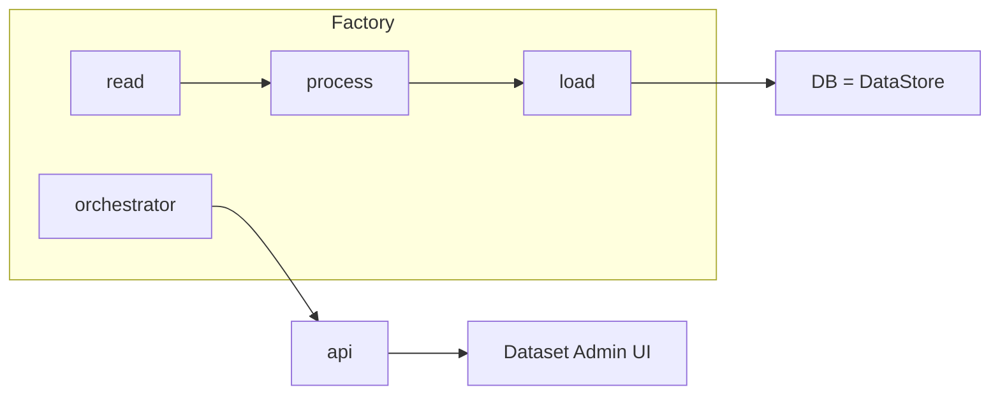
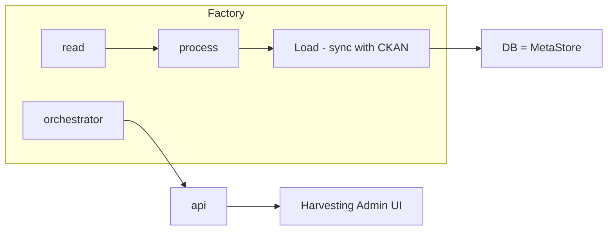
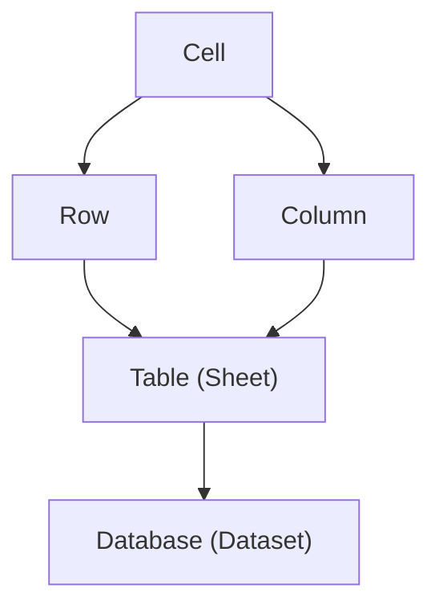

# Notebook

Our lab notebook. Informal thoughts. A very raw blog.

# Data Literate - a small Product Idea 2021-05-17 @rufuspollock

I want to write a README with data and vis in it and preview it ...

* Markdown is becoming a lingua franca for writing developer and even research docs
  * It's quick and ascii-like
  * It's widely supported
  * It's extensible ...
* Frontend tooling is rapidly evolving ...
  * The distant between code and a tool is declining => I might as well write code ...
* MDX = Markdown + react
* RStudio did this a while ago ...
* Missing part is data ...
  * You have juputer notebooks etc ... => they are quite high end ...

```
Notebooks (jupyter, literate programming) ==> 
  Write text and code together
  Write code like in a terminal
  Data oriented
```

Visualization

React

Markdown ...

---

Here the kinds of doc i want to write

```
## A Dataset

\```
# Global Solar Supply (Annual)

Solar energy supply globally.

Source: International Energy Association https://www.iea.org/reports/solar-pv.

| Year | Generation (TWh) | % of total energy |
|--|--|
|2008|12|
|2009|20|
|2010|32|
|2011|63|
|2012|99|
|2013|139|
|2014|190|
|2015|251|
|2016|329|
|2017|444|
|2018|585|
|2019|720| 2.7 |
\```

Europe Brent Spot Prices (Annual/ Monthly/ Weekly/ Daily) from U.S. Energy Information Administration (EIA).

Source: https://www.eia.gov/dnav/pet/hist/RBRTEd.htm
```

### Notes

R Markdown - https://rmarkdown.rstudio.com

> Use a productive notebook interface to weave together narrative text and code to produce elegantly formatted output. 


## A DMS is a tool, a Data Portal is a solution 2021-03-14 @rufuspollock

Over the years, we've seen many different terms used to describe software like CKAN and the solutions it is used to create e.g. data catalog, data portal, data management system, data platform etc.

Over time, personally, I've converged towards [data management system (DMS)](/docs/dms/dms) and [data portal](/docs/dms/data-portals). But I've still got two terms and even people in my own team ask me to clarify what the difference is. Recently it became clear to me:

**A data management system (DMS) is a tool. A data portal is a solution.**

And a data management system is a tool you can use to build a data portal. Just like you can use a hammer to build a house. 

## Data Factory Concepts 2020-09-03 @rufuspollock

Had this conceptual diagram hanging round for a couple of years.

```
Objects

Row
  File
    Dataset

Transformations

Operator
  Pipeline
    Flow 
````

NTS

* A factory could be a (DA)G of flows b/c could be dependencies between them ... e.g. run ComputeKeyMetrics only after all other flows have run ...
* But not always like that: flows can be completely independent.

## Current Data Factory Components (early 2019)

```
      Factory - Runners, SaaS platform etc

datapackage-pipelines -> (dataflows-server / dataflows-runner)
dataflows-cli : generators, hello-world, 'init', 'run'
goodtables.io
"blueprints": standard setups for a factory (auto-guessed?)

            DataFlows: Flow Libs

dataflows : processor definition and chaining
processors-library: stdlib, user contributed items [dataflows-load-csv]

            Data Package Libs

data.py, DataPackage-py, GoodTables, ...
tabulator, tableschema
```

## Composition vs Inheritance approaches to building applications and esp web apps 2020-08-20 @rufuspollock

tl;dr: composition is better than inheritance but many systems are built with inheritance 

Imagine we want a page like this:

```
<header>
{{title}}
</footer>
```

Inheritance / Slot model

```
def render_home:
  return render('base_template.html'< {
    title="hello world"
  })
```

Composition / declarative

```
def render_home:
  mytitle = 'hello world'
  response.write(get_header())
  response.write(mytitle)
  response.write(get_footer()
```

You can write templates two ways:

### Inheritance

Base template

```html
# base.html
<header>
<title>{{title}}</title>

{{content}}
</footer>
```

`blog-post.html`

```

<block name="title">{{title}} -- Blog</block>
```

### Composition

`blog-post.html`

```
<include/partial name='header.html' title="..."/>

{{content}}

<include name='footer.html' />
```


## How Views should work in CKAN v3 (Next Gen) 2020-08-10  @rufuspollock

Two key points:

1. Views should become an explicit (data) project level object
2. Previews: should be very simple and work *without* data API

Why?

* Views should become an explicit (data) project level object
  * So I can show a view on dataset page (atm I can't)
  * I have multiview view inside reclinejs but rest are single views ... (this is confusing)
  * I can't create views across multiple resources
  * They are nested under resources but they aren't really part of a resource
* Previews: should be very simple and work *without* data API
  * so they work with revisions (atm views often depend on data API which causes problems with revisions and viewing old revisions of resources)

Distinguish 3 concepts

* Preview: a very simple method for previewing specific raw data types e.g. csv, excel, json, xml, text, geojson etc ...
  * Key aspect are ability to sample a part and to present.
* Viz: graph, map, ... (visualizations)
* Query UI: UI for creating queries
* Viz Builder: a UI for creating charts, tables, maps etc
* Explorer (dashboard): combines query UI, Viz Builder and Viz Renderer

## What a (future) Data Project looks like 

NB: To understand what a project is see [DMS](/docs/dms/dms).

It helps me to be very concreate and imagine what this looks looks like on disk:

```
datapackage.json # dataset
data.csv    # dataset resources (could be anywhere)
views.yml
data-api.yml
flows.yml
```

Or, a bit more elegantly:

```
data/
  gdp.csv | gdp.pdf | ...
views/
  graph.json | table.json | ...
api/
  gdp.json | gdp-ppp.json | ...
flows/
  ...
README.md
datapackage.json    # ? does this just contain resources or more than that? Just resources
```

## Data Factory 2020-07-23 @rufuspollock

I've used the term Data Factory but it's not in common use. At the same time, there doesn't seem to be a good term out there in common use for what I'm referring to.

What am I referring to?

I can start with terms we do have decent-ish terminlogy for: data pipelines or data flows.

Idea is reasonably simple: I'm doing stuff to some data and it involves a series of processing steps which I want to run in order. It may get more complex: rather than a linear sequence of tasks I may have branching and/or parallelization.

Because data "flows" through these steps from one end to the otehr we end up with terminology like "flow" or "pipeline".

Broken down into its components we have two things:

* Tasks: the individual processing nodes, i.e. a single operator on a unit of data (aka Processors / Operators)
* Pipeline: which combines these tasks into a whole (aka Flow, Graph, DAG ...). It is a DAG (directed acycle graph) of processors starting from one or more sources and ending in one or more sinks. Note the simple case of a linear flow is very common.

[NB: tasks in an actual flow could either be bespoke to that flow or are configured instances of a template / abstract tasks e.g. load from s3 might be be a template task which as a live task in an actual flow will be configured with a specific bucket.]

So far, so good.

But what is the name for a system (like AirFlow, Luigi) for creating, managing and running data pipelines?

My answer: a Data Factory.

What I don't like with this is that it messes with the metaphor: factories are different from pipelines. If we went with Data Factory then we should talk about "assembly lines" rather than "pipelines" and "workers" (?) rather than tasks. If one stuck with water we'd end up with something like a Data Plant but that sounds weird.

Analogy: for data we clearly have a file and dataset. And a system for organizing and managing datasets is a data catalog or data management system. So what's the name for the system for processing datasets ...

And finally :checkered_flag: I should mention [AirCan][], our own Data Factory system we've been developing built on AirFlow.

[AirCan]: https://github.com/datopian/aircan/

### Appendix: Terminology match up

| Concept |  Airflow | Luigi |
|---------|----------|-------|
| Processor |  Task  | Task  |
| Pipeline  | DAG    | ?     |
| Pipeline (complex, branching) | DAG |


## Commonalities of Harvesting and Data(Store) Loading 2020-06-01 @rufuspollock

tags: portal, load, factory

Harvesting and data loading (for data API) are almost identical as mechanisms. As such, they can share the same "data factory" system.

Data API load to backing DB (CKAN DataStore + DataPusher stuff)



Harvesting



## 10 things I regret about NodeJS by Ryan Dahl (2018) 2020-05-17 @rufuspollock

Valuable generally and more great lessons for data packaging.

https://www.youtube.com/watch?v=M3BM9TB-8yA

### package.json and npm were a mistake

Why package.json was a mistake: https://youtu.be/M3BM9TB-8yA?t=595


* `npm` + a centralized repo are unnecessary (and were a mistake)
* doesn't like centralized npm repo (I agree) and look what go are doing. Sure, you probably have something via the backdoor at the end (e.g. go is getting that) for caching and reliability purposes, but it is not strictly necessary.

ASIDE: It's the core tool (node) that make a metadata format and packager relevant and successful. It's node require allowing using of `package.json` or bundling `npm` in by defaultonly 

* Kind of obvious when you think about it
* Something i've always said re Data Packages (but not strongly enough and not followed enough): the tooling comes first and the format is, in many ways, a secondary conveinience. To be fair to myself (and others) we did write `dpm` first (in 2007!), and do a lot of stuff with the workflow and toolchain but its easy to get distracted.


* modules aren't strictly necessary and `package.json` metadata is not needed
* on the web you just have js file and you can include them ...
* "package.json has all this unnecessary noise in it. like license, repository. Why am i filling this out. I feel like a book-keeper or something. This is just unnecessary stuff *to do* when all I am trying to do is link to a library" [ed: **I think this is a major relevance for Data Packages. There's a tension between the book-keepers who want lots of metadata for publishing etc ... and ... the data science and data engineers who just want to get something done. If I had a choice (and I do!) I would prioritize the latter massively. And they just care about stuff like a) table schema b) get me the data on my hard disk fast**]
* "If only relative files and URLs were used when importing, the path defines the version. There is no need to list dependencies" [ed: cf Go that did this right]
  * And he's borrowed from Go for deno.land

### Vendoring by default with `node_modules` was a mistake

Vendoring by default with `node_modules` was a mistake - just use an env variable `$NODE_PATH`

* `node_modules` then becomes massive
* module resolution is (needlessly) complex

### General point: KISS / YAGNI

E.g. `index.js`was "cute" but unnecessary, allowing `require xxx` without an extension (e.g. `.js` or `.ts` ) means you have to probe the file system.

+data package. +data packaging. +frictionless. +lessons

## Go modules and dependency management (re data package management) 2020-05-16 @rufuspollock

Generally Go does stuff well. They also punted on dependency management initially. First, you just installed a url it was up to you to manage your depedencies. Then there was a period of chaos as several package/dependency managers fought it out (GoDeps etc). Then, ~ 2018 the community came together led by Russ Cox and came up with a very solid proposal which is official as of 2019.

Go's approach to module (package) and dependency management can be an inspiration for Frictionless and Data Packages. Just as we learnt and borrowed a lot from Python and Node so we can learn and borrow from Go.

1. Overview (by Russ Cox the author): https://research.swtch.com/vgo
2. The Principles of Versioning in Go https://research.swtch.com/vgo-principles
3. A Tour of Versioned Go (vgo) https://research.swtch.com/vgo-tour
4. cmd/go: add package version support to Go toolchain https://github.com/golang/go/issues/24301
5. Using Go Modules - https://blog.golang.org/using-go-modules (official introduction on go blog)
6. Publishing Go Modules https://blog.golang.org/publishing-go-modules
7. Main wiki article and overview https://github.com/golang/go/wiki/Modules

### Key principles

> These are the three principles of versioning in Go, the reasons that the design of Go modules deviates from the design of Dep, Cargo, Bundler, and others.
>
> 1. Compatibility. The meaning of a name in a program should not change over time.
> 2. Repeatability. The result of a build of a given version of a package should not change over time. https://research.swtch.com/vgo-principles#repeatability
> 3. Cooperation. To maintain the Go package ecosystem, we must all work together. Tools cannot work around a lack of cooperation.

Summary

* Go used urls for identifiers for packages (including special cases for github) 
  * e.g. `import rsc.io/quote`
  * Brilliant! No more dependency resolution via some central service. Just use the internet.
* Go installed packages via `go get` e.g. `go get rsc.io/quote`. This would install the module into `$GOPATH` at `rsc.io/quote`
  * They did the absolute minimum: grab the files onto your hard disk under `$GOPATH/src`. `import` would then search this (IIUC)
* There was no way originally to get a version but with go modules (go > 1.11) you could do `go get rsc.io/quote@[version]`
* Dependency management is actually complex: satisfying dependency requirements is NP complete. Solve this by ...
  * The Node/Bundler/Cargo/Dep approach is one answer. Allow authors to specify arbitrary constraints on their dependencies. Build a given target by collecting all its dependencies recursively and finding a configuration satisfying all those constraints. => SAT solver => this is complex.
  * Go has a different solution
  * Versioning is central to dependency management => you need to get really clear on versioning. Establish a community rule that you can only break compatibility with major versions ...
  * Put breaking version (e.g. major versions) **into the url** so that you actually have a different package ...

    > For Go modules, we gave this old advice a new name, the import compatibility rule:

    >> If an old package and a new package have the same import path,
    >> the new package must be backwards compatible with the old package.


    

  * Install the minimal version of a package that satisfies the requirements (rather than the maximal version) => this yields repeatability (principle 2)
  * In summary Go differs in that: all versions are explicit (no `<=`, `>=`). Since we can assume that all later versions of a module are backwards compatible (and any breaking change generates a new module with explicit `vX` in name) we can simply cycle through a module and its dependencies and find the highest version that are listed and install that.
* Publishing a module is just pushing to github/gitlab or putting it somewhere on the web -- see https://blog.golang.org/publishing-go-modules
* Tagging versions is done with git tag
* "A module is a collection of related Go packages that are versioned together as a single unit."

Layout on disk in a module (see e.g. https://blog.golang.org/publishing-go-modules). Main file `go.mod` and one extra for storing hashes for verification (it's not a lock file)

```
$ cat go.mod
module example.com/hello

go 1.12

require rsc.io/quote/v3 v3.1.0

$ cat go.sum
golang.org/x/text v0.0.0-20170915032832-14c0d48ead0c h1:qgOY6WgZOaTkIIMiVjBQcw93ERBE4m30iBm00nkL0i8=
golang.org/x/text v0.0.0-20170915032832-14c0d48ead0c/go.mod h1:NqM8EUOU14njkJ3fqMW+pc6Ldnwhi/IjpwHt7yyuwOQ=
rsc.io/quote/v3 v3.1.0 h1:9JKUTTIUgS6kzR9mK1YuGKv6Nl+DijDNIc0ghT58FaY=
rsc.io/quote/v3 v3.1.0/go.mod h1:yEA65RcK8LyAZtP9Kv3t0HmxON59tX3rD+tICJqUlj0=
rsc.io/sampler v1.3.0 h1:7uVkIFmeBqHfdjD+gZwtXXI+RODJ2Wc4O7MPEh/QiW4=
rsc.io/sampler v1.3.0/go.mod h1:T1hPZKmBbMNahiBKFy5HrXp6adAjACjK9JXDnKaTXpA=
```


### Asides

#### Vendoring is an incomplete solution to package versioning problem

> More fundamentally, vendoring is an incomplete solution to the package versioning problem. It only provides reproducible builds. It does nothing to help understand package versions and decide which version of a package to use. Package managers like glide and dep add the concept of versioning onto Go builds implicitly, without direct toolchain support, by setting up the vendor directory a certain way. As a result, the many tools in the Go ecosystem cannot be made properly aware of versions. It's clear that Go needs direct toolchain support for package versions. https://research.swtch.com/vgo-intro

## 2020-05-16 @rufuspollock

Ruthlessly retain compatibility after v1 - inspiration from Go for Frictionless

> It is intended that programs written to the Go 1 specification will continue to compile and run correctly, unchanged, over the lifetime of that specification. Go programs that work today should continue to work even as future “point” releases of Go 1 arise (Go 1.1, Go 1.2, etc.).
>
> — https://golang.org/doc/go1compat

And they go further -- not just Go but also Go packages:

> Packages intended for public use should try to maintain backwards compatibility as they evolve. The Go 1 compatibility guidelines are a good reference here: don’t remove exported names, encourage tagged composite literals, and so on. If different functionality is required, add a new name instead of changing an old one. If a complete break is required, create a new package with a new import path.
>
> The Go FAQ has since Go 1.2 in November 2013

+frictionless

## 2020-05-15 @rufuspollock

`Project` should be the primary object in a DataHub/Data Portal -- not Dataset.

Why? Because actually this is more than a Dataset. For example, it includes issues or workflows. A project is a good name for this that is both generic and specific.

cf Git-hub e.g. Gitlab (and Github). Gitlab came later and did this right: it's primary object is a Project which hasA Repository. Github still insits on calling them repositories (see primary menu item which is "Create a new repository"). This is weird, a github "repository" isn't actually a github repository: it has issues, stats, workflows and even a discussion board now. Calling it a project is the accurate description and the repository label is a historical artifact when that was all it was. I sometimes create "repos" on Github just to have an issue tracker. Gitlab understands this and actually allows me to have projects without any associated repository.

TODO: take a screenshot to illustrate Gitlab and Github.

+flashes of insight. +datahub +data portal. +domain model.

## 2020-04-23 @rufuspollock

4 Stores of a DataHub

>[!tip]Naming is one of the most important things -- and hardest!

* MetaStore [service]: API (and store) of the metadata for datasets
* HubStore [service]: API for registry of datasets (+ potentially organizations and ownership relationships to datasets)
* BlobStore [service]: API for blobs of data
* StructuredStore [service]: API for structured data

Origins:

* Started using MetaStore in DataHub.io back in 2016
* Not used in CKAN v2
* Conceptually CKAN originally was MetaStore and HubStore.

In CKAN v2:

* MetaStore and HubStore (no explicit name) => main Postgres DB
* StructuredStore (called DataStore) => another separate Postgres DB
* BlobStore (called FileStore) => local disk (or cloud with an extension)

In CKAN v3: propose to separate these explicitly ...

## Data Portal vs DataHub vs Data OS 2020-04-23 @rufuspollock

Data Portal vs DataHub vs Data OS -- naming and definitions.

Is a Data Portal a DataHub? Is a DataHub a DataOS? If not, what are the differences?

+todo

## Data Concepts - from Atoms to Organisms 2020-03-05 @rufuspollock

```
Point -> Line -> Plane (0d -> 1d -> 2d -> 3d)

Atom -> Molecule -> Cell -> Organism
```



```
          Domain =>
Dimension
    |
    V
```

| Dimension |  ... | Math | Spreadsheets | Databases | Tables etc | Frictionless | Pandas | R | 
|--|--|--|--|--|--|--|--|--|
| 0d | Datum | Value | Cell | Value | Scalar? | N/A | Value | ? |
| 1d | ....  | Array / Vector | Row  | Row | Row | N/A |
| 1d | ....  | N/A | Column | 
| 2d | Grid? | Matrix | Sheet | Table | Table | TableSchema |
| 3d | Cube  | 3d Matrix | Spreadsheet | Database (or Cube) | N/A | ? |  ? | ? |
| 4d+ | HyperCube | n-d Matrix | 

What's crucial about a table is that it is not just an array of arrays or a rowset but a rowset plus a fieldset.

```
Field => FieldSet
Row => RowSet
```

A Table is a FieldSet x RowSet (+ other information)

There is the question of whether there is some kind of connection or commonality at each dimension up ... e.g. you could have an array of arrays where each array has different fields ... 

```json
{ "first": "joe", "height": 3 }
{ "last": "gautama", "weight": 50 }
```

But a table has common fields.

```json
{ "first": "joe", "height": 3 }
{ "first": "siddarta", "height": 50 }
```

(NB: one could always force a group of rows with disparate fields into being a table by creating the union of all the fields but that's hacky)

So a table is a RowSet plus a FieldSet where each row conforms to that FieldSet.

Similarly, we can aggregate tables. By default here the tables do *not* share any commonality -- sheets in a spreadsheet need not share any common aspect, nor do tables in a database.  If they do, then we have a cube.

NEXT: moving to flows / processes.

## Is there room / need for a simple dataflow library?  2020-02-23 @rufuspollock

Is there room / need for a simple dataflow library ...?

What kind of library?

* So Apache Beam /Google DataFlow is great ... and it is pretty complex and designed for use out of the box in parallel etc
* Apache Nifi: got a nice UI, Java and heavy duty.
* My own experience (even just now with key metrics) is i want something that will load and pipe data between processors

Ideas 

* create-react-app for data flows: quickly scaffold data flows
* What is the default runner
