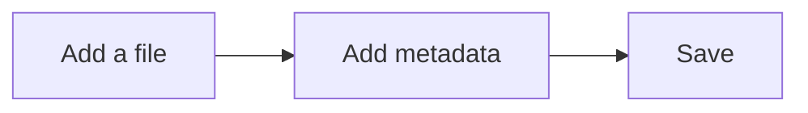
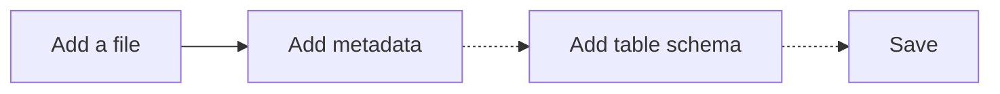
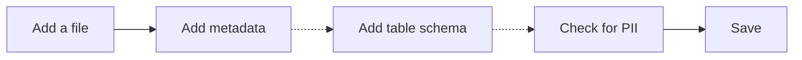
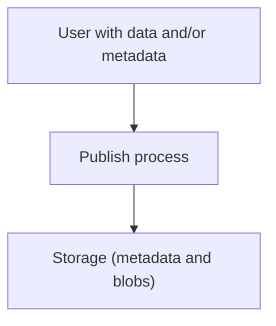
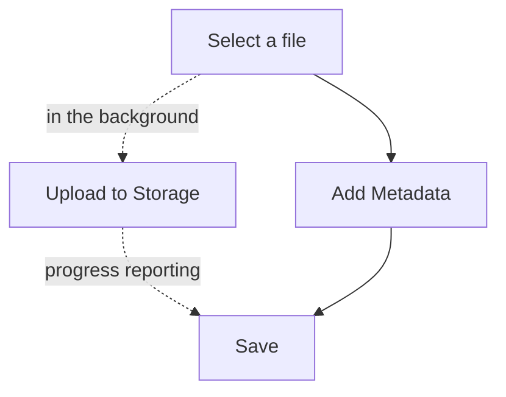
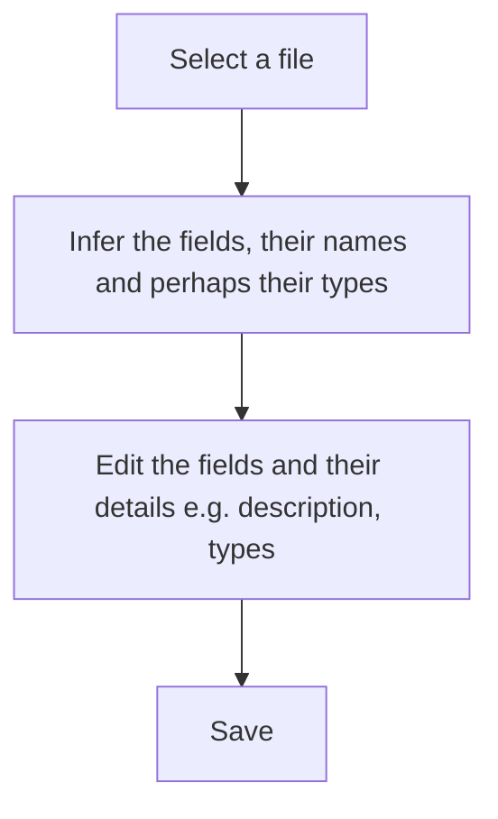

# Publish Data

## Introduction

Publish functionality covers the whole area of creating and editing datasets and resources, including data upload. The core job story is something like:

> When a Data Curator has a data file or dataset they want to add it to their data portal/platform quickly and easily so that it is available there.

Publication can be divided by its *mode*:

* **Manual**: publication is done by people via a user interfaces or other tool
* **Programmatic**: publication is done programatically using APIs and is usually part of automated processes
* **Hybrid**: which combines manual and programmatic. An example would be harvesting where setup and configuration may be done in a UI manually with the process then running automatically and programmatically (in addition, some new harvesting flows require manual programmatic setup e.g. writing a harvester in Python for a new source data format).

**Focus on Manual** we will focus on the manual in this section: programmatic is by nature largely up to the client programmer (assuming the APIs are there) whilst [Harvesting][] has a section of its own. That said, many concepts here are relevant for other cases e.g. material on [profiles][] and [schemas][].

**Data uploading**: included in publish is the process of uploading data into the DMS, and specifically into [storage][] and especially [(blob) storage][blob].
.

[Harvesting]: /docs/dms/harvesting
[profiles]: /docs/dms/glossary#profile
[schemas]: /docs/dms/glossary#schema
[storage]: /docs/dms/storage
[blob]: /docs/dms/blob-storage

### Examples

At its simplest, a publishing process can just involve providing a few metadata fields in a form -- with the data itself stored elsewhere.

At the other end of the spectrum, we could have a multi-stage and complex process like this:

* Multiple (simultaneous) resource upload with shared metadata e.g. I'm creating a timeseries dataset with the last 12 months of data and I want each file to share the same column information but to have different titles
* A variety of metadata profiles
* Data validation (prior to ingest) including checking for PII (personally identifiable infromation) 
* Complex workflow related to approval e.g. only publish if at least two people have approved
* Embargoing (only make public at time X)

### Features

* Create and edit datasets and resources
* File upload as part of resource creation
* Custom metadata for both profile and schemas

### Job Stories

When a Data Curator has a data file or dataset they want to add it manually (e.g. via drag and drop etc) to their data portal quickly and easily so that it is avaialble there.

More specifically: As a Data Curator I want to drop a file in and edit the metadata and have it saved in a really awesome interactive way so that the data is “imported” and of good quality (and i get feedback)

#### Resources

>[!tip]A resource is any data item in a dataset e.g. a file.

When adding a resource to a dataset I want metadata pre-entered for me (e.g. resource name from file name, encoding, ...) to save time and reduce errors

When adding a resource to a dataset I want to be able to edit the metadata whilst uploading so that I save time

When uploading a resource's data as part of adding a resource to a dataset I want to see upload progress so that I have a sense of how long this will take

When adding resources to a dataset I want to be able to add and upload multiple files at once so that I save time and make one big change 

When adding a resource which is tabular (e.g. csv, excel) I want to enter the (table) schema (i.e. the names, description and types of columns) so that my data is more useable, presentable, importable (e.g. to DataStore) and validatable

When adding a resource which is currently stored in dropbox/gdrive/onedrive I want to pull the bytes directly from there so as to speed up the upload process

### Domain Model

The domain model here is that of the [DMS](/docs/dms/dms) and we recommend visiting that page for more information. The key items are:

* Project
* Dataset
* Resource

[DMS]: /docs/dms/dms

### Principles

* Most ordinary data users don't distinguish resources and datasets in their everyday use. They also prefer a single (denormalized) view onto their data.
* Normalization is not normal for users (it is a convenience, economisation and consistency device)
* And in any case most of us start from files not datasets (even if datasets evolve later).
* Minimize the information the user has to provide to get going. For example, does a user *have* to provide a license to start with? If that is not absolutely required leave this item for later.
* Automate where you can but only where you can guess reliably. If you do guess, give the user ability to modify. Otherwise, magic often turns into mud. For example, if we are guessing file types let the user check and correct this.

## Flows

* Publish flows are highly custom: different platforms have different needs
* At the same time there are core components that most people will use (and customize) e.g. uploading a file, adding dataset metadata etc
* The flows shown here are therefore illustrative and inspirational rather than definitive

### Evolution of a Flow

Here's a simple illustration of how a publishing flow might evolve:








PII = personally identifiable info

### The 30,000 foot view



### Add Dataset: High Level

```mermaid
graph TD

project[Project/Dataset create]
addres["Add resource(s)"]
save[Save / Commit]

project --> addres
addres --> save
````

### Add Dataset: Mid Level

```mermaid
graph TD

project[Project/Dataset create]
addres["Add resource(s)"]
addmeta["Add dataset metadata"]
save[Save / Commit]

project --> addres
addres -.optional.-> addmeta
addmeta -.-> save
addres -.-> save
````

The approach above is "file driven" rather than "metadata driven", in the sense that you are start by providing a file rather than providing metadata.

Here's the metadata driven flow:

```mermaid
graph TD

project[Project/Dataset create]
addres["Add resource(s)"]
addmeta[Add dataset metadata]
save[Save / Commit]

project --> addmeta
addmeta --> addres
addres --> save
addmeta -.-> save
```

>[!tip]Comment: The file driven approach is preferable.
We think the "file driven" approach where the flow starts with a user adding and uploading a file (and then adding metadata) is preferable to a metadata driven approach where you start with a dataset and metadata and then add files (as is the default today in CKAN).  

Why do we think a file driven approach is better? a) a file is what the user has immediately to hand b) it is concrete whilst "metadata" is abstract c) common tools for storing files e.g. Dropbox or Google Drive start with providing a file - only later, and optionally, do you rename it, move it etc. 

That said, tools like GitHub or Gitlab require one to create a "project", albeit a minimal one, before being able to push any content. However, GitHub and Gitlab are developer oriented tools that can assume a willingness to tolerate a slightly more cumbersome UX. Furthermore, the default use case is that you have a git repo that you wish to push so the the use case of a non-technical user uploading files is clearly secondary. Finally, in these systems you can create a project just to have an issue tracker or wiki (without having fiile storage). In this case, creating the project first makes sense.

In a DMS, we are often dealing with non-technical or semi-technical users. Thus, providing a simple, intuitive flow is preferable. That said, one may still have a very lightweight project creation flow so that we have a container for the files (just as in, say, Google Drive you already have a folder to put your files in).


### Dataset Metadata editor

There are lots of ways this can be designed. We always encourage minimalism.


* Adding information e.g. license, description, author …
* ? Default the license (and explain what the license means …)


### Add a Resource

From here on, we'll zoom in on the "publish" part of that process. Let's start with the simplest case of adding a single resource in the form of an uploading file:



Notes

* Alternative to "Select a file" would be to just "Link" to a file that is already online and available


### Schema (Data Dictionary) for a Resource

One part of a publishing flow would be to describe the [schema][] for a resource. Usually, we restrict this to tabular data resources and hence this is a Table Schema.

[schema]: /docs/dms/glossary#schema

Usually adding and editing a schema for a resource will be an integrated part of managing the overall metadata for the resource but it can also be a standalone step. The following flow focuses solely on the add schema:



Notes

* We recommend using [Frictionless Table Schema][] as format for storing table schema information

[Frictionless Table Schema]: https://frictionlessdata.io/table-schema/

#### Schema editor

**Fig 1.2: Schema editor wireframe**


* can add title as well as description? Maybe we should have both but i often find them duplicative and why do people want a title …? (For display in charting …)
* Could pivot the display if lots of columns (e.g. have cols down left). This is traditional approach e.g. in CKAN 2 data dictionary

   

Advanced:

* Displaying validation errors could/should be live as you change types …  (highlight with a hover)
* add semantic/taxonomy option (after format) i.e. ability to set rich type


#### Overview Deck

**Deck**: This deck (Feb 2019) provides an overview of the core flow publishing a single tabular file e.g. CSV and includes a a basic UI mockup illustrating the flow described below.

<iframe src="https://docs.google.com/presentation/d/e/2PACX-1vQD09jo3Mwq-jM32rns_ehyd6GOv7cQ7F9UAK1U_jzO5G4ZgZ8ktG9rwK03-N-0XmQyJx-9kSW7-U4I/embed?start=false&loop=false&delayms=3000" frameborder="0" width="550" height="569" allowfullscreen="true" mozallowfullscreen="true" webkitallowfullscreen="true" />

#### Overview

For v1: could assume small data (e.g. < 5Mb) so we can load into memory ...?

**Tabular data only**

1. Load
    1. File select
    2. Detect type
    3. Preview                  {'<='} start preview here and continue throughout (?)
    3. Choose the data

2. Structural check and correction

    1. Structural validation
    2. Error presentation
    3. Mini-ETL to correct errors

3. Table metadata

    1. [Review the headers]
    2. Infer data-types and review
    3. [Add constraints]
    4. Data validation (and correction?)

4. General metadata (if necessary)

    1. Title, description
    2. License

5. Publish (atm: just download metadata (and cleaned data)


#### 1. Load

1. User drops a file or uploads a file

    * What about a url? Secondary for now
    * What about import from other sources e.g. google sheets, dropbox etc? KISS => leave for now
    * Size restrictions? Let's assume we're ok
    * Error reporting: any errors loading the data file should be reported ...
    * [Future]: in the background we'd be uploading this file to a file store while we do the rest of this process
    * Tooling options: https://uppy.io/ (note does lots more!), roll out own, filepicker.io (proprietary => no), ...
      * How do we find something that just does file selection and provides us with the object
    * [Final output] => a raw file object, raw file info (? or we already pass to data.js?)

2.  Detect type / format (from file name ...)

  * Prompt user to confirm the guess (or proceed automatically if guessed)?
  * Tooling: data.js already does this ...

3. Choose the data (e.g. sheets from excel)

    * Skip if CSV or if one sheet
    * Multiple sheets:
      * Present preview of the sheets ?? (limit to first 10 if a lot of sheets)
      * Option of choosing all sheets

#### 2. Structural check and correction

1. Run a goodtables structure check on the data
    * => ability to load a sample of the data (not all of it if big)
    * => goodtables js version

2. Preview the data and show structural errors

3. [Optional / v2] Simple ETL in browser to correct this


#### 3. Table metadata

All done in a tabular like view if possible.

Infer the types and present this in a view that allows review:

1. [Review the headers]
2. Infer data-types and review
3. [Add constraints] - optional and could leave out for now.

Then we do data validation against types (could do this live whilst they are editing ...)

4. Data validation (and correction?)

#### 4. General metadata (if necessary)

Add the general metadata.

1. Title, description
2. License

#### 5. Publish (atm: just download metadata (and cleaned data)

Show the dataresource.json and datapackage.json for now ...


## CKAN v2

In CKAN 2 the data publishing flow is a integral part of core CKAN. See this section of the user guide for a walkhthrough: https://docs.ckan.org/en/2.9/user-guide.html#features-for-publishers

Key points of note:

* Classic python webapp approach using a combination of html templates (in Jinja) with processing code in Python backend code using controllers etc.
* Customization is done via client extensions using CKAN extensions model
* There is also a dedicated extension ckanext-scheming for creating froms from a JSON DSL.

### Data Dictionary

Integrated with DataStore extension since CKAN v2.7. Old documentation with visuals at:

https://extensions.ckan.org/extension/dictionary/

### Issues

* Classic webapp is showing its age vs modern javascript based web application development. Nowadays, you'd usually build a UI like this in javascript and e.g. React or VueJS. This has implications for both:
  * UX: e.g. general lack of responsiveness, client side operations etc.
  * Development: miss out on modern dev stack
* No client-side direct to cloud upload etc
* Extension model has got complex and cumbersome: the template inheritance model is now somewhat byzantine to navigate. Changing data structures can operate at multiple levels.
  * The extension approach is "inheritance" based 
* ckanext-scheming uses its own DSL. Today, one would probably use JSON Schema and use a javascript framework.

In short, building a rich UI like this today would almost certainly be done in pure JS in something like React.


## CKAN v3

We recommend a pure JS React-based approach. The CKAN dataset and resource editor becomes a React app.

We have developed a "DataPub(lishing)" framework that provides core components and template apps that you can use to get started building out a data publishing UI:

https://github.com/datopian/datapub/


### Design

See [Design page &raquo;][design]

[design]: /docs/dms/publish/design

