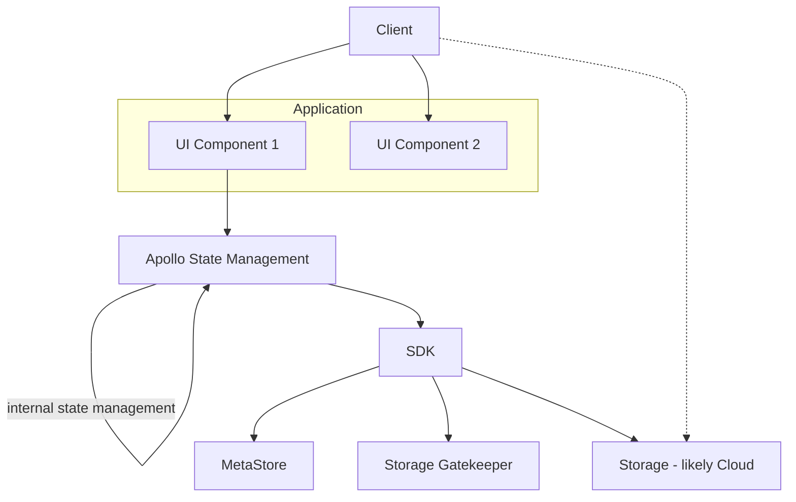
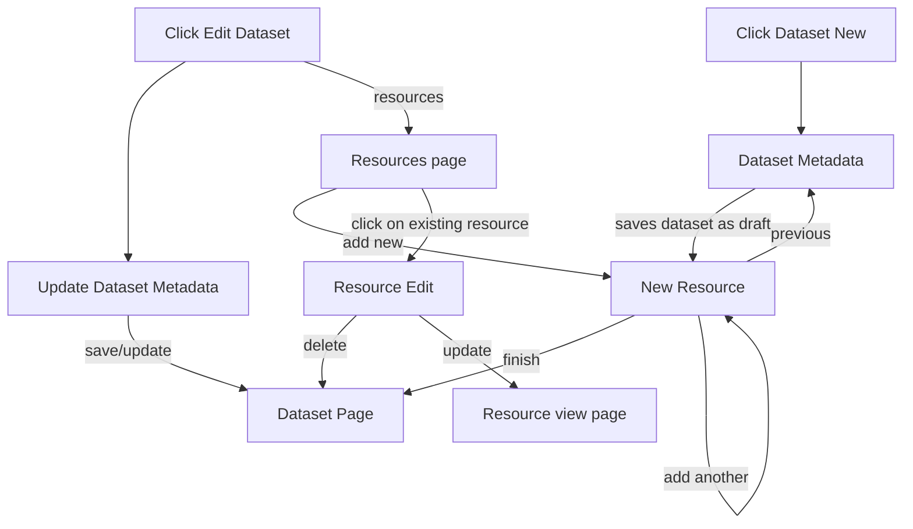
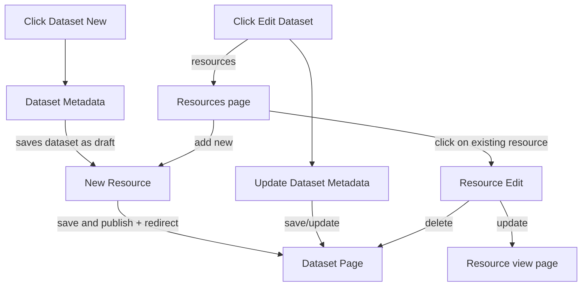
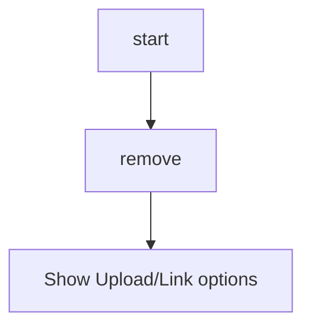

# Publish - Design

## Introduction

Design of a DMS publishing system, with a focus on CKAN v3 / DataHub.

Goal: an elegant single page application (that is easy to reuse and customize) that takes you from choosing your data file to a data package. Aka "a javascript app for turning a CSV into a data package".

This application would form the UI part of a "manual" user flow of importing a data file into a Data Portal.

### The framework approach

As a product, the Publish system should be thought of more as a framework than a single solution: a set of patterns, components and flows that can be composed together to build different applications and workflows.

A given solution is created by composing together different components into an overall flow. 

This approach is is designed to be extensible so that new workflows and their requirements can be easily accommodated.

## Design

### Principles and Remarks

* Simplicity: a focus on extraordinary, easy and elegant user experience
* Speed: not only responsiveness, but also speed to being "done"
* Tabular: focus on tabular data to start with
* Adaptable / Reusable: this system should be rapidly adaptable for other import flows
	* A copy-and-paste-able template that is then adapt with minor changes
  * Over time this may evolve to something configurable
* CKAN-compatible (?): (Longer term) e.g. be able to reuse ckanext-scheming config

### Technology

* Build in Javascript as a SPA (single page application)
* Use React as the framework
* ? Assume we can use NextJS as the SSR/SSG app
* Use Apollo local storage (rather than Redux) for state management

### Architecture

* Each step in a flow is "roughly" a react component
* Each component will pass information between itself and the central store / other components. Those structures that are related to Datasets and Resources wll follow Frictionless formats.
* Encapsulate interaction with backend in a library. Backend is CKAN MetaStore and Blob Storage access, raw Blob Storage itself (almost certainly cloud)
* Split UI into clear components and even sub-applications (for example, a sub-application for resource adding)
* Use [Frictioness specs][f11s] for structuring storage of data objects such as Dataset, Resource, Table Schema etc will be in
* The specification of these formats themselves will be done in JSON schema and JSON Schema is what we use for specifying  new metadata profiles (usually extensions or customizations of the base Frictionless ones)
* Data schemas are described using Table Schema (for tabular data) or JSON Schema.

Diagram: SDK library encapsulates interaction with backend



Working assumptions

* Permissions is "outside" of the UI: we can assume that UI is only launched for people with relevant permissions and that permissions are ultimately enforced in the backend (i.e. if someone attempts to save a dataset they don't have permission for that will fail in the call to the backend). => we don't need to show/hide/restrict based on permissions.

## Key Flows

* **Ultra-simple resource(s) publishing**: Publish/share a resource (file) *fast* to a new project (and dataset) - ultra-simple version (like adding a file to Drive or DropBox)
  * Implicitly creates a project and dataset
* **Publish resource(s) and make a dataset** Publish a file and create the dataset explicitly (ie. add title, license etc)
* **Add resource(s) to a dataset**: a new resource to an existing dataset
  * Add multiple resources at once
* Edit the metadata of an existing dataset

Qu:

* Do we even permit the super simple option - it's attractive but it brings some complexity in the UI 
(either we need to make user provide project/dataset level metadata at end or we guess it for them and guessing usually goes wrong). Note that Github makes you create the "project" and its repo before you can push anything.

## Components

UI

* File uploader
* Resource 

SDK

* File upload
* MetaStore
  * (Project creation / updating)
  * Dataset creation / updating
* ...

## Plan of Work

Task brainstorm

* 

```mermaid
graph TD
```

## Design Research

### Uploading library

Atm we implement from "scratch". Could we use an "off the shelf" solution e.g. uppy

Impressions of uppy:

- Good support
- Open-source MIT
- Beautiful design
- Customizable
- Support (dropbox, google drive, AWS S3, Tus, XHR)

Question:

* how to implement uppy + CKAN SDK?
* support for azure https://github.com/transloadit/uppy/issues/1591 (seems like it can work but maybe issue with large files (?))

[f11s]: https://f11s.com/


## Previous work

* 2019: https://github.com/datopian/import-ui - alpha React App. Working demo at http://datopian.github.io/import-ui
* 2018: https://github.com/datopian/data-import-ui (unfinished React App)
* https://github.com/datahq/pm/issues/90 
* https://github.com/frictionlessdata/datapackage-ui 
* Cf also openspending version
  * can take from openspending but do it right :-)
* the spreadsheet view is best - see [example](https://docs.google.com/spreadsheets/d/1RoKbiTXaxT_N5Vio93Er-BA3ev3iwWlu4KYv-M7kvqc/edit#gid=0)
  * maybe given option to rotate if a lot of rows
* v1 should assume tidy data
* (?) v2 should allow for some simple wrangling to get tidy data (??)
* This is a template for people building their own configurers


### Original Flow for DataHub `data` cli in 2016

Context:

* you are pushing the raw file
* and the extraction to get one or more data tables ...
* in the background we are creating a data package + pipeline

```
data push {file}
```

Algorithm:

1. Detect type / format
2. Choose the data (e.g. sheet from excel)
3. Review the headers
4. Infer data-types and review
5. [Add constraints]
6. Data validation
7. Upload
8. Get back a link - view page (or the raw url) e.g. http://datapackaged.com/core/finance-vix
    * You can view, share, publish, [fork]

Details

1. Detect file type

    1. file extension
      1. Offer guess
      2. Probable guess (options?)
      3. Unknown - tell us
    2. Detect encoding (for CSV)

2. Choose the data
    1. Good data case
      1. 1 sheet => ok
      2. Multiple sheets guess and offer
      3. Multiple sheets - ask them (which to include)
    2. bad data case - e.g. selecting within table

3. Review the headers
    * Here is what we found
    * More than one option for headers - try to reconcile


## Appendix: Integration into CKAN v2 Flow

See https://github.com/datopian/datapub/issues/38

### Current system



### New system



Resource editor




## Appendix: Project Creation Flow Comparison

### Github

Step 1


Step 2


### Gitlab

Step 1


Step 2


