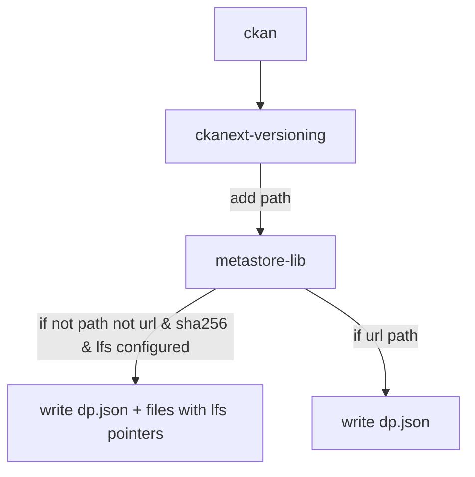
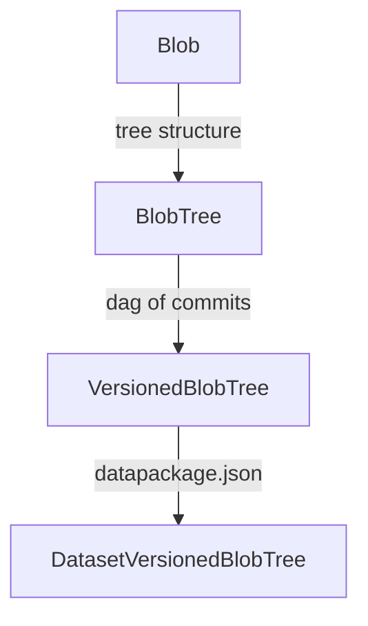
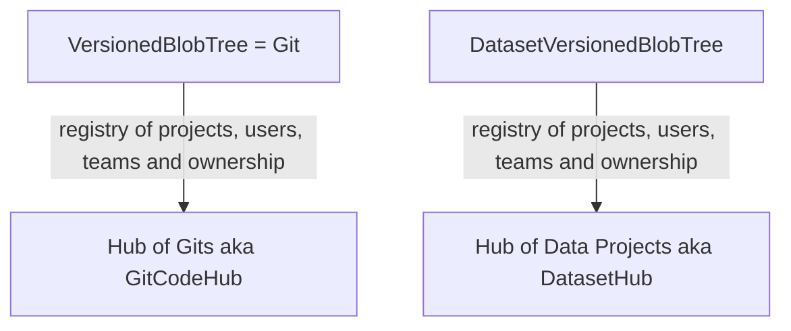
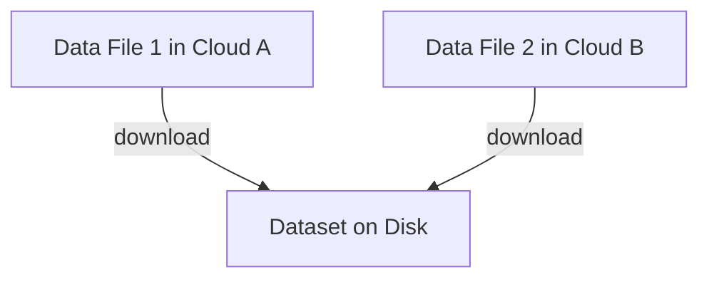

# Versioning 

## The Advantages of a Git-Based Approach

* Excellent command line support out of the box (git)
* Full revisioning and tagging and more (e.g. branches) in an extremely robust system
* Support for non-dataset files in same place ... (e.g. code, visualization, data processing, data analytics)

### What shall we use to create the Hub part of the DataHub

* CKAN Classic MetaStore
* Gitea or Gitlab or Github ...

For now definitely CKAN Classic MetaStore

### What shall we use to create / manage git repos for us?

* GitHub
* Gitea
* Azure Git Repos https://azure.microsoft.com/en-us/services/devops/repos/

## Metadata flow



## Research

### References

* [Git (and Github) for Data - Rufus Pollock - blog.okfn.org - July 2013](https://blog.okfn.org/2013/07/02/git-and-github-for-data/)
  * Discussion on okfn-labs: https://lists-archive.okfn.org/pipermail/okfn-labs/2013-July/002690.html
* [We Need Distributed Revision/Version Control for Data -Rufus Pollock - blog.okfn.org - July 2010](https://blog.okfn.org/2010/07/12/we-need-distributed-revisionversion-control-for-data/)
* [Diffing and patching tabular data - Paul Fitzpatrick - Aug 2013](http://okfnlabs.org/blog/2013/08/08/diffing-and-patching-data.html)
* Noms - Noms is a decentralized database philosophically descendant from the Git version control system. https://github.com/attic-labs/noms
  * Written in Go. Open source (apache license)
  * Functional but still alpha
  * Now abandonware as makers of Noms, Attic Labs, were acquired by Salesforce in Jan 2018 and developed stopped at that point. "Nobody is working on this right now. You shouldn't rely on it unless you're willing to take over development yourself." https://github.com/attic-labs/noms/blob/master/README.md#status
* (Old - last updated in 2018 and largely from before that) Collecting thoughts about data versioning - https://github.com/leeper/data-versioning
* TODO: See Rufus' revisioning work at Data Protocols

### Context: (Dataset) Versioned Blob Trees



* We could also add things like a dataflows.yml to a repo to make a data pipeline or a model.pkl file to store your machine learning analysis ...

### Context: Project => Project Hub



### Approaches for storing large files and versioning them

For now I'll assume we use Git for versioning *and* we want large files outside of git.

My sense is that Git LFS with custom backend storage works fine for most CKAN use cases in which customer has their own storage.

In more ML use cases the ability to have multiple data sources from different systems could be valuable.

It seems to me some hybrid could be achieved using extensions to Data Resource (to use remote URLs that have a local cache) and a special client that is aware of those extensions.

See also this matrix comparison https://docs.google.com/spreadsheets/d/1gc7vxcFt9OSVL7JoXXo9KSBVG4oIASaL08vdvoEst4o/edit#gid=1833965075

#### Git LFS option

Use git-lfs and build a custom lfs server to store to arbitrary cloud storage.

* Pros: compatible with git lfs client
* Cons: you are limited to one cloud storage and can't pull data from different places (and no central caching)

For example, suppose i have a project using an AWS public dataset. In this approach i have to first copy that large dataset down, add to git (lfs) and push into my own cloud storage via git lfs.

#### Manifest option (dvc approach and datahub.io)

We store a manifest in git of the "local" paths that are not in git but in cloud storage.



One approach would be to mod Data Resource to have a storage / cloud url option

```json=
{
  path: 'mydata.csv'
  storageUrl: 'https://cloudstorage.com/content-addressed-path'
}
```

As long as the storage url changes each time you change the file (e.g. using content addressing) you get proper data versioning.

Another option is to store soft links in the main repo pointing into a local cache directory that is gitignored but has a manifest listing what to download into it. These would have to get updatd each time the data changed (as we ould point to a new blob file in the cache)

Or you could store a special file
https://dvc.org/doc/user-guide/dvc-files-and-directories
(the dvc approach i think )

Notes

* Authentication / authorization is sort of out of scope (we need to assume that user has access to storage url and permissions to upload)
* Could achieve some degree of similar functionality by inverting and having a `cachePath` or similar in datapackage.json and having a tool that pulls all resources that are remote and stores them to their `cachePath`

Pros:

* I could use multiple cloud storage sources in a given dataset (including pulling from public sources)

Cons:

* Need a separate tool other than git (lfs)
* Some weird behaviour if i pull and mod a data file and then push - where does it now go? (not that weird though: my command line tool can take care of this)
  * Guess you would set a default storage "server/service"


---

## Research

### Git

See https://git-scm.com/book/en/v2/Git-Internals-Plumbing-and-Porcelain


### Git-Hubs and how they work ...

* It turns out git really needs to be backed onto disk (you couldn't put git on s3 because of latency)
  * This has a good analysis https://github.com/go-gitea/gitea/issues/2959 that led me to this excellent post https://github.blog/2016-04-05-introducing-dgit/
* however, gitlab have built a git rpc service you can integrate with that abstracts git access https://gitlab.com/gitlab-org/gitaly
  * Gitaly is a Git RPC service for handling all the git calls made by GitLab. As of GitLab 11.5, almost all application code accesses Git repositories through Gitaly instead of direct disk access. GitLab.com production no longer uses direct disk access to touch Git repositories


### Git-Hub APIs for creating files etc

* Github: does not support creating a "commit" with multiple files in standard API but does in low level "Data API" https://developer.github.com/v3/git/ (via https://github.com/isaacs/github/issues/199)
* Gitea: Can create and update files (but not in bulk)
  * https://try.gitea.io/api/swagger#/repository/repoCreateFile
  * https://try.gitea.io/api/swagger#/repository/repoUpdateFile


### Git LFS

Git LFS works as follows:

* When committing LFS-tracked files replace them with pointer file
* Store the actual file into some backend storage
* When pulling cache thoese large files
* On checkout into the working directory replace the pointer file with the actual file

Key specs

* Pointer file: https://github.com/git-lfs/git-lfs/blob/master/docs/spec.md
* LFS client: https://github.com/git-lfs/git-lfs/blob/master/docs/spec.md#intercepting-git
* The server protocol: https://github.com/git-lfs/git-lfs/tree/master/docs/api
* How to mod the git command line

Implementation has 3 components:

* Git client "plugin"
* Server API
* Storage: use your storage of choice

API https://github.com/git-lfs/git-lfs/blob/master/docs/api/README.md

#### File Storage flow
https://github.com/datopian/datahub-client/blob/master/lib/utils/datahub.js#L22

In storing a file there are the following steps

* Discover the LFS server to use
* Authenticate
* Call it with batch API with upload option
  * Tell it what protocols the client supports
* Get back URLs to store to
* Store to them
  * Note there are only certain protocols supported

#### Servers

* Official Test Implementation: https://github.com/git-lfs/lfs-test-server - 507*, official test server
* NodeJS + S3 Implementation: https://github.com/Caellian/node-git-lfs

#### Batch API

https://github.com/git-lfs/git-lfs/blob/master/docs/api/batch.md

Basic Transfers

https://github.com/git-lfs/git-lfs/blob/master/docs/api/basic-transfers.md

> The Basic transfer API is a simple, generic API for directly uploading and downloading LFS objects. Git LFS servers can offload object storage to cloud services like S3, or implement this API natively.
> 
> This is the original transfer adapter. All Git LFS clients and servers SHOULD support it, and default to it if the Batch API request or response do not specify a transfer property.

They say that tus.io may be supported ... (and that in theory supports s3 tho' issues with multipart https://tus.io/blog/2016/03/07/tus-s3-backend.html)

#### Batch Upload to Cloud Storage

Looks like this is def possible. Here's someone doing it with GCS:

https://github.com/git-lfs/git-lfs/issues/3567

#### FAQs

* Can you plug in to cloud provider or choice => Yes, you can with a custom server
* Size limitations at the big providers e.g. github is less than 2Gb
* Does not support those nice cloud features e.g. multipart uploads, resumable etc
  * some discussion here https://github.com/git-lfs/git-lfs/issues/802
* Can you configure your own backend? YES `.lfsconfig` file ...
* Can you back onto s3?
  * I did not see a live implementation from my search but i found
  * https://sqr-001.lsst.io/ => this looks really promising. They built their own lfs server.
* Does it support multipart downloads NO
  * See "Please add multipart file downloads" https://github.com/git-lfs/git-lfs/issues/802 Proposed 2015 and still open


### Git Annex

* Seems to do content addressing built in ...
* May not be compatible with minio due to minor header issue (may be fixed now?) https://github.com/minio/minio/issues/5007
* Example of working with s3 backend (via datalab it sounds like)  https://git-annex.branchable.com/forum/slow_s3_transfer/

### Content Addressed Storage

https://en.wikipedia.org/wiki/Content-addressable_storage

API ideas: https://github.com/jakearchibald/byte-storage/issues/11

https://gist.github.com/mikeal/70daaf34ab39db6f979b8cf36fa5ac56
https://github.com/mikeal/lucass lucass (Lightweight Universal Content Addressable Storage Spec)

```
let key = await byteStorage(value) // value is a File, Blob, Stream, whatever
let value = await byteStorage(key) // could return a promise, or a stream, whatever you wanna go for
```

Garbage collection: how do you do it ...

* https://www.usenix.org/system/files/conference/fast13/fast13-final91.pdf - 2013 paper. Sort of useful.


### DVC

https://dvc.org "Data Version Control"

It does large files but also much more related to machine learning workflow. e.g. it has a whole dep tree in each of its special files https://dvc.org/doc/user-guide/dvc-file-format so it is doing some kind of optimiazation there ...

https://dvc.org/doc/understanding-dvc/related-technologies

Basically, it combines part of all of these

* Git Large file management
* Workflows: creating and running them esp machine learning workflows. Includes a DAGs for workflows (esp ML flows)
* Experiment management

> DVC does not require special Git servers like Git-LFS demands. Any cloud storage like S3, GCS, or an on-premises SSH server can be used as a backend for datasets and models. No additional databases, servers, or infrastructure are required.

NB: this is actually untrue about Git-LFS. Git LFS server could be backed by any cloud storage.

### Misc

* https://towardsdatascience.com/why-git-and-git-lfs-is-not-enough-to-solve-the-machine-learning-reproducibility-crisis-f733b49e96e8 Argues against git-lfs and talks about dvc. However, my further reading on LFS suggests this article is attacking a bit of a straw man i.e. the Git LFS backend as provided by Github (which is expensive and limited). However, it is quite straightforward to back Git LFS onto your own cloud storage.
* https://developer.lsst.io/  - large synoptic survey telescope. Have built their own datahub afaict
  * https://www.lsst.org/about/dm
  * https://sqr-001.lsst.io/ => this looks really promising. They built their own lfs server.
* Minio can provide a common interfact to all blob storage systems afaict ...
  * https://github.com/minio/mc
  * Does it integrate with lfs? https://github.com/mi2428/git-lfs-minio => 2* and only chinese
  * Works as a replacement for gitlab storage https://github.com/minio/cookbook/issues/149
* Can you do raw git on cloud storage e.g. s3? Not sure??
  * https://stackoverflow.com/questions/7031729/publish-to-s3-using-git => this is more about raw publishing of the repo ...
* gitea: go based open source git server. Backs onto cloud maybe via minio or fuse or ...?
* https://github.com/s3git/s3git - written in go and writes data to cloud storage
  * => this is a potential lightweight alternative to full git and hacking lfs in it.
  * does have a big this is pre-release disclaimer
* git-lfs vs git-annex: https://anarc.at/blog/2018-12-21-large-files-with-git/
* +10 https://martinfowler.com/articles/cd4ml.html (Sep '19) Continuous Delivery for Machine Learning (not actually writteby by fowler)
  * they cite dvc.org yet again ...
* Clearly big discussion happening around machine learning reproducibility
  * dvc.org are a play in this space ...
  * https://christophergs.github.io/machine%20learning/2019/05/13/first-impressions-of-dvc/
    * Mixed conclusion: it is useful but a new flow ...
* dvc.org
* pachyderm
* https://www.datalad.org/ Providing a data portal and a versioning system for everyone, DataLad lets you have your data and control it too.
  * https://github.com/datalad 178*
  * Uses git and git-annex
  * Works well with gin (see next)
  * Born to solve data distribution and management problem in academic (neuroimaging) setting
  * Doesn't have a web UI. Just a command line which is a wrapper around git and git-annex
  * Has extended user oriented documentation: http://handbook.datalad.org/
  * JOSS publication under review with a nice overview: https://github.com/openjournals/joss-reviews/issues/3262
* https://gin.g-node.org/
  * Modern Research Data Management for Neuroscience ...distributed version control, flavoured for science
  * Powered by gogs
  * Classic somewhat crude academic effort i suspect
  * Uses git, git-annex and gogs
