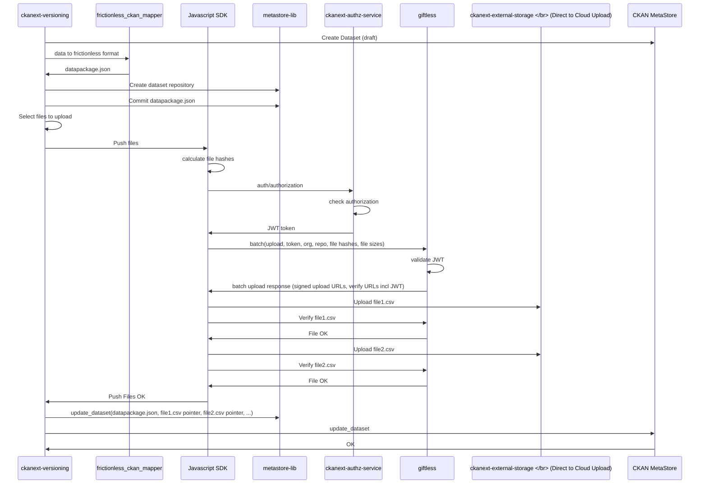

# Versioning - Technical Overview

> This is technical, developer oriented overview of the next gen versioning project implemented in 2020.

**Storage:** We offer an approach to data storage that leverages cloud blob storage directly (i.e.: without having to upload and serve all files via the CKAN web server), unlocking the performance characteristics of the storage backend directly. More info: http://tech.datopian.com/blob-storage/#direct-to-cloud-upload

**Versioning:** We offer an approach to data versioning that is integrated with CKAN, but does not implement large amounts of custom logic in order to achieve versioning, and instead, leverages git, the world’s most popular software for versioning, for this purpose.

## Implementation

### Working areas

 1. Data Versioning (Git Server + Git LFS Server)
 2. Cloud Storage (Direct to Cloud Upload)
 3. CKAN Integration (CKAN extensions to call APIs)


## Main Architecture

### CKAN Extensions

The solution has the following components:

**[ckanext-external-storage](https://github.com/datopian/ckanext-external-storage)**: This extension will integrate the javascript sdk with CKAN.
 * Update resources form to upload files to the cloudstorage provider using the new Javascript SDK.
 * Update all the download points in CKAN to download the resources from the cloudstorage
 * Integrate [datapub](https://github.com/datopian/datapub) for data publishing flows

**[ckanext-authz-service](https://github.com/datopian/ckanext-authz-service):** This extension uses CKAN's built-in authentication and authorization capabilities to:
 * Generate JWT tokens and provide them via CKAN's Web API to clients.
 * Validate JWT tokens

This extension requires a RSA keypair for RS* signing & encryption.

**[ckanext-versioning](https://github.com/datopian/ckanext-versioning)**: This CKAN extension adds a full data versioning capability to CKAN including:
 * Metadata and data is revisioned so that all updates create new revision and old versions of the metadata and data are accessible
 * Create and manage "revision tags" (named labels plus a description for a specific revision of a dataset e.g. "v1.0")
 * Diffs, reverting, etc

### Giftless

**[giftless](https://github.com/datopian/giftless):** Giftless is just a middleware service to get the location (URLs) of the files in the storage server so clients can interact with them through HTTP requests.
 * Given the sha256 and the filesize of a data file, the call to giftless it will return the signed URLs so the client (ckanext-external-storage) can do a dummy HTTP PUT request to upload and to verify the content
 * Validate the JWT token given by ckanext-authz-service

Note: Giftless will require in it's configuration access to the public key created for ckanext-authz-service.

### Main libraries

**[Javascript SDK](https://github.com/datopian/ckan-client-js):** This javascript SDK will contain the logic to be used in the browser to:
 * calculate file hashes,
 * get the authorization JWT from ckanext-authz-service
 * get signed urls from git lfs server (giftless)
 * upload the file to the cloud storage provider. (Basic HTTP PUT request to the signed url)
 * Verify the file. (HTTP GET request to the verify URL)

**[metastore-lib](https://github.com/datopian/metastore-lib/)**: Library for storing dataset metadata, with versioning support and pluggable backends including GitHub.

metastore-lib is used by ckanext-versioning and requires environment variables related to the Github Repository where the data is gonna be stored and the access token.

**[frictionless-ckan-mapper (python)](https://github.com/frictionlessdata/frictionless-ckan-mapper)**: A library for mapping CKAN metadata {'<=>'} Frictionless metadata.

### Main interaction between main components

This is a workflow example to understand how each component interacts with each other.




Note: I keep this mermaid code for versioning purposes

## Main Configurations

### CKAN configs

CKAN extensions configs are described as usual in the `production.ini` file and the template to create it in our current deployment pipeline can be found in the [values.yaml.template](https://github.com/gatesfoundation/ckan/blob/develop/contrib/cco/ckan-conf-templates/values.yaml.template) file

The specific configs for the versioning stack feature are:

```
# ckanext-external-storage
ckanext.external_storage.storage_service_url=https://{{CKAN_INSTANCE_NAME}}.gatesfoundation.org/giftless
# ckanext-authz-service
ckanext.authz_service.jwt_algorithm=RS256
ckanext.authz_service.jwt_private_key_file=/etc/ssh/jwt-rs256.key
ckanext.authz_service.jwt_public_key_file=/etc/ssh/jwt-rs256.key.pub
ckanext.authz_service.jwt_include_user_email=true
#ckanext-versioning
ckanext.versioning.backend_type=github
ckanext.versioning.backend_config={"github_options": {"login_or_token": "{{GITHUB_PERSONAL_TOKEN}}"}, "default_owner": "{{GITHUB_DEFAULT_OWNER}}", "lfs_server_url": "https://{{CKAN_INSTANCE_NAME}}.gatesfoundation.org/giftless", "private": True}
```

### ckan-cloud-helm

The CKAN architecture is deployed using K8s and Helm charts: [https://github.com/datopian/ckan-cloud-helm](https://github.com/datopian/ckan-cloud-helm)


**Giftless** needs a server of it's own so it is managed by K8s, the configs can be found in the [ckan-cloud-helm](https://github.com/datopian/ckan-cloud-helm) repository and it is currently configured [for Azure](https://github.com/datopian/giftless#azure-support) in ckan-cloud-helm repository.

Example of the config map we are using at the moment:

```
AUTH_PROVIDERS:
  - factory: giftless.auth.jwt:factory
    options:
      algorithm: RS256
      public_key_file: /etc/ssh/jwt-rs256.key.pub
TRANSFER_ADAPTERS:
  basic:
    factory: giftless.transfer.basic_external:factory
    options:
      storage_class: giftless.storage.azure:AzureBlobsStorage
      storage_options:
        connection_string: {{ .Values.excternalStorageConnectionString }}
        container_name: {{ .Values.excternalStorageContainerName }}
        path_prefix: {{ .Values.giftlessPathPrefix | default "giftless" | quote }}
PRE_AUTHORIZED_ACTION_PROVIDER:
  options:
    private_key: {{ randAlphaNum 16 | b64enc | quote }}
MIDDLEWARE:
  - class: werkzeug.middleware.proxy_fix:ProxyFix
    kwargs:
      x_host: 1
      x_port: 1
      x_prefix: 1
```

