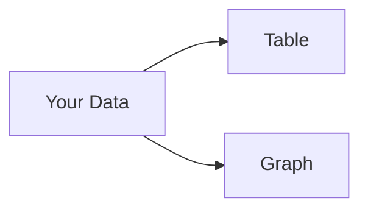
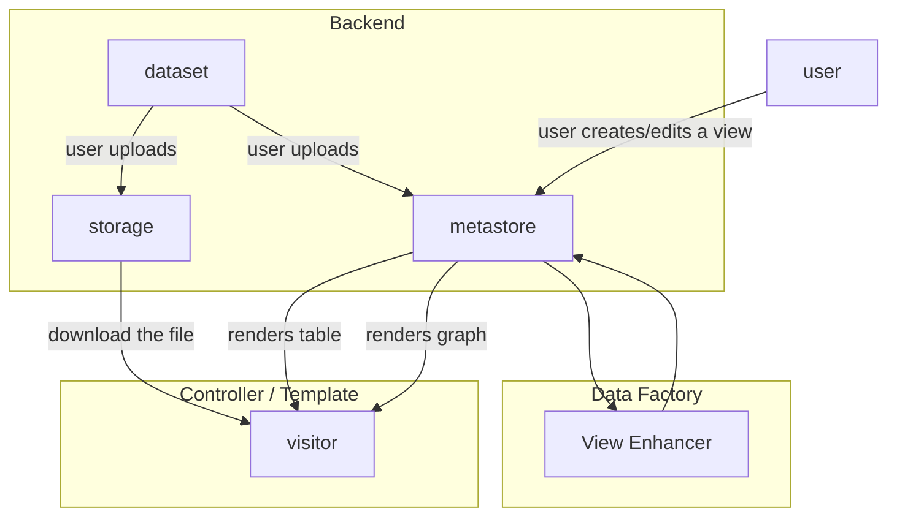
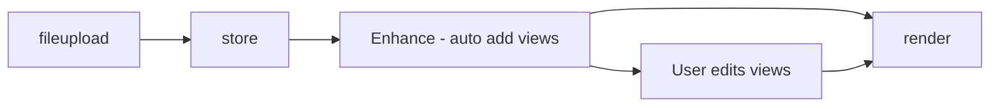

# Data Views

## Introduction

Publishers and users of data want data presented in tables, graphs maps to make it more *human* "readable".[^1] We use the term "view" or "data view" ofr all these various ways of presenting data in more human "readable" ways.

[^1]: for an introduction to the power and art of visual presentation data see e.g. Tufte *Visualizing Information*.

At base, views need:

* **A descriptive language**: for *specifying* views such as tables, graphs and maps (and their source data).
* **Rendering tools**: take those specifications and render actual "live on the web" tables, graphs and maps from those specifications (and their source data)

In addition, we may want:

* **Wizards**: to enable (non-technical) users to create tables, graphs, maps etc -- and to select the input data to power them.
* **Explorers**: that build on the views and wizards to allow users to do interactive data exploratio via live filtering and viewing.
* **Dashboards** that combine tables, charts, maps etc (often with widgets that allow users to adjust these e.g. to select a country that updates associated charts).

>[!tip]Often when we say "view" we identify with the particular presentation such as the table or graph. E.g. we say "this table is a view of that data". However, when you stop and think, strictly a view is more than that, for example it includes the title for the table. Formally, for us a view will include the combination of the presentation specification, the data sources that feed, plus any general metadata such as a title and description.

## Definitions

* Preview: a display (of a sample) of a resource
* Previewer: a method for previewing specific raw data types e.g. csv, excel, json, xml, text, geojson etc …
* Viz: visualizations e.g. table, graph, map, ...
* Viz Builder: a UI for creating graphs, maps etc
* Query UI: a UI for building queries of a dataset
* Explorer: Query UI + Viz Builder + Viz (renderer)

## Features

Definitions for feature clusters

* View: "(pre)view" a variety of data formats, most importantly tabular and geodata, and extending to PDFs, JSON HTML etc.
  * Tabular:
  * Geo:
  * Chart:
  * Maps:
  * Everything else: this is more a preview
  * Pluggable system
  * Resource proxy (cors issues)
* [Data Explorer][]: think "tableau lite", a rich app for querying/loading data and then displaying that in tables, charts, maps etc.
  * Builders:
    * Query Builder:
    * Chart Builder: a wizard for building charts
    * Map Builder
      * Lite: set popups etc.
      * Complex: think carto
* Rich Viz: bespoke, complex visualization
* Dashboard: something that has many widgets displayed at once
  * Basic: no linkage between widgets (basic controls)
  * Complex: linkage between widgets (e.g. zooming on the map changes the map, or clicking the map changes the charts)

[Data Explorer]: /docs/dms/data-explorer

## CKAN v2

In CKAN v2 and earlier this is provided by the internal view object plus ReclineJS.

* Controller / Template = frontend controller, templating library or even browser JS
* "Data Factory" is a fancy name for any business logic that automatically adds views to a dataset. In CKAN 2 this happens as part of the resource creation logic

The sequence of it ...

## CKAN v3

In CKAN v3 and DataHub these are provied through the use of Frictionless (Data Package) "Views" and associated tooling.

See:

* https://github.com/datopian/datapackage-views-js
  * https://github.com/frictionlessdata/datapackage-render-js
* [Data Explorer][] page in this site.

For more on the technical background see the [Views Design page &raquo;](/docs/dms/views/design).

