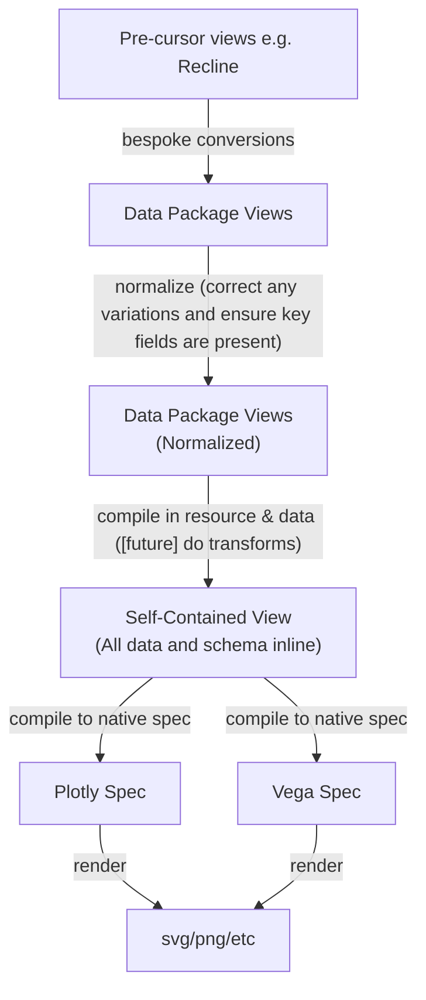
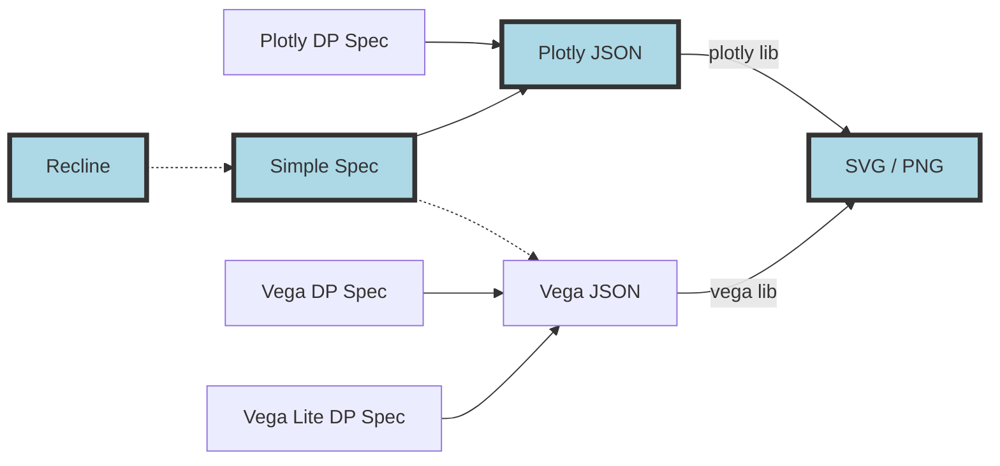
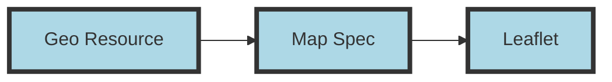
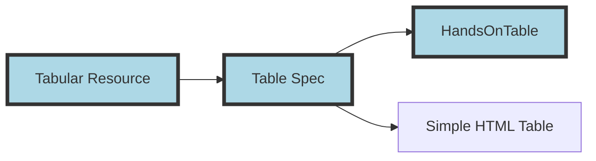

# Views - Design

Design of [Views](/docs/dms/views).

## Concepts and Background

>[!tip]
This is from https://specs.frictionlessdata.io/views/#concepts-and-background

To generate visualizations you usually want the following 3 types of information:

- metadata: e.g. title of graph, credits etc
- graph: description / specification of the graph itself
- data: specification of data sources for the graph including location and key metadata like types

The data spec itself often consists of three distinct parts:

- "raw / graph data": a spec / description of data exactly in the form needed by the visualization system. This is often a very well defined spec e.g. an array of series ...
- locate/describe: a spec of where to get data from e.g. `url` or `data` attribute plus some information on that data such as format and types.
- transform: a spec of how transform external data prior to use e.g. pivoting or filtering it

From this description it should be clear that the latter two data specs -- locate/describe and transform -- are actually generic and independent of the specific graphing library. The only thing the graphing library really needs is a clear description of the "raw" format which it directly consumes. Thus, we can consider a natural grouping of specs as:

- general-metadata - e.g. title of graph, credits etc [provided by e.g. Data Package / define yourself!]
- data: sourcing and transform [provided by e.g. Data Resource]
  - sourcing: how to source data from external sources
  - transform: how to transform data e.g. pivot it, select one field, scale a field etc
- graph description / specification [provided by e.g. Vega]
  - graph data (raw): data as directly consumed by graph spec (usually JSON based if we are talking about JS web-based visualization)

However, in many visualization tools -- including specs like Vega -- these items are combined together. This is understandable as these tools seek to offer users a "complete solution". However, **decoupling these parts and having clearly defined interfaces would offer significant benefits**:

* Extensability: it would be easier to extend and adapt the system. For example, adding new data import options could be done without changing the graph system.
* Composability: we can combine different parts together in different ways. For example, data import and transformation could be used for generating data for tabular display as well as graphing.
* Reusability: we want to reuse existing tools and specifications wherever possible. If we keep the specs relatively separate we can reuse the best spec for each job.
* Reliability: when the system is decoupled it is easier to test and check.

In summary, a smaller pieces, loosely joined makes it easier to adapt and evolve the specs and the associated tooling.

## The Tool Chain

***Figure 1: From Data Package View Spec to Rendered output***

>[!info]Important
An important "convention" we adopt for the "compiling-in" of data is that resource data should be inlined into an `_values` attribute. If the data is tabular this attribute should be an array of *arrays* (not objects).

### Graphs

***Figure 2: Conversion paths***

Notes:

* Implemented paths are shown in lightblue.
* Left-most column (Recline): pre-specs that we can convert to our standard specs
* Second-from-left column: DP View spec types.
* Second-from-right column: the graphing libraries we can use (which all output to SVG)

### Geo support

>[!note]Support for customizing map is limited to JS atm - there is no real map "spec" in JSON yet beyond the trivial version.

>[!note]Vega has some geo support but geo here means full geojson style mapping.

### Table support

### Summary

***Figure 3: From Data Package View to Rendered output flow (richer version of diagram 1)***

